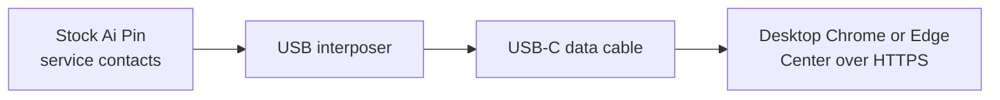

<div align="center">
  <h1>Luma</h1>
  <p><strong>Your Ai Pin. Yours again.</strong></p>
  <p>
    A recreation of the Humane Ai Pin and its infrastructure, built on the
    Penumbra device foundation and running on a server you control.
  </p>
  <p>
    
    
  </p>
  <p>
    <a href="#quick-start">Quick start</a> ·
    <a href="#get-luma">Deploy</a> ·
    <a href="#connect-a-pin">Connect a Pin</a> ·
    <a href="docs/faq.md">Questions</a> ·
    <a href="#for-developers">Develop</a> ·
    <a href="#contributing">Contribute</a>
  </p>
</div>

> [!IMPORTANT]
> Luma is a free, non-commercial, independent community project, there is
> nothing to buy and no donations are solicited. It is not affiliated with or
> endorsed by Humane or HP. It is for people who own an Ai Pin they lawfully
> possess and want to keep using it after Humane discontinued the service on
> 28 February 2025. The device software uses
> [Penumbra](https://github.com/PenumbraOS), the community foundation that lets
> owner-authorized Luma apps run on a stock Pin; ADB authorization is delegated
> to Penumbra's remote signer, so Luma stores and ships no device key or
> certificate. You are responsible for the device, server, accounts,
> credentials, and third-party services you connect. See [NOTICE](NOTICE) and
> [TRADEMARKS.md](TRADEMARKS.md).

## Quick facts

| | |
| --- | --- |
| **What it is** | A recreation of the Humane Ai Pin and its entire cloud |
| **Built on** | The [Penumbra](https://github.com/PenumbraOS) device foundation and stock-compatible services |
| **Where it runs** | Your own 64-bit Ubuntu 24.04 server, `amd64` or `arm64` |
| **What you keep** | The familiar Pin experience: Center, Cosmos, and the signed five-app runtime |
| **What it costs** | The software is free. You bring the server and your own provider accounts. |
| **Who sees your data** | You, and the providers you connect. Storage and every cloud service run on your server; assistant, speech, search, and maps requests go only to the provider accounts you choose. |

> [!NOTE]
> **Open and free.** Luma is [MIT licensed](LICENSE); its repository, releases,
> and container images are public, so the one-line installer and updates need
> no account or token. (Running a private fork? The installer still accepts a
> classic token with the `repo` and `read:packages` scopes, through the GitHub
> CLI or `LUMA_GITHUB_TOKEN_FILE`, and `./luma registry login` saves one for
> its updates; the public release needs none.)

## Documentation

This README is the overview and quick start. The depth lives in two places:

- **Guides** (step-by-step how-tos): [Server from nothing](guides/server-from-nothing.md),
  [Connect your Pin](guides/connect-your-pin.md), [Update Luma](guides/update.md),
  [Troubleshooting](guides/troubleshooting.md), [Glossary](guides/glossary.md).
- **Reference and design** ([docs/](docs/README.md)): [Install](docs/install.md),
  [Configure services](docs/services.md), [What your Center does](docs/center.md),
  [Run your server](docs/operations.md), [Architecture](docs/architecture.md),
  [The assistant runtime](docs/assistant.md), [App privacy](docs/privacy.md),
  [For developers](docs/developers.md), [Troubleshooting](docs/troubleshooting.md),
  [Questions](docs/faq.md).
- **For AI agents:** [llms.txt](llms.txt) indexes the docs, and [AGENTS.md](AGENTS.md)
  holds the contributor and agent rules.

## Quick start

Two words you will meet: **Center** is the website you sign in to, your own
humane.center. **Cosmos** is the cloud the Pin talks to. Both run on your
server; you never open Cosmos directly.

You can install the server, sign in to Center, configure services, and link
music accounts before you have a Pin. One Luma server supports one physical
Pin; connect it later when you are ready. Voice, photos, and music playback
need that Pin. Center's notes and account settings work without it.

**Before you start.** Plan about 30 minutes for the server, plus the time the
Pin needs. Have these ready:

- [ ] **A server:** fresh 64-bit Ubuntu 24.04, `amd64` or `arm64`, with a
      public IPv4 address, ports 80 and 443 open, 8 GiB of free disk, and
      4 GB of RAM (8 GB is comfortable; INFERRED, see
      [Choosing your server, domain, and providers](docs/install.md#choosing-your-server-domain-and-providers)).
      About €4 to €12 a month. No server yet? Follow
      [Server from nothing](guides/server-from-nothing.md).
- [ ] **A domain name** with one A record pointing at that IPv4. About €10 a
      year, or free as `name.duckdns.org`.
- [ ] **Accounts:** an OpenAI-compatible assistant key (OpenRouter or OpenAI);
      an Azure Speech key and region. Everything else is optional. No GitHub
      account is needed, because Luma is public.
- [ ] **Hardware, when you connect the Pin later:** an Ai Pin, the
      [PenumbraOS USB interposer](https://github.com/PenumbraOS/interposer), a
      USB-C data cable, and a computer with desktop Chrome or Edge.
- [ ] **A release:** the five files of the
      [latest GitHub release](https://github.com/TheAndersMadsen/luma/releases/latest)
      (or the maintainer's `operator-release` folder), in a folder named
      `luma-VERSION` on your computer.

Each step is one action, with the line that tells you it worked.

1. **Point your domain at the server.** At your DNS provider, create one A
   record for `center.example.com` with the server's public IPv4, with any
   proxy (Cloudflare's orange cloud) off.
   Result: `dig +short center.example.com` prints that address.
2. **Copy the release to the server.** From your computer:
   `scp -r luma-VERSION you@SERVER_IP:`
   Result: on the server, `ls ~/luma-VERSION` lists the operator archive, the
   Pin archive, `luma-VERSION.release.json`, `SHA256SUMS`, and
   `SHA256SUMS.sigstore.json`.
3. **Check and unpack the release.** On the server:
   ```sh
   cd ~/luma-VERSION
   sha256sum --check SHA256SUMS
   tar -xzf luma-operator-*-linux.tar.gz
   cd luma-operator-*/
   ```
   Result: every `sha256sum` line ends in `: OK`. With `cosign` installed,
   `cosign verify-blob --key luma-operator-*/platform/distribution/release-signing.pub --bundle SHA256SUMS.sigstore.json --insecure-ignore-tlog SHA256SUMS`
   (run in `~/luma-VERSION`) prints `Verified OK`.
4. **Install Bun and Docker.** `bash ./bootstrap --tools-only`
   Result: `Bun and Docker are ready.` If it also prints `Reconnect over SSH so
   this session picks up Docker group membership.`, do that, then
   `cd ~/luma-VERSION/luma-operator-*/` again.
5. **Set up, deploy, and verify.** Luma's images are public, so no registry
   login is needed.
   `./luma onboard production --pin-release-archive ../luma-pin-*.tar.gz`
   Answer its questions, `[1/6] Public Center domain` through `[6/6] Review`,
   and answer `Write this production configuration? [y/N]` and later `Deploy
   this verified release now? [y/N]` with `y`.
   Result: `Luma release ... is deployed and passed production verification.`
   (it names the release ID, a commit hash) and
   `Setup complete: https://center.example.com/login?...`.
6. **Sign in to Center.** `cat ~/.config/luma/production/first-login.txt`
   shows the address, owner email, and initial password. Open the address in
   your browser and sign in.
   Result: Center's home page. Change the password in **Settings → Passcode &
   password**, then `rm ~/.config/luma/production/first-login.txt`.
7. **Connect your providers, then your Pin.** In **Settings → Assistant &
   voice**, enter the assistant key and the Azure Speech key and region, and
   choose **Save changes**. Then follow
   [Connect your Pin](guides/connect-your-pin.md).
   Result: the Pin answers your first voice question from your own server.
   You can stop after configuring Center and return to **Guided setup** when
   you have your Pin; server setup never contacts or changes it.

The full install, with the reasons behind each command, the one-line installer,
and the Hetzner cloud-init path, is in [docs/install.md](docs/install.md).
Something did not match? See [Troubleshooting](docs/troubleshooting.md) and the
[long troubleshooting guide](guides/troubleshooting.md). Words you do not
know are in the [glossary](guides/glossary.md).

## What works today

| Area | Works today |
| --- | --- |
| **Pin: assistant** | Voice questions and answers, web search, knowledge lookups, weather and forecasts, places and directions (walking, driving, cycling, public transit), calls, translation, Catch Me Up, Touchcode, and Vision actions; the optional OS3 (Rabbit) agent |
| **Pin: everyday** | Photos and videos uploaded to your Center, notes by voice, contacts by voice, the food log with nutrition, fitness sessions, and music playback |
| **Pin: setup** | Installing the five Luma apps, joining Wi-Fi, activation, the passcode, updates, and remote access, all from Center over USB in desktop Chrome or Edge |
| **Center** | Captures with favorites, tags, search, and share links; notes; contacts; My Data and Memories; Ai Mic and Music history; name, Pin features, passcode, privacy, and account deletion; provider and music settings; the Pin installer and Guided setup; backup, restore, and verified updates from the command line |
| **Providers** | Assistant: any OpenAI-compatible API (OpenRouter, OpenAI, a gateway, or self-hosted) or a Codex subscription. Speech: Azure Speech. Search: SearXNG (bundled) or SerpAPI, plus Perplexity. Maps: Google Maps. Weather: Pirate Weather. Knowledge: Wolfram. Food: Open Food Facts. Music: Spotify, YouTube Music, TIDAL (Apple Music links but does not play yet). Agent: Rabbit OS3 |

Everything above runs on your server with your own provider accounts; the
Pin holds no provider key. The details are in
[What your Center does](docs/center.md) and
[The assistant runtime](docs/assistant.md).

## About

The Ai Pin is a lovely piece of hardware whose cloud is gone. Every other way
to keep a Pin working depends on someone else's servers staying up.

Luma recreates the whole thing, the assistant, the services behind it, the
installer, and the control plane, as software you run yourself. The Pin keeps
its sensors, capture, and playback close to the hardware. Everything that was
Humane's cloud becomes Cosmos on your server, and Center, your humane.center,
is where you sign in, see your captures, notes, and data, connect providers,
and manage your Pin. A stock Pin joins through Center's USB installer, with
Penumbra providing the device foundation underneath.

Keep the familiar experience. Run it on infrastructure you control.

## Built to stay yours

- **Your cloud, your rules.** Assistant, search, maps, weather, transcription,
  and speech synthesis run in Cosmos. You choose every provider and key, and
  you can change them from Center without touching the Pin.
- **No keys on the device.** Activation copies only the Cosmos endpoint, the
  operator trust root, and that Pin's device identity. An assistant, search,
  maps, or speech credential never reaches the device.
- **Fails closed.** The Compatibility Layer routes stock cloud calls only to
  your activated Cosmos server. Before activation, or if your server is
  unreachable, the Pin does not silently talk to anyone else.
- **Stock where it counts.** Required stock `humane.*` protocol names and
  Android package identities are preserved byte-for-byte, because the original
  software calls them exactly.
- **One verified release.** Device Installer, Setup Helper, Compatibility
  Layer, Device Services, and Compatibility Loader ship and verify as one
  signed set. Production deploys a checksum-verified operator archive; the
  server never clones or compiles source.
- **Safe to rerun.** Setup, deploy, and verify keep your configuration,
  secrets, and data, and stop at the first problem they find without undoing
  what already works.

## Get Luma

Install Luma on a fresh Ubuntu 24.04 server, sign in to Center, configure
providers, and connect a Pin. The public release and its images need no account
or token. Three paths lead to the same place: the step-by-step
[Server from nothing](guides/server-from-nothing.md) guide, the full reference
in **[docs/install.md](docs/install.md)** (server and provider choices, the
one-line installer, and the Hetzner cloud-init path), or the
[Quick start](#quick-start) above.

**Running Umbrel OS?** The community app store
[Perseu5/umbrel-apps](https://github.com/Perseu5/umbrel-apps) repackages Luma
for Umbrel. Add `https://github.com/Perseu5/umbrel-apps` as a community app
store in Umbrel, then install and set up Luma from there. Its packager builds
their own images, so it is not this project's signed release, and it is still
being tested.

## Configure services in Center

A useful Pin needs an assistant model and Azure Speech; search, maps, weather,
knowledge, food, music, and the optional OS3 (Rabbit) agent are added the same
way, in Center's settings, with your own provider accounts. Every key lives in
Cosmos and never reaches the Pin. Setup, provider options, OS3, and music are
in **[docs/services.md](docs/services.md)**.

## Connect a Pin

**One Pin per server (Luma policy, INFERRED).** Cosmos durably reserves the
server's Pin in production PostgreSQL when it is first paired, provisioned,
or enters enrollment. Concurrent requests cannot reserve different Pins.
Repairing or reactivating that same device is allowed; a different device is
refused (pairing and provisioning answer HTTP 409, enrollment
`permission denied`). Removing a pairing or deleting an account does not
free the slot or revoke its certificates, so a server cannot switch to a
different Pin. Development enrollment without PostgreSQL is process-local and
does not provide production durability.



Guided setup runs in a desktop Chromium browser over HTTPS and talks to the Pin
through WebUSB. The apps it installs and the Wi-Fi password you type travel from
the browser over the local USB cable; the production server never needs
physical access to the Pin, and your Wi-Fi password never reaches the production
server. The [Connect your Pin guide](guides/connect-your-pin.md) is the
illustrated walkthrough.

### 1. Prepare and connect

Have these ready:

- A compatible Ai Pin USB interposer. A stock Pin exposes its USB service
  contacts beneath the small moon sticker rather than through a USB-C socket;
  follow the maintained [interposer guide](https://github.com/PenumbraOS/interposer)
  and its illustrated [stock-Pin preparation](https://github.com/PenumbraOS/interposer/blob/master/preparation.md)
  before connecting it.
- Current desktop Chrome, Chromium, or Edge. The page checks both HTTPS and
  WebUSB before enabling installation.
- A known-good USB-C **data** cable between the interposer and computer,
  connected directly when possible. Disconnect other Android devices while installing.
- A powered-on, unlocked Pin that has finished booting. The computer may not
  see it for a few minutes after it is switched on.
- Your Wi-Fi network name and password, unless the Pin already has a working
  mobile line.

Follow the illustrated preparation, place the Pin on the interposer, open
**Center → Settings → Set up a Pin** (or **Open guided setup** on
**Settings → My Ai Pin**) in desktop Chrome or Edge, and
choose **Connect over USB** (or **Connection help** first). Continue only with
the serial Center displays.

Linux USB permissions, verifying the matching signed Pin release, and ADB
readiness checks (for troubleshooting only) are in
[docs/connect-a-pin.md](docs/connect-a-pin.md).

### 2. Follow Guided setup

Guided setup shows seven stages in the order a real Pin needs them. Their titles
and descriptions come from the Pin journey in `contracts/operator-setup.json`.
A stage turns green only from something Center read off the Pin or your server,
and **Check again** re-reads everything.

1. **Connect your Pin.** Choose the Pin in the browser's USB prompt.
2. **Network & time.** Center reads the Pin's Wi-Fi and clock over the cable.
   Choose **Turn on Wi-Fi**. A Pin that knows a nearby network rejoins it by
   itself; otherwise pick your network (or **Other network**) and type its
   password. The password goes from the browser to the Pin over USB and is
   saved on the Pin like any other network; Center never sends it to your
   server or keeps it. Once Android reports the network working, Center
   compares the Pin's clock with your server's. A Pin that sat unused often
   reads February 2025, which makes every certificate your server issued look
   not yet valid. Android corrects the clock within seconds of going online, and
   Center sets it only if it is still wrong. A Pin already online over mobile
   data needs no Wi-Fi. Without a cable, **Wi-Fi QR code** (`/wifi`) makes a
   code the Pin can scan instead.
3. **Install Luma.** Choose **Open installer**, review the current and target
   versions, and run it. Keep the tab open, the Pin unlocked, and the cable
   connected while the Pin restarts; Center reconnects to the same serial by
   itself, so never pick a different device to continue. Center checks that
   Android is ready just before it changes anything and stops with a plain
   message if it is not. If your server has no Pin release yet, this stage
   names the server command `./luma pin release acquire --archive` with the
   Pin archive from your release files; when the GitHub release carries the
   maintainer's signature, leave out `--archive` and the server verifies its
   signed `SHA256SUMS` with the committed key and downloads the archive.
4. **Required services.** Only the assistant and speech must be ready before
   the Pin can answer. Weather, nearby places, music, and food logging are
   optional; add them in **Settings → Assistant & voice** or **Settings → Music**
   whenever you like.
5. **Connect to your Luma.** If this Pin still needs its own setup, first choose
   four digits in **Settings → Passcode & password**. Cosmos immediately turns
   them into an OPAQUE password file and cannot recover or display the digits,
   so Guided setup asks for one local re-entry after activation. Then this stage
   points the Pin at your server and pairs it with your account, as described in
   the next section.
6. **Pin passcode.** Guided setup asks you to re-enter the same four digits once.
   The browser sends that copy directly to this Pin over USB, clears the field
   immediately, and never sends it to your server. The Pin's stock setup
   performs its normal account login and makes those digits its lock code. A Pin
   that already finished Humane's original setup skips its welcome screens,
   never asks, and keeps unlocking with the passcode it has today. Guided setup
   says so when it sees one.
7. **Try it.** Hold the touchpad, ask a question, and choose **Confirm
   microphone, speaker & gesture** once the Pin answers.

### 3. Activate and prove the device

Set your Pin passcode before this step. After the Pin connects to your Luma,
Guided setup asks you to re-enter those digits once and hands them directly to
the Pin over USB; Center never sends that copy to the server or stores it.

1. Keep the Pin connected over USB and open **Center → Settings → Advanced →
   Connect to your server**. If needed, choose **Connect over USB** and select the same Pin.
2. Choose **Connect this Pin to Cosmos**. Center reads the connected hardware ID,
   pairs it with your signed-in account, creates its one-time identity, installs
   the Cosmos address and trust roots, and verifies the complete activation on
   that exact device.
3. Return to **Guided setup**, enter the same four digits under **Pin
   passcode**, and choose **Finish setup on this Pin**. Center waits no longer
   than 30 seconds for the stock setup to confirm completion. Then make one real
   voice request, verify its microphone, speaker, and gesture response, and
   choose **Confirm microphone, speaker & gesture**.

That final human observation is stored on the Pin, not in browser storage. It
is bound to the Pin's hardware serial, the authenticated release ID, the
locally installed runtime version, and the active Cosmos edge. Guided setup
reads it back from the Pin; changing any of those identities requires a fresh
physical confirmation.

Activation stores the server hostname, device-status endpoint, trust roots, and
device identity as one transaction. Provider credentials stay in Cosmos and
are managed from Center. Installation and activation both bind to the exact
serial and plan without changing the device until explicitly confirmed.

Only the server's own Pin can connect again; a different Pin cannot replace
it (see "One Pin per server" above). To give Center back its remote access to
that same Pin, connect it over USB and open **Guided setup**. If its pairing
was removed, choose **Pair this Pin**; once it is connected to your Luma and
paired with your account, choose **Turn on remote access**. **Connect this Pin
to Cosmos** in **Advanced → Connect to your server** does the same as part of
activation.

If USB connects but Luma stops answering, Center tries to start Device Services
and keeps checking for recovery. Keep the Pin connected and unlocked;
**Check connection** lets you retry immediately. If account setup succeeds
before remote access is ready, Center shows both states separately.
**Retry remote access** keeps the verified identity already installed on the Pin.

The **Create an activation file instead** section is a fallback for recovery or
headless activation. Normal stock-Pin setup stays in Center and does not require
native ADB commands or moving a private key by hand.

Penumbra also rechecks the replacement-carrier LTE/VoLTE compatibility values
at boot and whenever Android reports a SIM or carrier-configuration change. If
the carrier does not publish the line's phone number, Cellular Settings reports
the validated LTE state or says that the number is unavailable; it never
invents a phone number.

## What your Center does

Center is your humane.center: captures, notes, contacts, My Data and Memories,
provider and music settings, the Pin installer, and account management. It reads
all cloud data from Cosmos and keeps none itself. The full tour is in
**[docs/center.md](docs/center.md)**.

## Run your server

Day-to-day operation, from a browser or the `./luma` CLI. The full reference
(sessions, Traefik, public verification, and agent discovery) is in
**[docs/operations.md](docs/operations.md)**.

### Update Luma

`./luma update production` installs the release your update source offers, after
a verified download, a backup, setup, deploy, and verify. A nightly timer can do
it for you. See [docs/operations.md#update-luma](docs/operations.md#update-luma)
and the [Update guide](guides/update.md).

### Back up and restore

`./luma backup production` copies everything Luma cannot recreate; a restore
needs its backup's own release. Take one before any risky change. See
[docs/operations.md#back-up-and-restore](docs/operations.md#back-up-and-restore).

### Reset a lost password

Reset the Center owner's password from the server when it is lost. See
[docs/operations.md#reset-a-lost-password](docs/operations.md#reset-a-lost-password).

## The assistant runtime

The Pin assistant is a bounded voice assistant: exact deterministic routes for
small auditable request shapes, one model-led loop for everything else, and hard
limits in code. Cosmos is the only planner; the Pin runs no local model. How it
routes, the deadlines, the policy checks, and the music rules are in
**[docs/assistant.md](docs/assistant.md)**.

## For developers

Set up a checkout, run the checks, and extend Luma faithfully. Follow
[CONTRIBUTING.md](CONTRIBUTING.md) and [AGENTS.md](AGENTS.md); the full developer
reference is in **[docs/developers.md](docs/developers.md)**.

### Configuration

Every `LUMA_` and `COSMOS_` setting, where it lives, and what it changes. See
[docs/developers.md#configuration](docs/developers.md#configuration).

### Stock reference

`./luma stock decompile` builds the decompiled stock apps outside the checkout,
the specification every stock behaviour cites. See
[docs/developers.md#stock-reference](docs/developers.md#stock-reference).

### Build the Pin apps

Build the five companion APKs in the pinned container. See
[docs/developers.md#build-the-pin-apps](docs/developers.md#build-the-pin-apps).

### Publish a release

`./luma release publish` builds, signs, and publishes a tagged release from the
maintainer's machine. See
[docs/developers.md#publish-a-release](docs/developers.md#publish-a-release).

### Keep root access after reboot

The optional on-device root flag and the `./luma pin dock` helper, bounded to one
guarded attempt per boot. See
[docs/developers.md#keep-root-access-after-reboot](docs/developers.md#keep-root-access-after-reboot).

## Troubleshooting

Common symptoms, their causes, and fixes are in
**[docs/troubleshooting.md](docs/troubleshooting.md)**, with a longer task-based
version in the [Troubleshooting guide](guides/troubleshooting.md).

## Contributing

Luma welcomes fixes, stock-faithful features, and clearer documentation.
[CONTRIBUTING.md](CONTRIBUTING.md) is the short version of how to set up a
checkout ([For developers](#for-developers)), which checks to run before a
pull request, and the rules in [AGENTS.md](AGENTS.md) that every change
follows. Two of them matter most: stock APKs and decompiled stock code never
enter the repository, and stock `humane.*` names stay byte-for-byte. The
[Code of Conduct](CODE_OF_CONDUCT.md) applies to every issue, pull request,
and message.

## Security

Luma runs your cloud, so a security problem in it is a problem in your
server. Report one privately through GitHub's private vulnerability reporting
on the repository, never in a public issue; [SECURITY.md](SECURITY.md) says
what to include, what is out of scope, and what to expect.

## Credits and legal

Luma exists because of the work around
[Penumbra](https://github.com/PenumbraOS) and its
[USB interposer](https://github.com/PenumbraOS/interposer), which make a stock
Ai Pin reachable and loadable again. The Pin apps, the Device Installer, and
Center's Pin-setup flow derive from that PenumbraOS-lineage work and keep its
MIT licenses ([pin/LICENSE](pin/LICENSE),
[pin/device-installer/LICENSE](pin/device-installer/LICENSE)). The interface is
set in [Inter](https://github.com/rsms/inter) under the SIL Open Font License.
Vendored third-party code keeps its own license files and notices;
[NOTICE](NOTICE) lists them all.

Luma is an independent reimplementation built for interoperability with Ai Pin
hardware its owners lawfully possess, after Humane permanently shut the original
cloud down on 28 February 2025. It contains no Humane source code, firmware,
binaries, fonts, or design assets. The `humane.*` protocol names, Android
package identities, and the device's own build strings appear only where an
unmodified Pin requires them byte-for-byte to interoperate; every product,
deployment, configuration, and operator-facing name is Luma's own.

Luma is not affiliated with or endorsed by Humane or HP. “Humane”, “Ai Pin”,
“CosmOS”, and related marks belong to their respective owners and are used only
to describe compatibility; see [TRADEMARKS.md](TRADEMARKS.md).
