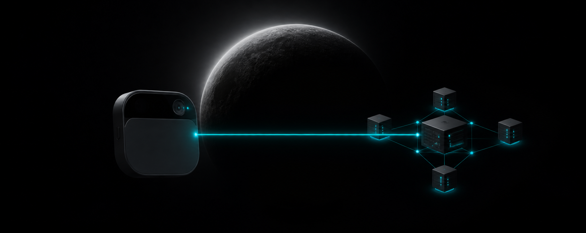
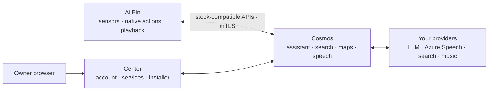
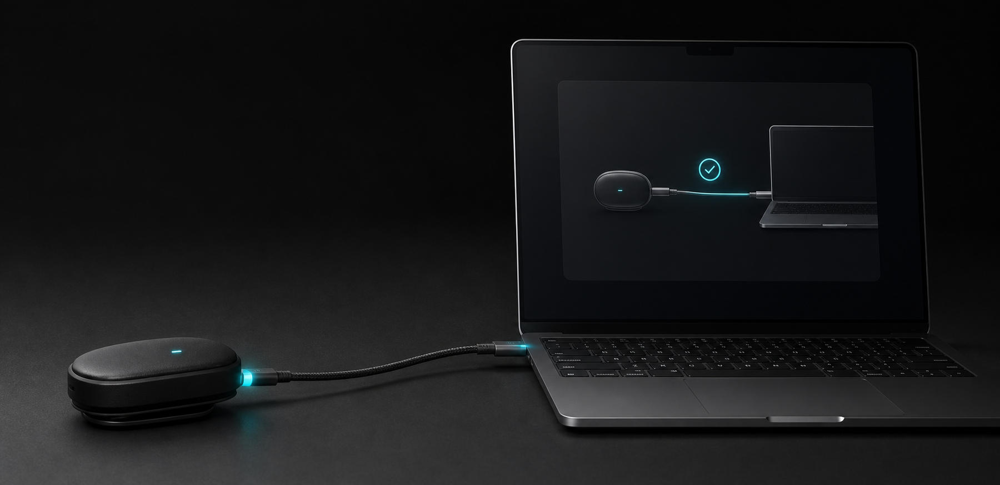

<div align="center">
  
  <h1>Ai Pin Revival</h1>
  <p><strong>Your Ai Pin. Yours again.</strong></p>
  <p>
    Keep the familiar experience. Run Center, Cosmos, and the signed five-app
    Pin runtime on infrastructure you control.
  </p>
  <p>
    <a href="https://github.com/TheAndersMadsen/ai-pin-revival/releases/latest"></a>
    <a href="https://github.com/TheAndersMadsen/ai-pin-revival/actions/workflows/ci.yml"></a>
    
    
  </p>
  <p>
    <a href="#deploy-cosmos">Deploy Cosmos</a> ·
    <a href="#connect-a-pin">Connect a Pin</a> ·
    <a href="#ai-assisted-setup">Use an AI agent</a> ·
    <a href="#development">Develop</a>
  </p>
</div>

> [!IMPORTANT]
> This is an independent community project. It is not affiliated with or
> endorsed by Humane. You are responsible for the device, server, accounts,
> credentials, and third-party services you connect.

## Choose your path

| I want to… | Start here | What happens |
| --- | --- | --- |
| **Run Cosmos** | [Deploy Cosmos](#deploy-cosmos) | Download one verified operator bundle; the server does not clone or compile this repository. |
| **Connect my Pin** | [Connect a Pin](#connect-a-pin) | Import the signed five-app release, install through Center, then activate one exact serial. |
| **Change the project** | [Development](#development) | Clone the repository and use the root `revival` CLI with external build caches. |
| **Let an agent help** | [AI-assisted setup](#ai-assisted-setup) | Give Claude, Codex, or another agent the outcome-based prompt and required inputs. |

## Architecture



| Part | Runs on | Purpose |
| --- | --- | --- |
| Center | Your server | The owner control plane: sign-in, Cosmos integration settings, music connections, Pin installer, and provisioning |
| Cosmos | Your server | The runtime authority: assistant, search, maps, speech, enrollment, media, and storage |
| Server | Ai Pin | Device-local settings, captures, diagnostics, and native action bridges; it holds no provider key |
| Hook | Ai Pin | Routes stock cloud calls only to the activated Cosmos server and fails closed before activation |

Search, maps, weather, language-model work, transcription, and speech synthesis
run in Cosmos. The Pin keeps microphone and sensor capture, cached location,
native actions, maps presentation, and audio playback close to the hardware.
Activation copies only the Cosmos endpoint, operator trust root, and that Pin's
device identity. It never copies an assistant, search, maps, or speech
credential to the device.

Cosmos sends uploaded photo thumbnails to the assistant provider you select so
Center can find visible subjects such as “cat” across the full capture library.
The resulting captions and tags stay inside Cosmos and are never returned by
the capture API; older photos are indexed in the background on first search.

The repository retains required stock `humane.*` protocol names and Android
package identities because the original software calls them byte-for-byte.
Product, deployment, configuration, and operator-facing names use Cosmos.

## Deploy Cosmos

Production supports 64-bit Ubuntu 24.04 on both `amd64` (`x86_64`) and `arm64`
(`aarch64`). Every project image in a release is published as a multi-platform,
digest-pinned manifest; this project's production deployment runs the ARM64
variant.

| Host architecture | `uname -m` | Support |
| --- | --- | --- |
| Intel/AMD 64-bit | `x86_64` | Supported |
| ARM 64-bit | `aarch64` or `arm64` | Supported |

The production host also needs:

- Node.js 22.14 or newer on the Node 22 line.
- Docker Engine and Docker Compose 2.34 or newer.
- A domain whose DNS points to the server.
- Public ports 80 and 443 available.
- A public IPv4 address when the `pin` profile is enabled.

Confirm the two architecture-sensitive prerequisites before downloading a
release:

```sh
uname -m
docker version --format '{{.Server.Version}}'
docker compose version
```

### 1. Download a verified release

Choose a version from
[GitHub Releases](https://github.com/TheAndersMadsen/ai-pin-revival/releases),
then download all three operator files from that tag:

```sh
RELEASE_VERSION=0.0.0
RELEASE_TAG="v${RELEASE_VERSION}"
RELEASE_BASE="https://github.com/TheAndersMadsen/ai-pin-revival/releases/download/${RELEASE_TAG}"

curl --fail --location --remote-name \
  "${RELEASE_BASE}/ai-pin-revival-operator-${RELEASE_VERSION}-linux.tar.gz"
curl --fail --location --remote-name \
  "${RELEASE_BASE}/ai-pin-revival-${RELEASE_VERSION}.release.json"
curl --fail --location --remote-name "${RELEASE_BASE}/SHA256SUMS"
sha256sum --check SHA256SUMS
tar -xzf "ai-pin-revival-operator-${RELEASE_VERSION}-linux.tar.gz"
cd "ai-pin-revival-operator-${RELEASE_VERSION}"
```

Replace `0.0.0` with the chosen release version. Do not skip the checksum.

### 2. Create the production configuration

```sh
./revival setup production \
  --domain center.example.com \
  --acme-email admin@example.com \
  --operator-email owner@example.com \
  --public-ip 203.0.113.10 \
  --profile pin \
  --profile search
```

The command writes configuration, secrets, certificates, and runtime data to
owner-controlled directories outside the extracted release. It prints the path
to a mode-0600 first-login file. Use that file once, sign in, then remove it.
Rerunning setup preserves existing nonblank values.

Optional profiles are `pin`, `search`, `spotify`, and `observability`. Spotify
also needs the Iroh ticket file named by `./revival setup production --help`.
The `spotify` profile owns the complete music bridge: Spotify plays natively on
the Pin, while Center keeps YouTube Music and TIDAL account state and catalog
logic. YouTube player requests and both providers' audio bytes leave through
the Pin's active Wi-Fi or LTE connection and feed the stock Music player through
an opaque loopback stream. Apple Music can be linked in Center, but cannot be
selected for playback until Apple's official Android playback runtime is
available; previews and web players are not used as a fallback.

`REVIVAL_SPOTIFY_ADAPTER_TIMEOUT_MS` remains the general control-route timeout
and defaults to 10 seconds. The YouTube Music Pin-egress playback path uses a
separate route-specific ladder: 25 seconds for the Pin provider request, 30 for
Iroh, 35 for adapter egress, 40 for Center resolution, 50 for the Pin music
gateway, and a 60-second Android read-idle timeout. The Android value limits how
long a response-body read may stay idle; it is not a strict total request
deadline. Raising the general timeout does not extend playback and should not
be used to mask a provider or Pin connectivity problem.

### 3. Deploy and verify

```sh
./revival doctor production
./revival deploy production --dry-run
./revival deploy production --confirm
./revival verify production
```

`--dry-run` changes nothing. `--confirm` pulls the release's digest-pinned OCI
application, starts it, and runs the same public verification used by
`verify production`; it does not compile source.

If GHCR packages are private, first run:

```sh
./revival registry login --username YOUR_GITHUB_USER
```

Enter a package-read token only at Docker's hidden prompt.

### 4. Configure Cosmos in Center

Sign in as the operator, then open **Settings → Services → Cosmos**. This is the
normal configuration path for every Pin-facing cloud capability:

- **Assistant:** choose an OpenAI-compatible API or a Codex subscription.
  OpenAI-compatible covers OpenRouter, OpenAI, a compatible gateway, and a
  self-hosted endpoint; enter its base URL, API key, exact model ID, reasoning
  effort, and response limit. For Codex, select **Codex subscription**, choose
  **Connect Codex**, and finish the device-code sign-in in the linked browser
  page. Cosmos runs the official Codex app server and refreshes that session.
  Its separate **Speed** selector can opt supported Codex models into Fast mode;
  Fast is about 1.5 times faster and uses more ChatGPT credits than Standard.
- **Search, maps & knowledge:** add SearXNG or SerpAPI for web results and any
  optional Perplexity, Google Maps, Pirate Weather, or Wolfram credentials.
- **Speech:** add the Azure Speech key, region, and voice.

Secret fields are never returned to the browser. A configured field says so;
leave it blank to keep the stored value or choose **Remove** to clear it. Saving
takes effect for new Cosmos requests without restarting or re-provisioning the
Pin.

Center sends settings over the private operator API to Cosmos. Cosmos stores
them in its owner-only state volume; Center does not retain a second copy and
the Pin receives none of them. Existing provider environment values are
imported only as the initial Cosmos configuration, so upgrades keep working.
The `./revival config` commands remain available for headless bootstrap and
automation, but they are not part of normal Pin setup.

## Cosmos assistant runtime

Cosmos uses one bounded foreground agent for the whole Pin, not a separate
general agent for music. Each request follows the smallest lane that can finish
it:

| Lane | Used for | Model evidence |
| --- | --- | --- |
| D1 | Closed device prerequisites and already-grounded actions, such as asking the Pin for its location before local weather | No model call is credited |
| A1 | One semantic task, direct answer, clarification, or one server lookup | Exact model provenance, step count, and terminal state are recorded |
| A2 | A compound request with multiple tool operations | The bounded run upgrades from A1 only after more than one tool call |

The run owns one 22-second absolute deadline across context loading, model
steps, server tools, and the terminal response. Legacy and bidirectional stock
transports share that budget and telemetry. A new utterance cancels the old
foreground run; no detached background agent continues after the wearer moves
on.

Tool results, saved wearer facts, and authenticated device context enter the
model as typed, untrusted data rather than system instructions. Required action
fields are enforced after the model responds. Missing data produces one short
clarifying question. Consequential actions such as placing a call require an
exact, scoped confirmation, and changing the action or its arguments invalidates
that confirmation. Reversible playback and volume controls do not gain that
extra confirmation step.

Music discovery is one specialist A1/A2 tool. It can research a subjective or
time-bound request, corroborate ambiguous rankings once, and try up to three
evidence-ordered candidates against the active provider. Only the grounded
provider result becomes a stock `PlayMusic` action. Play, pause, stop, and skip
execute on the Pin once recognized; speech recognition may still use Cosmos.

Production exposes content-free Prometheus counters for route, transport, model
use and provenance, terminal state, duration, tool outcomes, and the bounded
music-resolution stages. Wearer text, tool arguments, identity, and provider
results are never metric labels.

After deployment, run the fixed production evaluation from the extracted
operator release:

```sh
./revival eval assistant production --repeat 2
```

It exercises direct reasoning, fresh web search, compound multi-tool work, and
consequential-action confirmation through the real production Engine. Every
case must correlate its returned actions with a model-invoked run, valid model
provenance, the expected terminal state, and the Pin deadline. This is a server
acceptance check; final release acceptance still includes representative spoken
turns and device actions on a physical Pin.

### Public verification and agent discovery

Center publishes a small unauthenticated discovery surface. It contains no
wearer data and is useful for release checks, search engines, and setup agents:

| URL | Purpose |
| --- | --- |
| `/api/version` | Product, immutable release ID, and runtime environment |
| `/api/pin/releases/current` | Current verified five-APK release manifest, when imported |
| `/developers` or `/developers.md` | Deployment, CLI, API, and agent guidance |
| `/openapi.json` | Typed OpenAPI 3.1 contract for public read operations |
| `/llms.txt` | Concise when-to-use instructions and canonical links |
| `/sitemap.xml` and `/robots.txt` | Public page discovery and crawler policy |

Public information pages are server-rendered and return Markdown when requested
with `Accept: text/markdown`. Unknown paths return HTTP 404 rather than the app
shell. Public API responses include `RateLimit-Policy` and `RateLimit`; a 429
also includes `Retry-After`.

## Connect a Pin

<p align="center">
  
</p>

The installer runs in a desktop Chromium browser over HTTPS and talks directly
to the Pin through WebUSB. The APKs travel from Center to the browser and then
over the local USB cable; the production server never needs physical access to
the device.

### Before you connect

Have these ready:

- A deployed Cosmos release for which `./revival verify production` passes.
- The matching signed Pin archive imported into Center.
- Current desktop Chrome, Chromium, or Edge. The page checks both HTTPS and
  WebUSB before enabling installation.
- A known-good USB-C **data** cable connected directly to the computer when
  possible. Disconnect other Android devices while installing.
- A powered-on, unlocked Pin that has finished booting.

Only one program can own the Pin's USB ADB interface at a time. Close Android
Studio, scrcpy, phone-management tools, and terminals streaming `adb` output
before using Center. The preparation commands below deliberately stop native
ADB before the browser claims the device.

WebUSB is available only in a [secure context](https://developer.mozilla.org/en-US/docs/Web/API/WebUSB_API),
which is why production installation uses Center over HTTPS. The Linux setup
below follows Android's [official Ubuntu device guidance](https://developer.android.com/studio/run/device.html).

### 1. Import the signed Pin release

The GitHub release publishes the signed five-APK Pin set as a separate archive.
Download it from the same release as the operator bundle, then import it on the
server:

```sh
./revival pin release import ai-pin-revival-pin-YYYY-MM-DD.N.tar.gz
```

The importer validates the archive, manifest, signer receipt, package roles,
sizes, and every APK digest before making the complete release available to
Center. A partial set is never published.

### 2. Prepare Linux USB permissions

Ubuntu users should install the standard Android udev rules and join the USB
device group:

```sh
sudo apt update
sudo apt install adb android-sdk-platform-tools-common
sudo usermod -aG plugdev "$LOGNAME"
```

Log out and back in after changing the group, then verify the workstation sees
the Pin:

```sh
id -nG | tr ' ' '\n' | grep -x plugdev
lsusb
adb devices -l
```

The Pin must appear in the `device` state. `unauthorized` means the device still
needs to be unlocked or authorized; `no permissions` means the udev rule or
group has not taken effect.

<details>
<summary><strong>Linux fallback: add a device-specific udev rule</strong></summary>

Use this only when `lsusb` sees the Pin but the standard Android rules do not
grant access. Read its hexadecimal vendor and product IDs from `lsusb`, then
create `/etc/udev/rules.d/51-ai-pin.rules` with those exact lowercase values:

```udev
SUBSYSTEM=="usb", ATTR{idVendor}=="vvvv", ATTR{idProduct}=="pppp", MODE="0660", GROUP="plugdev", TAG+="uaccess"
```

Do not copy `vvvv` or `pppp` literally. Reload the rules, unplug the Pin, and
reconnect it:

```sh
sudo udevadm control --reload-rules
sudo udevadm trigger
```

</details>

macOS does not use udev rules. Windows may require a compatible Android/WinUSB
driver before a Chromium browser can claim the device.

### 3. Confirm Android finished booting

The installer waits for the same package-manager path it will use for the real
installation. You can prove that path is ready before opening Center:

```sh
adb wait-for-device
adb shell cmd package path android
```

A ready Pin prints an absolute package path such as:

```text
package:/system/framework/framework-res.apk
```

If it prints `cmd: Can't find service: package`, reboot the Pin once, leave it
powered on and unlocked, and retry after Android finishes starting. Do not begin
installation until the absolute package path appears.

Finally release the USB interface for WebUSB:

```sh
adb kill-server
```

### 4. Install from Center

1. Sign in to `https://center.example.com/settings/pin/install` in the Chromium
   browser on the computer physically connected to the Pin.
2. Select **Connect**, choose the Pin in the browser's USB chooser, and verify
   the displayed serial before continuing.
3. Review the detected current and target versions, then run the Center
   installer. Keep the tab open, the Pin unlocked, and the cable connected.
4. If the Pin reboots, wait for Center to reconnect to the same serial. Do not
   select a different device to continue a plan.

Center performs a bounded package-service readiness wait and rechecks it just
before the first mutation. If Android becomes unavailable, installation stops
before package changes begin and tells you to wait and retry.

### 5. Activate and prove the device

1. Keep the Pin connected over USB and open **Center → Settings → My Ai Pin →
   Provisioning**. If needed, choose **Connect over USB** and select the same Pin.
2. Choose **Connect this Pin to Cosmos**. Center reads the connected hardware ID,
   pairs it with your signed-in account, creates its one-time identity, installs
   the Cosmos address and trust roots, and verifies the complete activation on
   that exact device.
3. Return to **Guided setup** and choose **Check again**. When this Pin reports
   online, make one real voice request and confirm that it worked.

The **Create an activation file instead** section is a fallback for recovery or
headless activation. Normal stock-Pin setup stays in Center and does not require
native ADB commands or moving a private key by hand.

Activation stores the server hostname, device-status endpoint, trust roots, and
device identity as one transaction. Provider credentials stay in Cosmos and
are managed from Center. Installation and activation both bind to the exact
serial and plan without changing the device until explicitly confirmed.

Penumbra also rechecks the replacement-carrier LTE/VoLTE compatibility values
at boot and whenever Android reports a SIM or carrier-configuration change. If
the carrier does not publish the line's phone number, Cellular Settings reports
the validated LTE state or says that the number is unavailable; it never
invents a phone number.

## Build the Pin apps

Building signed Pin apps requires the external signing material and private
native assets already authorized for the project:

```sh
./revival pin doctor
./revival pin release build --version YYYY-MM-DD.N --version-code INTEGER
./revival pin release export --output ai-pin-revival-pin-YYYY-MM-DD.N.tar.gz
```

The pinned builder uses JDK 17, Android SDK 34, NDK r28c, Rust 1.91.1, and
external caches. It always signs and verifies installer, bootstrap, Hook,
Server, and injector as one release. The Server APK no longer embeds the old
on-device Codex executable; only the TFLite native runtime remains an external
private build input. Building never runs ADB.

## AI-assisted setup

The following prompt is intentionally outcome-based and gives Claude, Codex, or
another coding agent the constraints it needs without prescribing every shell
step. Fill in the bracketed values and run it on the target server:

```text
Set up the latest stable Ai Pin Revival release on this Ubuntu 24.04 64-bit
Linux server. It may be amd64/x86_64 or arm64/aarch64.

Outcome:
- Cosmos and Center run at https://[DOMAIN].
- The deployment reports environment "production" and one immutable release ID.
- The pin and search profiles are enabled.
- My existing external Ai Pin Revival configuration and provider credentials are
  preserved if this is an upgrade.

Inputs:
- Domain: [DOMAIN]
- ACME email: [ACME_EMAIL]
- First operator email: [OPERATOR_EMAIL]
- Public IPv4: [PUBLIC_IPV4]
- I will connect assistant, search, maps, and speech providers in Center after
  deployment. Do not ask for or place provider secrets on the Pin.

Rules:
- Read the repository README first.
- After deployment, read https://[DOMAIN]/llms.txt and use the linked developer
  index and OpenAPI document as the public machine-readable authority.
- Deploy only the checksum-verified operator archive from the latest stable
  GitHub release. Do not clone or deploy a source checkout.
- Use the bundled ./revival commands and their --help output as authority.
- Never print, log, commit, or place a secret in argv or shell history.
- Treat Center as the provider control plane and Cosmos as the runtime
  authority. Provision the Pin only with the Cosmos endpoint, trust root, and
  device identity.
- Do not add compatibility, migration, backup, or alternate deployment paths.
- Run one narrow diagnostic after a failure; fix the cause and resume.
- Ask me only for a missing input, credential, DNS change, firewall change, or
  device interaction you cannot perform.

Success evidence:
- ./revival config check passes.
- ./revival doctor production passes.
- ./revival deploy production --dry-run passes before confirmation.
- ./revival verify production passes after deployment.
- GET https://[DOMAIN]/api/version returns the expected release and
  environment "production".
- The operator can open Settings → Services → Cosmos and choose either an
  OpenAI-compatible provider or Codex subscription, plus search, maps, and
  speech settings.
- https://[DOMAIN]/llms.txt, /openapi.json, /sitemap.xml, and /developers.md
  return successful machine-readable responses.

Continue until all success evidence is green or report one exact blocker and
the command/output that proves it.
```

For a new Pin, follow with: “Download the signed Pin archive from the same
release, import it, guide me through Center's USB installer, and activate the
exact connected Pin directly in Center. Use an activation file only as a
recovery fallback.”

## Development

Clone only when changing source:

```sh
git clone https://github.com/TheAndersMadsen/ai-pin-revival.git
cd ai-pin-revival
./revival setup contributor
./revival doctor
```

Run Center with hot reload:

```sh
./revival dev center
```

Run only what your change needs:

```sh
./revival check changed
./revival check center
./revival check cosmos TEST_FILTER
./revival check platform
./revival pin check
```

For a broad change:

```sh
./revival check platform --full
./revival test
```

Dependencies and compiler output are reused from the external build directory,
so narrow reruns avoid rebuilding unrelated components. Configuration defaults
to `~/.config/ai-pin-revival`; data and caches default to
`~/.local/share/ai-pin-revival`. Successful Cosmos checks keep the eight newest
incremental variants per crate and remove superseded ones automatically, which
prevents fast local rebuilds from growing the VPS disk without bound.

## Configuration

```sh
./revival config path
./revival config list
./revival config list --group provider
./revival config get NAME
./revival config set NAME VALUE
./revival config set SECRET_NAME --stdin
./revival config check
```

Path overrides must be set before initialization:

| Variable | Default |
| --- | --- |
| `REVIVAL_CONFIG_DIR` | `~/.config/ai-pin-revival` |
| `REVIVAL_SECRETS_DIR` | `~/.config/ai-pin-revival/secrets` |
| `REVIVAL_DATA_DIR` | `~/.local/share/ai-pin-revival` |
| `REVIVAL_BUILD_DIR` | `~/.local/share/ai-pin-revival/build` |

## Troubleshooting

- **The browser has no USB chooser:** use current desktop Chrome, Chromium, or
  Edge over HTTPS; unlock the Pin; try a known-good data cable and a direct USB
  port; then recheck Linux `plugdev` and udev access above.
- **`Unable to claim interface`:** another program owns USB ADB. Close Android
  Studio, scrcpy, and Android management tools, run `adb kill-server`, unplug
  the Pin, reconnect it, and select **Connect** again.
- **`cmd: Can't find service: package`:** unlock the Pin, reboot it once, wait
  for the stock UI to settle, and require `adb shell cmd package path android`
  to print an absolute `package:/...` path before retrying. The installer makes
  no package changes while this service is unavailable.
- **The Pin reconnects as a different device:** stop. Disconnect other Android
  hardware and restart the plan against the original serial; installation and
  activation never switch serials implicitly.
- Center shows an old release or unknown environment: run
  `./revival verify production`, then inspect `https://YOUR_DOMAIN/api/version`.
  A production deployment must return `environment: "production"` and the
  release revision you deployed.
- Assistant, search, maps, or speech is unavailable: open **Settings → Services
  → Cosmos**, complete the field marked **Needs setup**, save, and retry. If the
  whole card is unavailable, run `./revival verify production`; changing these
  providers never requires a Pin reinstall or activation.
- A command is unclear: use `./revival COMMAND --help`. Help is read-only and
  states whether a command can change local, remote, or device state.

## Licensing

The Pin and injector components retain their upstream MIT licenses in
[pin/LICENSE](pin/LICENSE) and [pin/injector/LICENSE](pin/injector/LICENSE).
Vendored third-party code retains its own license files and notices.
