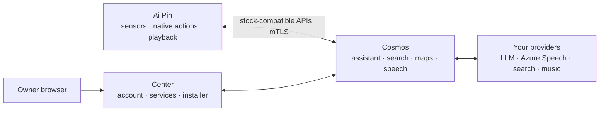
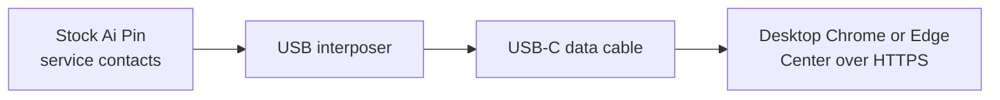

<div align="center">
  
  <h1>Ai Pin Revival</h1>
  <p><strong>Your Ai Pin. Yours again.</strong></p>
  <p>
    Keep the familiar experience. Run Center, Cosmos, and the signed five-app
    Pin runtime on infrastructure you control.
  </p>
  <p>
    <a href="https://github.com/TheAndersMadsen/ai-pin-revival/releases/latest"></a>
    <a href="https://github.com/TheAndersMadsen/ai-pin-revival/actions/workflows/ci.yml"></a>
    
    
  </p>
  <p>
    <a href="#deploy-cosmos">Deploy Cosmos</a> ·
    <a href="#connect-a-pin">Connect a Pin</a> ·
    <a href="#ai-assisted-setup">Use an AI agent</a> ·
    <a href="#development">Develop</a>
  </p>
</div>

> [!IMPORTANT]
> This is an independent community project. It is not affiliated with or
> endorsed by Humane. You are responsible for the device, server, accounts,
> credentials, and third-party services you connect.

## Choose your path

| I want to… | Start here | What happens |
| --- | --- | --- |
| **Run Cosmos** | [Deploy Cosmos](#deploy-cosmos) | Download one verified operator bundle; the server does not clone or compile this repository. |
| **Connect my Pin** | [Connect a Pin](#connect-a-pin) | Acquire the matching signed five-app release, install through Center, then activate one exact serial. |
| **Change the project** | [Development](#development) | Clone the repository and use the root `revival` CLI with external build caches. |
| **Let an agent help** | [AI-assisted setup](#ai-assisted-setup) | Give Claude, Codex, or another agent the outcome-based prompt and required inputs. |

## Architecture



| Part | Runs on | Purpose |
| --- | --- | --- |
| Center | Your server | The owner control plane: sign-in, Cosmos integration settings, music connections, Pin installer, and provisioning |
| Cosmos | Your server | The runtime authority: assistant, search, maps, speech, enrollment, media, and storage |
| Server | Ai Pin | Device-local settings, captures, diagnostics, and native action bridges; it holds no provider key |
| Hook | Ai Pin | Routes stock cloud calls only to the activated Cosmos server and fails closed before activation |

Search, maps, weather, language-model work, transcription, and speech synthesis
run in Cosmos. The Pin keeps microphone and sensor capture, cached location,
native actions, maps presentation, and audio playback close to the hardware.
Activation copies only the Cosmos endpoint, operator trust root, and that Pin's
device identity. It never copies an assistant, search, maps, or speech
credential to the device.

Cosmos sends uploaded photo thumbnails to the assistant provider you select so
Center can find visible subjects such as “cat” across the full capture library.
The resulting captions and tags stay inside Cosmos and are never returned by
the capture API; older photos are indexed in the background on first search.

The repository retains required stock `humane.*` protocol names and Android
package identities because the original software calls them byte-for-byte.
Product, deployment, configuration, and operator-facing names use Cosmos.

### Ambiance v2 work in progress

The `codex/cosmos-ambiance-v2` branch starts from the live `v0.1.108` release.
[The requirement inventory](contracts/ambiance-v2.json) pins the exact
[Ambiance v2 research draft](https://gist.githubusercontent.com/ericlewis/12e8f7d381a5d93926f4858ae2d725dc/raw/6bac46cd8251af39c40263331d7269c5e418fe8f/ambi_v2.md)
and separates its twelve invariants from Cosmos-specific product acceptance.
It tracks incomplete coverage, not passing behavior or production conformance.
Its metadata tests validate the inventory and evidence references only; the
paper's reference implementation and reported test results are unavailable for
independent reproduction.

Ambiance v2 is the target architecture, not an optional addition to the existing
assistant. Existing Cosmos behavior is not a correctness requirement where it
conflicts with that architecture. Preserve necessary stock wire/package
compatibility and verified release infrastructure; replace conflicting
orchestration, memory, permission, routing, and output paths. Temporary
coexistence on the development branch is not the release architecture: remove
bypasses and superseded control paths before deployment. Existing regression
tests prove compatibility only; paper-derived behavioral tests define
architectural acceptance.

The implementation plan keeps Cosmos as the runtime authority and thin clients
responsible for local permissions, capture, rendering, and playback evidence:

1. **Provenance — implemented in `5ea98384`.** Authentication preserves device
   evidence through the real plaintext, encrypted, and bidirectional Ai Bus
   paths. Focused transport tests and broad source checks passed for that
   increment. Actor identity and physical privacy remain unknown: preserving
   provenance is not privacy enforcement.
2. **Phase 2A: durable surface enrollment — implemented, enrollment only.** The owner explicitly
   approves the current Center browser as a shared visual surface through a
   verified bearer session, never a share token or forwarded certificate
   header. Cosmos approves the six-dimensional manifest's capability ceiling,
   owns its class-0 trust floor, and grants neither hints nor autonomy.
   Occupancy remains unknown; account ownership does not establish privacy.
   The PostgreSQL Store atomically commits each registry transition with its
   per-principal hash-chain event. Connection credentials bind the account,
   surface, and connection incarnation, with a fixed one-hour expiry separate
   from 45-second liveness. Enrollment starts hidden; hiding, leaving, or
   revoking makes the surface ineligible. Becoming visible restores only
   availability under the approved ceiling, never private-room status.
   Center exposes join, leave, revoke, and a surface list without stored
   content. Enrollment alone does not prove that a channel can render.
   PostgreSQL is the durable default; the snapshot-backed registry is unsupported
   and fails closed, while default MemoryStore is ephemeral. The current cap is
   16 active approvals, not the paper's 50-surface evaluation. This registry hash
   chain has no independent anchors, retention or privacy-filtered audit views;
   it is not yet the complete routing and policy ledger.
3. **Phase 2B: exercised Pin-to-Center presentation — next.** Join privacy
   provenance before inference or memory retrieval; connect runtime-owned
   intents to one authoritative runtime on which the stock handlers converge.
   Reuse provider adapters, not the old control path as a fallback. Filter
   eligible channels before versioned
   ranking and commit the decision durably before dispatch. Center receives
   bounded typed render commands and acknowledges after the render commits,
   binding the exact action, channel, incarnation, and content. Commit that
   acknowledgment before a controlled terminal outcome. State changes cancel
   or dismiss affected output; use a 2–5-second action timeout, not the
   heartbeat deadline. This does not prove arbitrary model prose truthful.
   Redacted logs, checkpoints, and independent anchors are required before
   claiming the full audit-ledger invariant, not merely a local hash chain.
4. **Phase 3: realtime Pin interaction.** Verify the actual stock PCM codec,
   framing, correlation, cancellation, and playback lifecycle on hardware.
   Add an explicit media contract only if the stock seam is insufficient;
   preserve stock wire identities and all five APK roles. The realtime front
   delegates bounded larger-model analysis without executor capability.
   Measure interruption against audio actually played and reject late results
   from superseded turns, rather than treating server enqueue as playback.
5. **Phase 4: thin native clients and scoped intelligence.** macOS and Android
   use the same authority protocol with native permission and lifecycle
   handling. Scope memory to the requesting origin. Earned authority requires
   calibration, counterfactual lift, coverage, and tenure evidence, not raw
   acceptance rate. Offline operation permits only preapproved none-risk
   reflexes. These clients remain part of the product goal, without blocking
   the initial Pin/Center proof.
6. **Phase 5: acceptance and release.** Exercise all twelve invariants on real
   paths, including performance, 50-surface and ablation evaluations, isolated
   database restart/failure tests, and explicit physical Pin observations.
   Deploy the authenticated signed release archive and verify the intended
   release ID with `environment: "production"`. The requested
   `cosmos.andersmadsen.dk` deployment still requires an explicit domain-identity
   decision relative to the existing Center address and physical Pin access.

Each phase has behavioral gates, not just inventory updates. Phase 2A tests deny
another account, share tokens, unsupported capabilities, stale incarnations,
and self-elevation; failed durable commits do not acknowledge success.
Actual isolated PostgreSQL tests exercised concurrent pools, reopen, and
rollback; visibility does not establish privacy. Physical devices, a real
browser session and database-server restart remain unverified. Phase 2B must reject private
output into an unknown room and hints that override eligibility, leave dropped
acknowledgments unresolved instead of guessing completion, and enforce memory
scope from the origin rather than the chosen output. Do not run these failure
tests against the production database.

The occupied-room/private-headset conflict remains unresolved and new routing
must fail closed pending an explicit policy decision. A private output never
grants private-memory access to a shared-origin request. Arbitrary model prose
is not proven universally truthful about outcomes. These gaps prevent a full
conformance claim; this branch does not change the release/deployment or
explicit physical-device confirmation requirements below.

## Deploy Cosmos

Production supports 64-bit Ubuntu 24.04 on both `amd64` (`x86_64`) and `arm64`
(`aarch64`). Every project image in a release is published as a multi-platform,
digest-pinned manifest; this project's production deployment runs the ARM64
variant.

| Host architecture | `uname -m` | Support |
| --- | --- | --- |
| Intel/AMD 64-bit | `x86_64` | Supported |
| ARM 64-bit | `aarch64` or `arm64` | Supported |

### Newcomer setup

Start with a fresh 64-bit Ubuntu 24.04 VPS with at least 8 GiB of free disk
space, point a domain at its public IP, then SSH into it as your normal
sudo-capable user and run one command:

```sh
bash <(curl -fsSL https://center.andersmadsen.dk/install.sh)
```

Do not run the whole command with `sudo`. The bootstrap asks before installing
missing host tools, uses an existing authenticated GitHub CLI session or asks
for a token with hidden input, authenticates the latest immutable release,
logs into the private container registry, and runs the complete production
journey. It asks only for the Center domain, certificate email, first owner,
public Pin IPv4, optional features, and the two explicit confirmations that
write configuration and deploy production. Tokens are not printed or placed in
arguments. The bootstrap keeps the token only in memory while Docker stores the
registry login in its standard protected credential file.

When verification passes, open the printed **Guided setup** link. Center then
walks through service accounts, the physical Pin connection, installation,
Cosmos activation, Wi-Fi or LTE, and one real voice check. A normal newcomer
does not need to copy the release-verification recipe, install Docker or Node
manually, move an Iroh ticket or private key, or run ADB commands.

The journey is safe to rerun after an interruption. A failure ends with the
stage that stopped, what may have changed, what was preserved, one focused
recovery check, and the exact safe retry command. Setup never deletes a working
configuration, server deployment, or Pin state because a later check fails.
The normal retry is the same one-line bootstrap; once the operator has been
authenticated, `./revival onboard production` is also resumable and keeps
existing nonblank configuration.

The repository and packages are currently private, so the GitHub account used
during bootstrap must have read access. That access requirement disappears if
the project artifacts are made public; the setup flow itself does not change.

<details>
<summary><strong>Manual deployment and verification reference</strong></summary>

The production host also needs:

- Node.js 22.14 or newer on the Node 22 line.
- Docker Engine and Docker Compose 2.34 or newer.
- A domain whose DNS points to the server.
- Public ports 80 and 443 available.
- A public IPv4 address when the `pin` profile is enabled.

Confirm the two architecture-sensitive prerequisites before downloading a
release:

```sh
uname -m
docker version --format '{{.Server.Version}}'
docker compose version
```

### 1. Download a verified release

Choose a version from
[GitHub Releases](https://github.com/TheAndersMadsen/ai-pin-revival/releases).
Authenticate its descriptor before trusting any download coordinate. The
following bootstrap pins Cosign itself by size and SHA-256, then binds the
proof to this repository, release workflow, and exact tag:

```sh
read -r -s -p 'GitHub token with read access: ' GH_TOKEN
export GH_TOKEN
printf '\n'
RELEASE_VERSION=0.0.0
RELEASE_TAG="v${RELEASE_VERSION}"
RELEASE_REPOSITORY="TheAndersMadsen/ai-pin-revival"
DESCRIPTOR="ai-pin-revival-${RELEASE_VERSION}.release.json"
PROOF="ai-pin-revival-${RELEASE_VERSION}.release.sigstore.json"

RELEASE_METADATA="$(mktemp)"
trap 'rm -f "$RELEASE_METADATA"' EXIT
curl --fail --proto '=https' --tlsv1.2 --max-filesize 2097152 \
  --header "Authorization: Bearer $GH_TOKEN" \
  --header 'Accept: application/vnd.github+json' \
  --header 'X-GitHub-Api-Version: 2022-11-28' \
  --output "$RELEASE_METADATA" \
  "https://api.github.com/repos/${RELEASE_REPOSITORY}/releases/tags/${RELEASE_TAG}"

download_release_asset() {
  asset_name="$1"
  maximum_size="$2"
  IFS="$(printf '\t')" read -r asset_url asset_size <<EOF
$(node --input-type=module - "$RELEASE_METADATA" "$RELEASE_REPOSITORY" "$RELEASE_TAG" "$asset_name" "$maximum_size" <<'NODE'
import { readFileSync } from 'node:fs';
const [file, repository, tag, name, maximumText] = process.argv.slice(2);
const release = JSON.parse(readFileSync(file, 'utf8'));
const maximum = Number(maximumText);
const matches = Array.isArray(release.assets)
  ? release.assets.filter((asset) => asset?.name === name)
  : [];
if (release.tag_name !== tag || release.draft !== false || matches.length !== 1) throw new Error('release metadata does not name one expected published asset');
const asset = matches[0];
const api = `https://api.github.com/repos/${repository}/releases/assets/${asset.id}`;
const browser = `https://github.com/${repository}/releases/download/${tag}/${name}`;
if (!Number.isSafeInteger(asset.id) || asset.id < 1 || !Number.isSafeInteger(asset.size) || asset.size < 1 || asset.size > maximum || asset.url !== api || asset.browser_download_url !== browser) throw new Error('release asset metadata is invalid');
console.log(`${api}\t${asset.size}`);
NODE
)
EOF
  curl --fail --location --proto '=https' --proto-redir '=https' --tlsv1.2 \
    --header "Authorization: Bearer $GH_TOKEN" \
    --header 'Accept: application/octet-stream' \
    --header 'X-GitHub-Api-Version: 2022-11-28' \
    --max-filesize "$asset_size" --output "$asset_name" "$asset_url"
  test "$(stat --format='%s' "$asset_name")" = "$asset_size"
}

download_release_asset "$DESCRIPTOR" 2097152
download_release_asset "$PROOF" 8388608

case "$(uname -m)" in
  x86_64) COSIGN_ASSET=cosign-linux-amd64; COSIGN_SIZE=141178250; COSIGN_SHA256=4629c757b7618056f8ddd7e2625ae9fdd94c0372a65049520bc7d9df9efc7f71 ;;
  aarch64|arm64) COSIGN_ASSET=cosign-linux-arm64; COSIGN_SIZE=132747403; COSIGN_SHA256=c5d324e091826b0d7a78eb16fef316450b4eb9aaec045611c08ba06f5e73220a ;;
  *) echo "unsupported host architecture" >&2; exit 1 ;;
esac
curl --fail --location --max-filesize "$COSIGN_SIZE" --output cosign \
  "https://github.com/sigstore/cosign/releases/download/v3.1.3/${COSIGN_ASSET}"
test "$(stat --format='%s' cosign)" = "$COSIGN_SIZE"
printf '%s  %s\n' "$COSIGN_SHA256" cosign | sha256sum --check --status
chmod 0700 cosign

./cosign verify-blob \
  --bundle "$PROOF" \
  --certificate-identity "https://github.com/TheAndersMadsen/ai-pin-revival/.github/workflows/release-cli.yml@refs/tags/${RELEASE_TAG}" \
  --certificate-oidc-issuer https://token.actions.githubusercontent.com \
  --certificate-github-workflow-repository TheAndersMadsen/ai-pin-revival \
  --certificate-github-workflow-name "immutable release" \
  --certificate-github-workflow-ref "refs/tags/${RELEASE_TAG}" \
  --certificate-github-workflow-trigger push \
  "$DESCRIPTOR"

OPERATOR_ARCHIVE="$(node --input-type=module - "$DESCRIPTOR" "$RELEASE_TAG" <<'NODE'
import { readFileSync } from 'node:fs';
const [file, tag] = process.argv.slice(2);
const descriptor = JSON.parse(readFileSync(file, 'utf8'));
if (descriptor.schemaVersion !== 3 || descriptor.source?.repository !== 'TheAndersMadsen/ai-pin-revival' || descriptor.source?.tag !== tag) throw new Error('verified descriptor coordinates are invalid');
const value = descriptor.operator?.archive;
if (typeof value !== 'string' || !/^[A-Za-z0-9][A-Za-z0-9._-]*$/u.test(value)) throw new Error('operator archive is invalid');
console.log(value);
NODE
)"
OPERATOR_SIZE="$(node --input-type=module - "$DESCRIPTOR" <<'NODE'
import { readFileSync } from 'node:fs';
const descriptor = JSON.parse(readFileSync(process.argv[2], 'utf8'));
if (!Number.isSafeInteger(descriptor.operator?.size) || descriptor.operator.size < 1) throw new Error('operator archive size is invalid');
console.log(descriptor.operator.size);
NODE
)"
download_release_asset "$OPERATOR_ARCHIVE" "$OPERATOR_SIZE"
test "$(stat --format='%s' "$OPERATOR_ARCHIVE")" = "$OPERATOR_SIZE"

node --input-type=module - "$DESCRIPTOR" "$OPERATOR_ARCHIVE" <<'NODE'
import { createHash } from 'node:crypto';
import { readFileSync } from 'node:fs';
const [descriptorFile, operatorFile] = process.argv.slice(2);
const descriptor = JSON.parse(readFileSync(descriptorFile, 'utf8'));
const bytes = readFileSync(operatorFile);
if (descriptor.operator?.archive !== operatorFile || bytes.length !== descriptor.operator?.size || createHash('sha256').update(bytes).digest('hex') !== descriptor.operator?.sha256) throw new Error(`${operatorFile} does not match the authenticated descriptor`);
NODE

tar -xzf "$OPERATOR_ARCHIVE"
cd "ai-pin-revival-operator-${RELEASE_VERSION}"
```

Replace `0.0.0` with the chosen release version. Do not skip the proof or the
descriptor-bound archive check. Setup acquires only that exact Pin
archive when the `pin` profile is selected.

### 2. Create the production configuration

For a fresh server, use the guided setup. It asks for the public domain,
certificate email, first owner, Pin address, and optional features, shows one
review, then writes the same production configuration as the noninteractive
command. It never deploys or changes a Pin.

```sh
./revival setup production --guided
```

For automation, pass those public values explicitly:

```sh
./revival setup production \
  --domain center.example.com \
  --acme-email admin@example.com \
  --operator-email owner@example.com \
  --public-ip 203.0.113.10 \
  --profile pin \
  --profile search \
  --profile spotify
```

The command writes configuration, secrets, certificates, and runtime data to
owner-controlled directories outside the extracted release. It prints the path
to a mode-0600 first-login file containing a direct Guided Setup sign-in URL.
Use that file once, sign in, then remove it. Rerunning setup preserves existing
nonblank values.

Optional profiles are `pin`, `search`, `spotify`, and `observability`. Center
creates the private Pin bridge identity during server setup and pairs it from
the existing “Connect this Pin to Cosmos” action; no ticket file or device ID
has to be copied by hand.
When the host cannot download the Pin asset directly, download the archive
named by the authenticated descriptor and pass it once with
`--pin-release-archive FILE`; setup applies the same size, digest, identity,
signer, and APK checks without a network fallback.
The `spotify` profile owns the complete music bridge: Spotify plays natively on
the Pin, while Center keeps YouTube Music and TIDAL account state and catalog
logic. YouTube player requests and both providers' audio bytes leave through
the Pin's active Wi-Fi or LTE connection and feed the stock Music player through
an opaque loopback stream. Apple Music can be linked in Center, but cannot be
selected for playback until Apple's official Android playback runtime is
available; previews and web players are not used as a fallback.

`REVIVAL_SPOTIFY_ADAPTER_TIMEOUT_MS` remains the general control-route timeout
and defaults to 10 seconds. The YouTube Music Pin-egress playback path uses a
separate route-specific ladder: 25 seconds for the Pin provider request, 30 for
Iroh, 35 for adapter egress, 40 for Center resolution, 50 for the Pin music
gateway, and a 60-second Android read-idle timeout. The Android value limits how
long a response-body read may stay idle; it is not a strict total request
deadline. Raising the general timeout does not extend playback and should not
be used to mask a provider or Pin connectivity problem.

### 3. Deploy and verify

```sh
./revival doctor production
./revival deploy production --dry-run
./revival deploy production --confirm
./revival verify production
```

`--dry-run` changes nothing. `--confirm` pulls the release's digest-pinned OCI
application, starts it, and runs the same public verification used by
`verify production`; it does not compile source.

If GHCR packages are private, first run:

```sh
./revival registry login --username YOUR_GITHUB_USER
```

Enter a package-read token only at Docker's hidden prompt.

</details>

### Configure services in Center

Sign in as the operator, then open **Settings → Services → Cosmos**. This is the
normal configuration path for every Pin-facing cloud capability:

- **Assistant:** choose an OpenAI-compatible API or a Codex subscription.
  OpenAI-compatible covers OpenRouter, OpenAI, a compatible gateway, and a
  self-hosted endpoint; enter its base URL, API key, exact model ID, reasoning
  effort, and response limit. For Codex, select **Codex subscription**, choose
  **Connect Codex**, and finish the device-code sign-in in the linked browser
  page. Cosmos runs the official Codex app server and refreshes that session.
  Its separate **Speed** selector can opt supported Codex models into Fast mode;
  Fast is about 1.5 times faster and uses more ChatGPT credits than Standard.
- **Search, maps & knowledge:** add SearXNG or SerpAPI for web results and any
  optional Perplexity, Google Maps, Pirate Weather, or Wolfram credentials.
- **Speech:** add the Azure Speech key, region, and voice.
- **Food & nutrition:** optionally connect and test an Open Food Facts account.
  Cosmos keeps both credentials private and sends them only in the provider's
  POST login body. Nutrition reads remain keyless, as required by the Open Food
  Facts API, and use its dedicated search and product endpoints.

Secret fields are never returned to the browser. A configured field says so;
leave it blank to keep the stored value or choose **Remove** to clear it. Saving
takes effect for new Cosmos requests without restarting or re-provisioning the
Pin.

Center sends settings over the private operator API to Cosmos. Cosmos stores
them in its owner-only state volume; Center does not retain a second copy and
the Pin receives none of them. Existing provider environment values are
imported only as the initial Cosmos configuration, so upgrades keep working.
The `./revival config` commands remain available for headless bootstrap and
automation, but they are not part of normal Pin setup.

## Cosmos assistant runtime

Cosmos uses one bounded foreground agent for the whole Pin, not a separate
general agent for music. Each request follows the smallest lane that can finish
it:

| Lane | Used for | Model evidence |
| --- | --- | --- |
| D1 | Closed device prerequisites and already-grounded actions, such as asking the Pin for its location before local weather | No model call is credited |
| A1 | One semantic task, direct answer, clarification, or one server lookup | Exact model provenance, step count, and terminal state are recorded |
| A2 | A compound request with multiple tool operations | The bounded run upgrades from A1 only after more than one tool call |

The run owns one 70-second absolute deadline across context loading, model
steps, server tools, and the terminal response. Individual model steps remain
bounded at 20 seconds. The signed Hook raises the inspected stock Ai Bus ceiling
from 25 to 90 seconds, so the agent keeps twenty seconds of delivery margin.
Legacy and bidirectional stock transports share that budget and telemetry. A
new utterance cancels the old foreground run; no detached background agent
continues after the wearer moves on.

Tool results, saved wearer facts, and authenticated device context enter the
model as typed, untrusted data rather than system instructions. Required action
fields are enforced after the model responds. Missing data produces one short
clarifying question. Consequential actions such as placing a call require an
exact, scoped confirmation, and changing the action or its arguments invalidates
that confirmation. Reversible playback and volume controls do not gain that
extra confirmation step.

Before an unlocked music lookup or weather request, the stock loading surface
may show and speak one closed category cue such as “Finding music” or “Checking
the weather.” This classification is deterministic and content-free; it does
not claim a model call. Direct playback controls, unclassified requests, and
locked requests stay silent, and physical verification records that
deterministic or lock-policy provenance explicitly.

Notes created on the Pin and facts explicitly saved by the assistant remain
wearer-scoped in Cosmos. “Show my notes” reads the authenticated wearer’s five
most recent notes; it never substitutes activity history or a generic answer,
and an unreadable encrypted note is reported as unreadable rather than absent.

Music discovery is one specialist A1/A2 tool. For a ranked, subjective, or
time-bound request, the foreground agent uses one research call: the configured
answer engine when available, otherwise web search, to identify an exact title
and artist. An information-only question ends there without contacting the
wearer's provider. An explicit
playback request then verifies that exact candidate against the active provider;
only the grounded provider result becomes a stock `PlayMusic` action. The model
chooses this path for requests such as “play the most popular song by Drake”;
no artist-only shortcut selects the provider's first row, and provider
verification never repeats the research step. If the first researched candidate
is absent from the active provider but the same research named a different exact
candidate, the agent may verify that second candidate once; title and artist
guards remain unchanged. Play, pause, stop, and skip
execute on the Pin once recognized; speech recognition may still use Cosmos.

Navigation requests first obtain the Pin's current location, then use the
configured places and directions backends to return bounded, spoken route
guidance. Explicit walking, driving, and cycling requests retain that travel
mode through provider resolution. The recovered stock System Navigation app has no dispatchable action
for starting a continuous turn-by-turn session, so Cosmos reports directions
without claiming that live navigation has started.

Production exposes content-free Prometheus counters for route, transport, model
use and provenance, terminal state, duration, tool outcomes, and the bounded
music-resolution stages. Wearer text, tool arguments, identity, and provider
results are never metric labels.

After deployment, run the fixed production evaluation from the extracted
operator release:

```sh
./revival eval assistant production --repeat 2
```

It exercises direct reasoning, fresh web search, compound multi-tool work, and
consequential-action confirmation through the real production Engine. It also
simulates an unlocked Pin request for read-only status, location, nutrition, and
world-clock routing; returned device actions are inspected but never
dispatched. Every case must correlate its returned actions with the expected
model or deterministic run, exact stock arguments, terminal state, and Pin
deadline. This is a server acceptance check; final release acceptance still
includes representative spoken turns and device actions on a physical Pin.
To rerun one failed case without repeating the whole matrix, pass its reported
ID with `--case ID`.

### Public verification and agent discovery

Center publishes a small unauthenticated discovery surface. It contains no
wearer data and is useful for release checks, search engines, and setup agents:

| URL | Purpose |
| --- | --- |
| `/api/version` | Product, immutable release ID, and runtime environment |
| `/api/pin/releases/current` | Current verified five-APK release manifest, when active |
| `/developers` or `/developers.md` | Deployment, CLI, API, and agent guidance |
| `/openapi.json` | Typed OpenAPI 3.1 contract for public read operations |
| `/llms.txt` | Concise when-to-use instructions and canonical links |
| `/sitemap.xml` and `/robots.txt` | Public page discovery and crawler policy |

Public information pages are server-rendered and return Markdown when requested
with `Accept: text/markdown`. Unknown paths return HTTP 404 rather than the app
shell. Public API responses include `RateLimit-Policy` and `RateLimit`; a 429
also includes `Retry-After`.

## Connect a Pin



The installer runs in a desktop Chromium browser over HTTPS and talks directly
to the Pin through WebUSB. The APKs travel from Center to the browser and then
over the local USB cable; the production server never needs physical access to
the device.

### 1. Prepare and connect

The normal path stays in **Center → Settings → My Ai Pin → Guided setup**. Have
these ready:

- A compatible Ai Pin USB interposer. A stock Pin exposes its USB service
  contacts beneath the small moon sticker rather than through a USB-C socket;
  follow the maintained [interposer guide](https://github.com/PenumbraOS/interposer)
  and its illustrated [stock-Pin preparation](https://github.com/PenumbraOS/interposer/blob/master/preparation.md)
  before connecting it.
- Current desktop Chrome, Chromium, or Edge. The page checks both HTTPS and
  WebUSB before enabling installation.
- A known-good USB-C **data** cable between the interposer and computer,
  connected directly when possible. Disconnect other Android devices while installing.
- A powered-on, unlocked Pin that has finished booting.

Follow the illustrated preparation, place the Pin on the interposer, open
Guided setup in desktop Chrome or Edge, choose **Connection help** if needed,
then choose **Connect over USB**. Center checks the browser, exact device,
signed release, package service, installed applications, and activation state
itself. Continue only against the serial Center displays.

<details>
<summary><strong>Troubleshooting only: Linux USB, release, and ADB checks</strong></summary>

Only one program can own the Pin's USB ADB interface at a time. Close Android
Studio, scrcpy, phone-management tools, and terminals streaming `adb` output
before using Center. The preparation commands below deliberately stop native
ADB before the browser claims the device.

WebUSB is available only in a [secure context](https://developer.mozilla.org/en-US/docs/Web/API/WebUSB_API),
which is why production installation uses Center over HTTPS. The Linux setup
below follows Android's [official Ubuntu device guidance](https://developer.android.com/studio/run/device.html).

### 1. Verify the matching signed Pin release

`./revival setup production --profile pin ...` downloads the exact signed
five-APK archive named by the verified operator release. It checks the
descriptor-bound byte size and SHA-256, internal release ID and version,
manifest digest, signer receipts, package roles, and every APK digest before
publishing it to Center. Confirm the release remains compatible with:

```sh
./revival pin release acquire --check
```

It never searches a release page or chooses the first matching filename. A
different valid Pin release blocks setup and deployment before either can mix
server and device releases. For an offline host, pass the exact archive once
with `./revival pin release acquire --archive FILE`; the same binding and
verification rules apply. A partial set is never published.

### 2. Prepare Linux USB permissions

Ubuntu users should install the standard Android udev rules and join the USB
device group:

```sh
sudo apt update
sudo apt install adb android-sdk-platform-tools-common
sudo usermod -aG plugdev "$LOGNAME"
```

Log out and back in after changing the group, then verify the workstation sees
the Pin:

```sh
id -nG | tr ' ' '\n' | grep -x plugdev
lsusb
adb devices -l
```

The Pin must appear in the `device` state. `unauthorized` means the device still
needs to be unlocked or authorized; `no permissions` means the udev rule or
group has not taken effect.

<details>
<summary><strong>Linux fallback: add a device-specific udev rule</strong></summary>

Use this only when `lsusb` sees the Pin but the standard Android rules do not
grant access. Read its hexadecimal vendor and product IDs from `lsusb`, then
create `/etc/udev/rules.d/51-ai-pin.rules` with those exact lowercase values:

```udev
SUBSYSTEM=="usb", ATTR{idVendor}=="vvvv", ATTR{idProduct}=="pppp", MODE="0660", GROUP="plugdev", TAG+="uaccess"
```

Do not copy `vvvv` or `pppp` literally. Reload the rules, unplug the Pin, and
reconnect it:

```sh
sudo udevadm control --reload-rules
sudo udevadm trigger
```

</details>

macOS does not use udev rules. Windows may require a compatible Android/WinUSB
driver before a Chromium browser can claim the device.

### 3. Confirm Android finished booting

The installer waits for the same package-manager path it will use for the real
installation. You can prove that path is ready before opening Center:

```sh
adb wait-for-device
adb shell cmd package path android
```

A ready Pin prints an absolute package path such as:

```text
package:/system/framework/framework-res.apk
```

If it prints `cmd: Can't find service: package`, reboot the Pin once, leave it
powered on and unlocked, and retry after Android finishes starting. Do not begin
installation until the absolute package path appears.

Finally release the USB interface for WebUSB:

```sh
adb kill-server
```

</details>

### 2. Install from Center

1. Sign in to `https://center.example.com/settings/pin/install` in the Chromium
   browser on the computer physically connected to the Pin.
2. Select **Connect**, choose the Pin in the browser's USB chooser, and verify
   the displayed serial before continuing.
3. Review the detected current and target versions, then run the Center
   installer. Keep the tab open, the Pin unlocked, and the cable connected.
4. If the Pin reboots, wait for Center to reconnect to the same serial. Do not
   select a different device to continue a plan.

Center performs a bounded package-service readiness wait and rechecks it just
before the first mutation. If Android becomes unavailable, installation stops
before package changes begin and tells you to wait and retry.

### 3. Activate and prove the device

1. Keep the Pin connected over USB and open **Center → Settings → My Ai Pin →
   Provisioning**. If needed, choose **Connect over USB** and select the same Pin.
2. Choose **Connect this Pin to Cosmos**. Center reads the connected hardware ID,
   pairs it with your signed-in account, creates its one-time identity, installs
   the Cosmos address and trust roots, and verifies the complete activation on
   that exact device.
3. Return to **Guided setup** and choose **Check again**. When this Pin reports
   online, make one real voice request, verify its microphone, speaker, and
   gesture response, then choose **Confirm microphone, speaker & gesture**.

That final human observation is stored on the Pin, not in browser storage. It
is bound to the Pin's hardware serial, the authenticated release ID, the
locally installed runtime version, and the active Cosmos edge. Guided setup
reads it back from the Pin; changing any of those identities requires a fresh
physical confirmation.

The **Create an activation file instead** section is a fallback for recovery or
headless activation. Normal stock-Pin setup stays in Center and does not require
native ADB commands or moving a private key by hand.

Activation stores the server hostname, device-status endpoint, trust roots, and
device identity as one transaction. Provider credentials stay in Cosmos and
are managed from Center. Installation and activation both bind to the exact
serial and plan without changing the device until explicitly confirmed.

Penumbra also rechecks the replacement-carrier LTE/VoLTE compatibility values
at boot and whenever Android reports a SIM or carrier-configuration change. If
the carrier does not publish the line's phone number, Cellular Settings reports
the validated LTE state or says that the number is unavailable; it never
invents a phone number.

## Build the Pin apps

Building signed Pin apps requires the external signing material and private
native assets already authorized for the project:

```sh
./revival pin doctor
./revival pin release build --version YYYY-MM-DD.N --version-code INTEGER
./revival pin release export --output ai-pin-revival-pin-YYYY-MM-DD.N.tar.gz
```

The pinned builder uses JDK 17, Android SDK 34, NDK r28c, Rust 1.91.1, and
external caches. It always signs and verifies installer, bootstrap, Hook,
Server, and injector as one release. The Server APK no longer embeds the old
on-device Codex executable; only the TFLite native runtime remains an external
private build input. Building never runs ADB.

Operator releases republish the exact pinned signed Pin archive until the Pin
version is deliberately advanced. A server-only release therefore does not
replace an unchanged Pin build or require the wearer to reinstall it.

## AI-assisted setup

The following prompt is intentionally outcome-based and gives Claude, Codex, or
another coding agent the constraints it needs without prescribing every shell
step. Fill in the bracketed values and run it on the target server:

```text
Set up the latest stable Ai Pin Revival release on this Ubuntu 24.04 64-bit
Linux server. It may be amd64/x86_64 or arm64/aarch64.

Outcome:
- Cosmos and Center run at https://[DOMAIN].
- The deployment reports environment "production" and one immutable release ID.
- The pin and search profiles are enabled.
- My existing external Ai Pin Revival configuration and provider credentials are
  preserved if this is an upgrade.

Inputs:
- Domain: [DOMAIN]
- ACME email: [ACME_EMAIL]
- First operator email: [OPERATOR_EMAIL]
- Public IPv4: [PUBLIC_IPV4]
- I will connect assistant, search, maps, and speech providers in Center after
  deployment. Do not ask for or place provider secrets on the Pin.

Rules:
- Read the repository README first.
- After deployment, read https://[DOMAIN]/llms.txt and use the linked developer
  index and OpenAPI document as the public machine-readable authority.
- Deploy only the checksum-verified operator archive from the latest stable
  GitHub release. Do not clone or deploy a source checkout.
- Use the bundled ./revival commands and their --help output as authority.
- Never print, log, commit, or place a secret in argv or shell history.
- Treat Center as the provider control plane and Cosmos as the runtime
  authority. Provision the Pin only with the Cosmos endpoint, trust root, and
  device identity.
- Do not add compatibility, migration, backup, or alternate deployment paths.
- Run one narrow diagnostic after a failure; fix the cause and resume.
- Ask me only for a missing input, credential, DNS change, firewall change, or
  device interaction you cannot perform.

Success evidence:
- ./revival config check passes.
- ./revival doctor production passes.
- ./revival deploy production --dry-run passes before confirmation.
- ./revival verify production passes after deployment.
- GET https://[DOMAIN]/api/version returns the expected release and
  environment "production".
- The operator can open Settings → Services → Cosmos and choose either an
  OpenAI-compatible provider or Codex subscription, plus search, maps, and
  speech settings.
- https://[DOMAIN]/llms.txt, /openapi.json, /sitemap.xml, and /developers.md
  return successful machine-readable responses.

Continue until all success evidence is green or report one exact blocker and
the command/output that proves it.
```

For a new Pin, follow with: “Verify the descriptor-bound Pin release acquired
by production setup, guide me through Center's USB installer, and activate the
exact connected Pin directly in Center. Use an activation file only as a
recovery fallback.”

## Development

Clone only when changing source:

```sh
git clone https://github.com/TheAndersMadsen/ai-pin-revival.git
cd ai-pin-revival
./revival setup contributor
./revival doctor
```

Run Center with hot reload:

```sh
./revival dev center
```

Run only what your change needs:

```sh
./revival check changed
./revival check center
./revival check cosmos TEST_FILTER
./revival check platform
./revival pin check
```

For a broad change:

```sh
./revival check platform --full
./revival test
```

Dependencies and compiler output are reused from the external build directory,
so narrow reruns avoid rebuilding unrelated components. Configuration defaults
to `~/.config/ai-pin-revival`; data and caches default to
`~/.local/share/ai-pin-revival`. Successful Cosmos checks keep the eight newest
incremental variants per crate and remove superseded ones automatically, which
prevents fast local rebuilds from growing the VPS disk without bound.

## Configuration

```sh
./revival config path
./revival config list
./revival config list --group provider
./revival config get NAME
./revival config set NAME VALUE
./revival config set SECRET_NAME --stdin
./revival config check
```

Path overrides must be set before initialization:

| Variable | Default |
| --- | --- |
| `REVIVAL_CONFIG_DIR` | `~/.config/ai-pin-revival` |
| `REVIVAL_SECRETS_DIR` | `~/.config/ai-pin-revival/secrets` |
| `REVIVAL_DATA_DIR` | `~/.local/share/ai-pin-revival` |
| `REVIVAL_BUILD_DIR` | `~/.local/share/ai-pin-revival/build` |

## Troubleshooting

- **Bootstrap rejects the host:** use 64-bit Ubuntu 24.04 on `amd64/x86_64` or
  `arm64/aarch64`, a normal sudo-capable account, and at least 8 GiB of free
  disk space. The bootstrap does not claim support for other distributions or
  remove an existing incompatible Docker package because either could damage
  unrelated workloads.
- **GitHub returns 401, 403, or 404, or GHCR login fails:** authorize a token
  for this private repository with repository read and package read access,
  then rerun the same bootstrap command. Token entry stays hidden; failed
  downloads are discarded.
- **Production preflight reports ports 80 or 443 in use:** stop or reconfigure
  the named Nginx, Apache, Caddy, or other Compose service, then run
  `./revival doctor production`. Ai Pin Revival never stops an unrelated
  listener automatically.
- **Production preflight reports that the domain does not resolve:** create or
  correct the domain's public A or AAAA record, wait for DNS propagation, and
  rerun `./revival doctor production`. Keep public ports 80 and 443 open so
  Traefik can obtain and renew the certificate.
- **Deployment or verification stops:** first run
  `./revival verify production`. If it still fails, keep the printed service
  diagnostic and rerun `./revival onboard production`; existing configuration
  and successfully started containers are preserved.
- **The browser has no USB chooser:** use current desktop Chrome, Chromium, or
  Edge over HTTPS; unlock the Pin; try a known-good data cable and a direct USB
  port; then recheck Linux `plugdev` and udev access above.
- **`Unable to claim interface`:** another program owns USB ADB. Close Android
  Studio, scrcpy, and Android management tools, run `adb kill-server`, unplug
  the Pin, reconnect it, and select **Connect** again.
- **`cmd: Can't find service: package`:** unlock the Pin, reboot it once, wait
  for the stock UI to settle, and require `adb shell cmd package path android`
  to print an absolute `package:/...` path before retrying. The installer makes
  no package changes while this service is unavailable.
- **The Pin reconnects as a different device:** stop. Disconnect other Android
  hardware and restart the plan against the original serial; installation and
  activation never switch serials implicitly.
- Center shows an old release or unknown environment: run
  `./revival verify production`, then inspect `https://YOUR_DOMAIN/api/version`.
  A production deployment must return `environment: "production"` and the
  release revision you deployed.
- Assistant, search, maps, or speech is unavailable: open **Settings → Services
  → Cosmos**, complete the field marked **Needs setup**, save, and retry. If the
  whole card is unavailable, run `./revival verify production`; changing these
  providers never requires a Pin reinstall or activation.
- A command is unclear: use `./revival COMMAND --help`. Help is read-only and
  states whether a command can change local, remote, or device state.

## Licensing

The Pin and injector components retain their upstream MIT licenses in
[pin/LICENSE](pin/LICENSE) and [pin/injector/LICENSE](pin/injector/LICENSE).
Vendored third-party code retains its own license files and notices.
