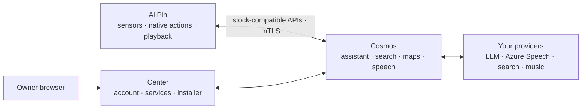
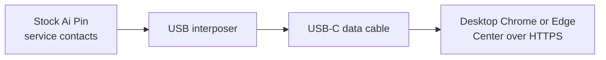

<div align="center">
  
  <h1>Ai Pin Revival</h1>
  <p><strong>Your Ai Pin. Yours again.</strong></p>
  <p>
    Keep the familiar experience. Run Center, Cosmos, and the signed five-app
    Pin runtime on infrastructure you control.
  </p>
  <p>
    <a href="https://github.com/TheAndersMadsen/ai-pin-revival/releases/latest"></a>
    <a href="https://github.com/TheAndersMadsen/ai-pin-revival/actions/workflows/ci.yml"></a>
    
    
  </p>
  <p>
    <a href="#deploy-cosmos">Deploy Cosmos</a> ·
    <a href="#connect-a-pin">Connect a Pin</a> ·
    <a href="#ai-assisted-setup">Use an AI agent</a> ·
    <a href="#development">Develop</a>
  </p>
</div>

> [!IMPORTANT]
> This is an independent community project. It is not affiliated with or
> endorsed by Humane. You are responsible for the device, server, accounts,
> credentials, and third-party services you connect.

## Choose your path

| I want to… | Start here | What happens |
| --- | --- | --- |
| **Run Cosmos** | [Deploy Cosmos](#deploy-cosmos) | Download one verified operator bundle; the server does not clone or compile this repository. |
| **Connect my Pin** | [Connect a Pin](#connect-a-pin) | Acquire the matching signed five-app release, install through Center, then activate one exact serial. |
| **Change the project** | [Development](#development) | Clone the repository and use the root `revival` CLI with external build caches. |
| **Let an agent help** | [AI-assisted setup](#ai-assisted-setup) | Give Claude, Codex, or another agent the outcome-based prompt and required inputs. |

## Architecture



| Part | Runs on | Purpose |
| --- | --- | --- |
| Center | Your server | The owner control plane: sign-in, Cosmos integration settings, music connections, Pin installer, and provisioning |
| Cosmos | Your server | The runtime authority: assistant, search, maps, speech, enrollment, media, and storage |
| Server | Ai Pin | Device-local settings, captures, diagnostics, and native action bridges; it holds no provider key |
| Hook | Ai Pin | Routes stock cloud calls only to the activated Cosmos server and fails closed before activation |

Search, maps, weather, language-model work, transcription, and speech synthesis
run in Cosmos. The Pin keeps microphone and sensor capture, cached location,
native actions, maps presentation, and audio playback close to the hardware.
Activation copies only the Cosmos endpoint, operator trust root, and that Pin's
device identity. It never copies an assistant, search, maps, or speech
credential to the device.

On the Ambiance development branch, photo selection uses local image-quality
scoring. Provider-based captions and visual indexing are disabled until an
origin-scoped runtime semantic service can mediate access.

The repository retains required stock `humane.*` protocol names and Android
package identities because the original software calls them byte-for-byte.
Product, deployment, configuration, and operator-facing names use Cosmos.

### Ambiance v2 work in progress

The `codex/ambiance-v2-production` branch continues the Cosmos-first work from
`codex/cosmos-ambiance-v2`, whose release baseline is `v0.1.108`.
[The requirement inventory](contracts/ambiance-v2.json) pins the exact
[Ambiance v2 research draft](https://gist.githubusercontent.com/ericlewis/12e8f7d381a5d93926f4858ae2d725dc/raw/6bac46cd8251af39c40263331d7269c5e418fe8f/ambi_v2.md)
and separates its twelve invariants from Cosmos-specific product acceptance.
It tracks incomplete coverage, not passing behavior or production conformance.
Its metadata tests validate the inventory and evidence references only; the
paper's reference implementation and reported test results are unavailable for
independent reproduction.

Ambiance v2 is the target architecture, not an optional addition to the existing
assistant. Existing Cosmos behavior is not a correctness requirement where it
conflicts with that architecture. Preserve necessary stock wire/package
compatibility and verified release infrastructure; replace conflicting
orchestration, memory, permission, routing, and output paths. Temporary
coexistence on the development branch is not the release architecture: remove
bypasses and superseded control paths before deployment. Existing regression
tests prove compatibility only; paper-derived behavioral tests define
architectural acceptance.

The implementation plan keeps Cosmos as the runtime authority and thin clients
responsible for local permissions, capture, rendering, and playback evidence:

1. **Provenance — implemented in `5ea98384`.** Authentication preserves device
   evidence through the real plaintext, encrypted, and bidirectional Ai Bus
   paths. Focused transport tests and broad source checks passed for that
   increment. Actor identity and physical privacy remain unknown: preserving
   provenance is not privacy enforcement.
2. **Phase 2A: durable surface enrollment — implemented, enrollment only.** The owner explicitly
   approves the current Center browser as a shared visual surface through a
   verified bearer session, never a share token or forwarded certificate
   header. Cosmos approves the six-dimensional manifest's capability ceiling,
   owns its class-0 trust floor, and grants neither hints nor autonomy.
   Occupancy remains unknown; account ownership does not establish privacy.
   The PostgreSQL Store atomically commits each registry transition with its
   per-principal hash-chain event. Connection credentials bind the account,
   surface, and connection incarnation, with a fixed one-hour expiry separate
   from 45-second liveness. Enrollment starts hidden; hiding, leaving, or
   revoking makes the surface ineligible. Becoming visible restores only
   availability under the approved ceiling, never private-room status.
   Center exposes join, leave, revoke, and a surface list without stored
   content. Enrollment alone does not prove that a channel can render.
   PostgreSQL is the durable default; the snapshot-backed registry is unsupported
   and fails closed, while default MemoryStore is ephemeral. The current cap is
   16 active approvals, not the paper's 50-surface evaluation. This registry hash
   chain has no independent anchors, retention or privacy-filtered audit views;
   it is not yet the complete routing and policy ledger.
3. **Phase 2B: shared runtime and Pin-to-Center presentation — implemented foundation; not realtime acceptance.**
   Plaintext, encrypted, bidirectional and stateful stock text converge on
   AmbianceRuntime and the Store's durable, per-principal transitions. The
   runtime admits the authenticated, currently paired and explicitly approved
   Pin before cognition. Browser text requires the verified owner and that
   approved browser's current connection capability. Actor identity and physical
   occupancy remain unknown. Cognition receives only current text and a bounded
   informational-intent schema; client history, prompts, observations, location,
   saved notes and photos are not loaded into its context. There is no
   unconfigured demo model fallback.
   Informational speech and visual text cards are the initial none-risk intents.
   The model proposes shape and content; policy joins provenance over
   public/shared_room/near_user/private/sensitive, permits only monotone model
   raises, filters eligibility, and commits routing before dispatch. Conservative
   text checks can raise privacy but do not prove arbitrary text is correctly
   classified. Unknown rooms cannot carry content above shared_room.
   Center receives bounded room commands and acknowledges the exact action, generation,
   channel, incarnation and content digest after render commit. A Pin display
   request waits for the committed acknowledgment, including a logged repair's
   exact lineage, before emitting the controlled display-confirmation sentence.
   Direct stock speech is recorded with playback unknown; enqueue is not played
   audio. Each dispatch has a three-second deadline, distinct from liveness;
   the stock display wait has a thirty-second overall bound.
   Worker/generation fencing rejects stale results. A replacement text request
   on the same admitted stream cancels only that stream's pending fence; it is
   not inferred speaker identity or a learned preference. Unsupported stock
   observations grant no playback evidence or authority.
   Regression coverage exercises the real AuthLayer and all three stock
   transport encoders, zero private-store reads before inference, invalid typed
   intents, late-model revocation and exact browser acknowledgment gating.
   Terminal action payloads are cleared from runtime projections in the same
   transaction as cancellation or unknown outcome; an acknowledged browser card
   remains only while its display is valid, for at most 60 seconds. An indexed
   cleanup queue runs on startup and once per second, processing at most 128
   due principals per tick. Expired content is cleared on the next successful
   bounded sweep; backlogs, database outages, or a stopped runtime delay cleanup.
   Digests and outcome metadata remain in the ledger. This is logical payload
   cleanup, not secure erasure of database storage or complete audit retention.
   Passing evidence must come from the current focused and broad checks.
   Center now uses room RPC; the stock speech seam, media and native-client
   paths still require work before deployment acceptance.
   Runtime dispatch also records a bounded fingerprint of each outgoing speech
   action. During the next 30 seconds, a matching normalized Pin utterance from
   the same principal is rejected and logged before cognition. Case, punctuation
   and whitespace are ignored; partial or fuzzy matches are not inferred. The
   guard survives turn replacement and database reopen, holds at most 32 entries,
   and expires through the existing cleanup queue. Typed browser requests remain
   eligible. This bounds one stock self-echo path; it does not attest a live
   microphone, actual playback duration, acoustic echo cancellation or actor
   identity. Speech outcome remains unknown.
4. **Phase 3: realtime Pin interaction and semantic services.** Integrate
   self-hosted LiveKit rooms, participant identity, media tracks, text streams
   and RPC as the paper's shared substrate. Bind cognition dispatch to the
   admitted origin, issue role-scoped permissions, prohibit unrestricted media
   subscriptions, and verify boot epochs, monotonic sequences and idempotency.
   Replace interim polling coordination rather than retaining parallel
   authoritative buses. Implement and test stock PCM framing, correlation and
   interruption while preserving wire identities and all five APK roles;
   reserve actual hardware playback verification for final Pin acceptance.
   The realtime text front can request one bounded larger-model analysis with
   no executor capability. Cosmos commits the analysis start before provider
   input, retains the original current request, checks the current turn and
   origin while awaiting inference, and commits the result's privacy join before
   routing. The tool-free HTTP analysis adapter uses the selected
   OpenAI-compatible assistant provider; Codex analysis remains unavailable
   until its app-server tool boundary is established. Service completion does
   not establish rendering or playback.
   Implement typed runtime semantic services for completion, child-agent
   experiences, device actions, composition, translation, vision, food and
   music work; the current unsupported responses are temporary safeguards,
   not completed product behavior. Consequential actions require exact
   action-instance/epoch-bound, single-use expiring confirmation grants that
   restart invalidates. Add origin-scoped retrieval with the memory/service
   provenance join before inference; selecting a private output must never
   grant a shared-origin request private-memory clearance.
5. **Phase 4: thin native clients and scoped intelligence.** macOS and Android
   use the same runtime with native permission and lifecycle handling. Complete
   the versioned scorer and per-term ablations, calibration, counterfactual
   lift, coverage and tenure evidence for earned authority. Add privacy-filtered
   audit views, redaction/retention, signed checkpoints and independent anchors.
   Offline operation permits only preapproved none-risk reflexes. Native clients,
   audio and hardware acceptance remain outstanding. Measure the paper's
   expression-under-200-ms, median durable-routing-under-50-ms and median
   voice-first-dispatch-under-2.5-s gates; current coordination tests prove none of them.
6. **Phase 5: staged acceptance and release.** Implement and verify Cosmos, then
   Center, and deploy the verified server release without waiting for physical
   Pin access. Build and test macOS and Android clients against the same
   contracts. Exercise all twelve invariants on real paths, including
   performance, 50-surface and ablation evaluations and isolated database
   restart/failure tests; physical Pin connection, installation and observations
   come last and remain required for final end-to-end conformance.
   Deploy the authenticated signed operator archive and verify the intended
   release ID with `environment: "production"` at the existing production
   origin, `https://center.andersmadsen.dk/`. No new domain or identity migration
   is requested. An unchanged descriptor-bound five-APK set may remain in a
   server-only release until the native Pin version deliberately advances;
   server deployment does not require a new Pin archive or installation.

Each phase has behavioral gates, not just inventory updates. Phase 2A tests deny
another account, share tokens, unsupported capabilities, stale incarnations,
and self-elevation; failed durable commits do not acknowledge success.
Actual isolated PostgreSQL tests exercised concurrent pools, reopen, and
rollback; visibility does not establish privacy. Physical devices, a real
browser session and database-server restart remain unverified. Phase 2B must reject private
output into an unknown room and hints that override eligibility, leave dropped
acknowledgments unresolved instead of guessing completion, and enforce memory
scope from the origin rather than the chosen output. Do not run these failure
tests against the production database.

The occupied-room/private-headset conflict remains unresolved and new routing
must fail closed pending an explicit policy decision. A private output never
grants private-memory access to a shared-origin request. Arbitrary model prose
is not proven universally truthful about outcomes. These gaps prevent a full
conformance claim; this branch does not change the release/deployment or
explicit physical-device confirmation requirements below.

### Cosmos-first realtime implementation gates

Foundation commit `7c4f9e0f` passed broad checks and is not deployed. The next
implementation order is Cosmos backend, then Center, then their verified server
deployment; native macOS and Android clients use the same contracts. Physical
Pin connection, installation and hardware acceptance come last, not as a blocker
to server deployment or native client builds. These gates refine the
[requirement inventory](contracts/ambiance-v2.json), not its conformance status.
The direct Rust LiveKit SDK is selected for the isolated transport adapter;
cognition framework compositions below remain research candidates.
Self-hosted LiveKit is our implementation direction; the paper
uses it as a research substrate, not a proposed production dependency, and its
transport-agnostic semantics make LiveKit neither proof nor a universal
requirement of conformance. The paper also permits cognition and runtime in one
process with separate interfaces: management-secret isolation for separate jobs
is our least-privilege deployment gate, not a claim that process separation is
required or that the stock SDK alone violates the paper.

1. **Cosmos transport.** The `cosmos-rtc` crate owns the direct Rust LiveKit SDK
   0.8.4/API 0.6.4 at
   [pinned revision `2d9f01ab`](https://github.com/livekit/rust-sdks/tree/2d9f01ab1e933a86a8a5c53805ee29ee58b9be1b).
   The published crates match this revision's source. The adapter uses ordinary
   participants, bounded attributed RPCs, no automatic media subscriptions and
   coordination-only tokens. It has a localhost integration test for real RPC
   delivery, payload bounds and disconnect state. The Cosmos application now
   exposes authenticated browser room bootstrap, sequenced input/control RPCs
   and targeted visual delivery through the
   [room contract](contracts/ambiance-room.json). Center now uses the room client,
   and canonical Compose includes the self-hosted service. External-network and
   media acceptance remain separate gates.
   `cosmos/native/webrtc.json` pins native bytes; acquisition verifies the
   archive and every extracted compiler input. The patched upstream build helper
   cannot download native code. Linux uses Clang 21/lld with target GLib headers
   in the pinned Trixie builder. macOS links Objective-C categories for both
   ordinary binaries and doctests. A token-only cognition process remains a
   candidate. Stock Node
   Agents 1.8.0 at
   [pinned revision `67fa5e03`](https://github.com/livekit/agents-js/tree/67fa5e031e324cef8fccaf4939960542c7ed6d5e)
   forwards the SFU management signing secret to jobs; `workerToken` does not
   replace it. Do not adopt that job boundary. An ordinary-participant RTC
   connection with public `AgentSession` and explicit `RoomIO` needs original
   source and typecheck proof, without shared admin credentials or a speculative
   proxy.
2. **Cosmos admission and coordination.** Keep Rust Store and its ledger as the
   single authority. Bind roles, current enrollment and incarnation, device boot
   epoch and monotonic sequence; explicitly authorize publication and
   subscription. Never infer the origin from the first room participant. Prove
   actual sender identity: SDK-attributed identities alone are insufficient with
   AGENT publishers. Verify the transport identity design before freezing its
   schema. Verify room permissions and ordinary delivery using an isolated
   local SFU and synthetic accounts, never production credentials or media.
   The durable browser ingress foundation now binds one boot epoch to an
   approved incarnation. Input sequence advancement and turn admission commit
   together. Exact retries return a prior admission without resuming cognition;
   changed retries and old sequences fail. At most 32 digested admission records
   remain for five minutes, and expiry never resets the sequence high-water
   mark. Rebooting into a new epoch requires renewed owner connection approval.
   The same durable cursor now covers acknowledgments, cancellation and state
   messages. Visibility and its sequence commit with the registry transition;
   an old cancellation cannot affect a replacement turn. Exact acknowledgment
   retries still require a current eligible render. PostgreSQL notifications
   wake dispatch after commit, including changes from another Store instance;
   notification loss closes the room. Runtime RPC receipt remains separate from
   the committed DOM acknowledgment. Actual localhost tests cover admission
   during a paused model, replay, caller attribution, disconnect cancellation,
   render receipt versus acknowledgment and hide-to-clear delivery. Isolated
   PostgreSQL tests cover rollback, competing workers, reopen and notification
   delivery; these are backend tests, not real Center or Pin acceptance.
   LiveKit 1.13.6 batches non-media participant updates for up to three seconds
   ([server source](https://github.com/livekit/livekit/blob/v1.13.6/pkg/rtc/room.go)).
   Admission therefore waits for the actual peer session; a runtime reconnect
   is permanently fenced. There is one connected coordinator per principal,
   not an active-active room deployment. The new endpoint uses `COSMOS_RTC_URL`,
   `COSMOS_RTC_PUBLIC_URL`, `COSMOS_RTC_API_KEY` and `COSMOS_RTC_API_SECRET`;
   the signing secret remains in Cosmos. Production Compose wiring is implemented;
   the new release has not been deployed.
3. **Cosmos realtime cognition.** Do not automatically forward
   `RoomSessionTransport`, control events or history. Manual `RoomIO` with a
   no-room `AgentSession.start` is a public-composition candidate requiring
   proof. Models propose typed semantic intents only. Before any proposal,
   require matching final `response.done` with completed status, exact IDs,
   bounded payloads and the current generation. Cancelled, expired or replaced
   turns cannot execute. Scope input audio and retention to the admitted origin;
   choosing private output grants no private memory. Native audio enqueue proves
   neither playback nor an action outcome. Verify recorded provider-protocol
   fixtures offline first; actual provider access and billing are a separate
   gate.
4. **Cosmos services and policy.** Rebuild completion, child agents, composition,
   translation, vision/food, music and native actions through typed services.
   Require exact single-use action/epoch grants, provenance-scoped retrieval,
   the full scorer and earned-authority evidence, durable repair, audit
   anchoring and retention, and behavioral coverage of all twelve invariants.
   Never restore old bypasses merely to pass compatibility tests.
5. **Center after Cosmos — room client implemented, full application acceptance pending.**
   One SDK adapter owns LiveKit imports. Authenticated bootstrap binds runtime
   identity and boot epoch; one bounded sequence covers input, visibility,
   cancellation and acknowledgment, including exact retries after a lost reply.
   Runtime stamps deduplicate frames; a clear or hidden page cannot revive a
   retired card. React's actual text commit remains the acknowledgment boundary.
   Hiding clears output immediately and sends state through the room; losing the
   connection or unmounting fences further work and requires new approval.
   HTTP poll/input/ack/state routes are removed. Owner approvals, provider
   configuration and redacted status remain HTTP operations. Focused rendered
   tests exercise these boundaries. The actual browser SDK and native Rust SDK
   exchanged attributed RPC in both directions through the isolated local SFU;
   native disconnect fenced the browser. The fixture waits for both replies
   before shutdown, so closing a peer cannot race an outstanding response.
   Run `center/verify/browser-room-live.mjs` with Node 22, an isolated SFU JSON
   and the verified native WebRTC directory, then open its loopback URL. This
   transport check does not prove the full authenticated UI or media playback.
6. **Thin native clients and Pin preparation.** Deliver macOS and Android
   clients using the shared contracts, with local permissions, capture,
   rendering/playback, lifecycle handling, protected credential storage,
   packaging and tests. Their builds do not require a connected Pin. Preserve
   stock Pin identifiers and all five APK roles while implementing native
   capture/framing, scoped room join, interruption, disconnect/reboot behavior
   and offline none-risk reflex limits. Physical Pin connection and installation
   happen last, require an exact serial and explicit confirmation, and must
   verify observed playback; simulations are not hardware evidence.
7. **Server/client release, then final hardware acceptance.** After Cosmos and
   Center implementation and verification, produce both architecture server
   images and the authenticated operator archive. Keep the exact signed,
   descriptor-bound five-APK set unchanged for server-only releases until the
   native Pin version deliberately advances; do not require a new Pin archive
   or installation to deploy the server. Extend preflight and
   verification for media routing, ICE and TURN without inventing a DNS migration
   or a conflicting port-443 binding. Deploy only that archive, never a checkout,
   to the existing `https://center.andersmadsen.dk/` origin. Require the intended
   release ID and `environment: "production"` and real browser evidence for
   server acceptance. Verify and package the thin native clients separately.
   Physical Pin evidence comes last, together with remaining end-to-end and
   measured paper latency, 50-surface and ablation gates for final conformance.
   Hardware absence does not block an otherwise verified server deployment;
   incomplete backend behavior still does. Unresolved paper conflicts and
   missing physical evidence explicitly block a 100% conformance claim.

### Native audio transport — implementation gate

The pinned Rust SDK supports a small manual-PCM extension to `cosmos-rtc`:
publish an authorized source, push bounded frames, subscribe to one authorized
track, and interrupt its generation. Keep SDK objects inside the adapter and
device permission, capture, audio focus and speaker queues inside each client.
The current adapter carries coordination only and discards media events; this
source audit does not establish implemented audio transport or hardware playback.

| Operation | Exact API at revision `2d9f01ab` |
| --- | --- |
| Publish | `NativeAudioSource::new(options, rate, channels, queue_ms)`, `LocalAudioTrack::create_audio_track(name, RtcAudioSource::Native(source))`, then `LocalParticipant::publish_track(LocalTrack::Audio(track), TrackPublishOptions { source: TrackSource::Microphone, ..Default::default() })` |
| Push PCM | `NativeAudioSource::capture_frame(&AudioFrame).await`; `clear_buffer()` clears its sender buffer |
| Limit recipients | `LocalParticipant::set_track_subscription_permissions(false, Vec<ParticipantTrackPermission>)`; each permission has `participant_identity`, `allow_all: false`, and exact `allowed_track_sids` |
| Select reception | Keep `RoomOptions::auto_subscribe = false`; call `RemoteTrackPublication::set_subscribed(true)` for the admitted publication and verify `RoomEvent::TrackSubscribed { participant, publication, track }` |
| Receive PCM | `NativeAudioStream::with_options(track.rtc_track(), rate, channels, NativeAudioStreamOptions { queue_size_frames: Some(positive_bound) })` yields owned `AudioFrame<'static>` values |
| End transport | `set_subscribed(false)`, `NativeAudioStream::close()`, and `LocalParticipant::unpublish_track(&track_sid).await`; unpublish takes one argument in this revision |

See the pinned [publication and recipient APIs](https://github.com/livekit/rust-sdks/blob/2d9f01ab1e933a86a8a5c53805ee29ee58b9be1b/livekit/src/room/participant/local_participant.rs#L358),
[subscription implementation](https://github.com/livekit/rust-sdks/blob/2d9f01ab1e933a86a8a5c53805ee29ee58b9be1b/livekit/src/room/publication/remote.rs#L236),
and [PCM stream API](https://github.com/livekit/rust-sdks/blob/2d9f01ab1e933a86a8a5c53805ee29ee58b9be1b/libwebrtc/src/audio_stream.rs#L33).

Keep coordination tokens media-disabled. A separate admitted audio role needs
explicit [`can_subscribe` and `can_publish_sources` grants](https://github.com/livekit/rust-sdks/blob/2d9f01ab1e933a86a8a5c53805ee29ee58b9be1b/livekit-token/src/access_token.rs#L64); the latter supersedes
`can_publish`, and source labels describe publication classes rather than prove
physical microphone origin. The SDK initially permits every subscriber: set
deny-all before publishing, then allow the granted recipient and returned track
SID. Permission/subscription methods send signaling requests; their return is
not an SFU enforcement acknowledgment. Verify initial denial and revocation in
the isolated room. [Server permission checks](https://github.com/livekit/livekit/blob/v1.13.6/pkg/rtc/uptrackmanager.go#L359)
apply to ordinary participants; [egress/recorder participants bypass them](https://github.com/livekit/livekit/blob/v1.13.6/pkg/rtc/room.go#L2205).
Keep `recorder`, room administration and management credentials out of clients.
The server-side API 0.6.4 exposes
[`RoomClient::update_participant(room, identity, UpdateParticipantOptions)`](https://github.com/livekit/rust-sdks/blob/2d9f01ab1e933a86a8a5c53805ee29ee58b9be1b/livekit-api/src/services/room.rs#L376)
for live permission changes and `update_subscriptions(room, identity,
track_sids, subscribe)` for explicit server control. These require room-admin
authority held by Cosmos; token expiry alone is not live media revocation.

`update_subscriptions` changes requested state, not authorization: the normal
[subscription path still checks `CanSubscribe`](https://github.com/livekit/livekit/blob/v1.13.6/pkg/rtc/subscriptionmanager.go#L751).
The receiver grant has no exact-track allowlist, and an ordinary publisher can
replace its own [recipient policy through signaling](https://github.com/livekit/livekit/blob/v1.13.6/pkg/rtc/signalling/signalhandler.go#L101).
Cosmos therefore cannot make a client-owned microphone's recipient list a
runtime-enforced boundary inside a multiparty media room. Keep the shared
coordination room media-disabled and isolate media in one two-party room per
client incarnation: that client and trusted Cosmos, with room-scoped tokens.
Cosmos publishes only currently granted output there, using a fresh track per
generation and retiring it on cancellation. These transport rooms belong to
the same logical Ambiance session; they do not create separate policy or memory
authorities. This is our transport adaptation to the paper's privacy invariants,
not its literal single-room topology. Server API success does not establish
media delivery or a durable receiver allowlist.

Use a fixed initial speech profile of 48 kHz, mono, signed 16-bit interleaved
PCM in 10 ms frames: 480 samples, 960 bytes. Convert device formats explicitly;
validate frame lengths before the FFI boundary. [`AudioFrame`](https://github.com/livekit/rust-sdks/blob/2d9f01ab1e933a86a8a5c53805ee29ee58b9be1b/libwebrtc/src/audio_frame.rs#L18)
holds `Cow<[i16]>`; borrowed input must remain valid until capture completes,
while received frames copy the native callback into owned storage. A zero
source queue requires exactly 10 ms frames and caller pacing. A positive queue
must be a multiple of 10 ms; the [native implementation](https://github.com/livekit/rust-sdks/blob/2d9f01ab1e933a86a8a5c53805ee29ee58b9be1b/webrtc-sys/src/audio_track.cpp#L147)
can buffer twice that configured duration. Capture completion signals buffer
capacity, not complete transmission. The receive queue defaults to ten roughly
10 ms frames and drops oldest frames on overflow; `Some(0)` means unbounded.

Media attribution comes from the [authenticated publishing connection](https://github.com/livekit/livekit/blob/v1.13.6/pkg/rtc/participant.go#L3503)
and the SDK's [participant/track association](https://github.com/livekit/rust-sdks/blob/2d9f01ab1e933a86a8a5c53805ee29ee58b9be1b/livekit/src/room/mod.rs#L1312).
Carry publisher identity, participant SID and track SID alongside the authorized
origin, boot epoch and generation. PCM itself contains no identity, timestamp or
generation. Bind each output generation to a fresh publication SID before
accepting its frames; delayed frames from a retired SID remain retired. This
attributes the transport publisher, not the person whose voice is present.

Interruption first fences the generation and stops its producer, then clears
the sender buffer, unsubscribes/closes the receiver, and stops/flushes the device
output queue. Serialize producer cancellation with clearing: a pending
multi-chunk capture can otherwise refill a cleared buffer. Closing the
[native stream](https://github.com/livekit/rust-sdks/blob/2d9f01ab1e933a86a8a5c53805ee29ee58b9be1b/libwebrtc/src/native/audio_stream.rs#L64)
removes its sink and clears queued frames; it cannot retract samples already
sent to a speaker. Mute/unpublish also does not stop an independently owned
microphone. Preserve the adapter's permanent disconnect fence because the SDK
can automatically republish tracks with new SIDs during reconnect.

The SDK's [PlatformAudio](https://github.com/livekit/rust-sdks/blob/2d9f01ab1e933a86a8a5c53805ee29ee58b9be1b/livekit/src/platform_audio/mod.rs#L432)
enables shared process-wide recording and playout. Manual PCM keeps those
lifecycles explicit for macOS, Linux, Android/Shield and the Pin. Android still
needs JVM initialization; the platform-audio option additionally needs the
application context and OS-controlled routing. Prove bounded synthetic PCM
delivery, denied subscriptions, recipient revocation, interruption, overflow
and reconnect fencing on the local SFU first. OS permission behavior, audio
focus, echo control, device routing and observed playback remain per-device
acceptance; no physical device or external provider was used for this audit.

### LiveKit production topology — acceptance pending

The canonical single-node design keeps Traefik on ports 80/443 and the existing
`center.andersmadsen.dk` origin. LiveKit 1.13.6 uses the pinned multiarch image
`livekit/livekit-server@sha256:e37d68f172556d02aa77968b9fc55ef481468c0315fa38e4fa6c56ce72e3a815`;
its image index includes Linux amd64 and arm64. This is deployment design and
local evidence, not a claim that the new server release is live.

Cosmos connects internally to `ws://livekit:7880`; clients receive
`wss://center.andersmadsen.dk/livekit`, without a trailing slash or `/rtc` suffix.
The [pinned Rust SDK](https://github.com/livekit/rust-sdks/blob/2d9f01ab1e933a86a8a5c53805ee29ee58b9be1b/livekit-api/src/signal_client/mod.rs)
and [JavaScript 2.22.2](https://github.com/livekit/client-sdk-js/blob/v2.22.2/src/api/utils.ts)
append `/rtc` or `/rtc/v1`, followed by `/validate` for connection diagnostics.
Traefik strips exactly `/livekit` before forwarding HTTP/WebSocket traffic;
the [server registers both protocol versions](https://github.com/livekit/livekit/blob/v1.13.6/pkg/service/rtcservice.go).
Rust preserves a trailing empty path segment, so `/livekit/` would produce a
double slash. JavaScript normalizes that case; use the same unambiguous base URL.

Center retains `connect-src 'self'`: [CSP3](https://w3c.github.io/webappsec-csp/#match-url-to-source-expression)
and the checked [Chromium 153](https://github.com/chromium/chromium/blob/153.0.8010.12/third_party/blink/renderer/core/frame/csp/csp_source_test.cc#L377),
[Firefox 155](https://hg.mozilla.org/releases/mozilla-release/file/FIREFOX_155_0_1_RELEASE/dom/security/nsCSPUtils.cpp#l555)
and [WebKit](https://github.com/WebKit/WebKit/blob/WebKit-7622.2.11.14.6/Source/WebCore/page/csp/ContentSecurityPolicySource.cpp#L52)
implementations permit HTTPS to same-host WSS on port 443. This is source and
upstream-test evidence; full production-browser acceptance remains required.
The browser client currently accepts text only; its microphone permission policy
must be deliberately updated when browser audio capture is implemented.

| Traffic | Canonical route |
| --- | --- |
| Signaling | HTTPS/WSS 443 through Traefik to internal LiveKit TCP 7880 |
| Direct WebRTC | Host TCP 7881 and UDP 7882 mapped to the same container ports |
| Embedded TURN | Host UDP 3478 mapped to container UDP 3478 |

[UDP mux configuration](https://github.com/livekit/livekit/blob/v1.13.6/config-sample.yaml)
uses `rtc.udp_port: 7882` with no ICE port range. `use_external_ip: true` discovers
the public address through STUN at startup; it requires working outbound UDP.
`advertise_internal_ip: true` retains private candidates for Cosmos on the
shared Docker network, as implemented by the [pinned transport library](https://github.com/livekit/mediatransportutil/blob/f234b534b095/pkg/rtcconfig/webrtc_config.go).
`enable_loopback_candidate` concerns loopback addresses, not adjacent containers.
STUN discovery does not prove inbound reachability, NAT hairpin behavior or
recovery after a public-IP change. Actual WebRTC bridge and external-network tests remain.

Embedded TURN uses `tls_port: 0` for this increment. Despite the sample config's
wording, [1.13.6 advertises TURN/TLS on port 443](https://github.com/livekit/livekit/blob/v1.13.6/pkg/service/roommanager.go#L1068)
regardless of its listening port; placing TLS termination on 5349 is insufficient.
Networks that permit only TCP 443 remain unsupported until a working TURN/TLS
route is implemented and tested. A `stun.turn` ALPN match has not been established
for both stock browser and native clients; do not infer TURN from absent ALPN.

The operator generates configuration outside the archive/checkout in its
mode-0700 directory and mounts only the required file read-only into LiveKit.
`--config /etc/livekit/config.yaml` puts a path, not signing credentials, in argv;
[the server accepts YAML with a `keys` map](https://github.com/livekit/livekit/blob/v1.13.6/pkg/config/config.go).
The mounted file's readability must match the unprivileged container UID.
Traefik access logs explicitly drop query parameters using
`accessLog.fields.queryParameters.defaultMode: drop`: [its logger](https://github.com/traefik/traefik/blob/v3.6.25/pkg/middlewares/accesslog/logger.go#L223)
otherwise includes query-carried credentials in `RequestPath` by default.

[LiveKit's readiness check](https://github.com/livekit/livekit/blob/v1.13.6/pkg/service/server.go#L406)
is `GET /` on port 7880: 200 with `OK`, or 406 when node statistics are stale.
The pinned ARM64 image was locally checked for `/livekit-server` version 1.13.6
and `/bin/busybox wget`; its local root endpoint returned `OK`. This does not
establish RPC delivery, media connectivity or TURN operation. The opt-in
`platform/deploy/acceptance/rtc-deployment.test.mjs` separately starts the
canonical unprivileged service with generated configuration and the actual
Traefik image. It verifies root health through `/livekit/`, authenticated
WebSocket signaling, rejected invalid credentials, and absence of synthetic
join credentials from proxy logs. Its proxy uses loopback HTTP in place of
public TLS/ACME; it does not establish WebRTC connectivity.
Run it with `REVIVAL_TEST_RTC_DEPLOYMENT=1 node --test
platform/deploy/acceptance/rtc-deployment.test.mjs` using Node 22 and the local
Docker context (`REVIVAL_TEST_DOCKER_CONTEXT` defaults to `desktop-linux`).
Before server acceptance, verify both SDKs through the real prefix, internal
Cosmos peers, external direct UDP/TCP and forced TURN/UDP, token expiry and
disconnects, and absence of synthetic credentials from logs. Production still
consumes the authenticated operator archive and verifies its exact release ID.

### Companion device targets — planned

The owner's target devices are a MacBook Pro M5 Pro, an Omarchy Linux PC, a
Pixel 10 Pro and an NVIDIA Shield 4K TV Pro, alongside the Ai Pin. Build thin
macOS, Linux, Android and Android TV clients against the same runtime contract.
Each device needs separate owner approval and honest local permission,
availability and playback reporting. Installable packages and actual device
checks remain deliverables; the browser and synthetic clients do not establish
native support. For Omarchy, verify the installed compositor and its microphone
and screen-sharing permission paths before selecting the native capture APIs.

### Shield playback context — planned

The NVIDIA Shield 4K TV Pro is a planned Android thin client, not a verified
release artifact. [NVIDIA lists Android TV 11](https://www.nvidia.com/en-us/shield/shield-tv-pro/)
for Shield TV Pro; the installed firmware and all five app versions still need
device verification. The intended flow is owner approval in Center, explicit
local media access on Shield, then questions through the Ai Pin using eligible,
fresh playback context in Cosmos. The Shield holds no model credentials.

Start with read-only [Android media sessions](https://developer.android.com/reference/android/media/session/MediaSessionManager#getActiveSessions(android.content.ComponentName)).
Cross-app access requires an enabled notification listener; the alternative
`MEDIA_CONTENT_CONTROL` permission is [signature/privileged](https://android.googlesource.com/platform/frameworks/base/+/refs/heads/android11-release/core/res/AndroidManifest.xml).
Verify an owner-mediated permission flow on NVIDIA's firmware: the upstream
[Android 11 TV settings manifest](https://android.googlesource.com/platform/packages/apps/TvSettings/+/refs/heads/android11-release/Settings/AndroidManifest.xml)
does not declare the notification-listener settings action. If access cannot be
granted, report unavailable; do not assume a phone's settings screen exists or
silently require root. Notification access must not export unrelated notifications.

Use allowlisted app packages and [MediaController callbacks](https://developer.android.com/reference/android/media/session/MediaController)
to report only published title, media ID, artist, duration and playback state.
Episode/season fields require actual app evidence; absent metadata stays unknown.
[Position, speed and last-update time](https://developer.android.com/reference/android/media/session/PlaybackState)
permit a labelled playback estimate, not proof of the current video frame.
Bind observations to the approved device, incarnation, boot epoch, sequence and
media session, with bounded age and payloads. Clear current context on session
loss, permission revocation or disconnect; preserve missing, stale and ambiguous
states. A priority-ordered session list does not prove which app is on screen.

| App | Evidence and implementation boundary |
| --- | --- |
| YouTube | Probe the installed TV app's media-session fields. The [IFrame API](https://developers.google.com/youtube/iframe_api_reference) observes its own embedded player, not the separate TV app. Official [caption download](https://developers.google.com/youtube/v3/docs/captions/download) requires permission to edit the video; arbitrary transcripts are not assumed available. |
| Stremio | Probe the built-in player and each selected external player separately. Its [add-on protocol](https://github.com/Stremio/stremio-addon-sdk/blob/master/docs/protocol.md) supplies catalog, metadata, streams and subtitles, not a live playback-state subscription. [Season/episode metadata](https://github.com/Stremio/stremio-addon-sdk/blob/master/docs/api/responses/meta.md) alone does not establish what is playing. |
| TV2 Play | No supported cross-app playback contract has been verified. Test published channel/title, episode, live/on-demand state and position; expose only observed fields. |
| Netflix | No supported cross-app playback contract has been verified. Test published title/episode, state and position; do not infer access to video frames or dialogue. |
| Spotify | Its OAuth [playback-state API](https://developer.spotify.com/documentation/web-api/reference/get-information-about-the-users-current-playback) exposes track/episode, progress and active device. Account playback is not proof of Shield playback; device binding, app access and applicable terms must be verified. |

[Spotify's policy](https://developer.spotify.com/policy) prohibits ingesting Spotify
Content into AI models and voice-assistant control integrations; its
[terms include metadata in Spotify Content](https://developer.spotify.com/terms).
Keep Spotify-derived data outside model input, retrieval and analysis. A
deterministic status display with attribution/link-back is a candidate requiring
implementation review, not an established permission for Ai Pin voice integration.
Android metadata is not an alternative route around the same restrictions.

Title-based questions can use verified, permitted context and identified sources;
"who is in this scene?" requires separately available scene evidence.
[Screen capture requires user consent](https://developer.android.com/media/grow/media-projection),
[secure windows restrict capture](https://developer.android.com/security/fraud-prevention/activities),
and [audio capture depends on the playing app's policy](https://developer.android.com/media/platform/av-capture).
Do not bypass protected output or assume a transcript from a title and timestamp.
Cosmos joins this shared-room context with the request's provenance; an approved
Shield does not establish occupancy, speaker identity or private-memory access.

Acceptance requires real Shield checks of all five apps: grant/revoke access,
pause/seek, ads, live streams, episode changes, competing sessions, external
players, sleep/reboot and network loss. Any later playback controls need the
runtime's action authorization and observed state changes; sending a command
does not prove success. Client build tests and mock metadata cannot replace
these checks or final Ai Pin microphone/playback acceptance.

## Deploy Cosmos

Production supports 64-bit Ubuntu 24.04 on both `amd64` (`x86_64`) and `arm64`
(`aarch64`). Every project image in a release is published as a multi-platform,
digest-pinned manifest; this project's production deployment runs the ARM64
variant.

| Host architecture | `uname -m` | Support |
| --- | --- | --- |
| Intel/AMD 64-bit | `x86_64` | Supported |
| ARM 64-bit | `aarch64` or `arm64` | Supported |

### Newcomer setup

Start with a fresh 64-bit Ubuntu 24.04 VPS with at least 8 GiB of free disk
space, point a domain at its public IP, then SSH into it as your normal
sudo-capable user and run one command:

```sh
bash <(curl -fsSL https://center.andersmadsen.dk/install.sh)
```

Do not run the whole command with `sudo`. The bootstrap asks before installing
missing host tools, uses an existing authenticated GitHub CLI session or asks
for a token with hidden input, authenticates the latest immutable release,
logs into the private container registry, and runs the complete production
journey. It asks only for the Center domain, certificate email, first owner,
public Pin IPv4, optional features, and the two explicit confirmations that
write configuration and deploy production. Tokens are not printed or placed in
arguments. The bootstrap keeps the token only in memory while Docker stores the
registry login in its standard protected credential file.

When verification passes, open the printed **Guided setup** link. Center then
walks through service accounts, the physical Pin connection, installation,
Cosmos activation, Wi-Fi or LTE, and one real voice check. A normal newcomer
does not need to copy the release-verification recipe, install Docker or Node
manually, move an Iroh ticket or private key, or run ADB commands.

The journey is safe to rerun after an interruption. A failure ends with the
stage that stopped, what may have changed, what was preserved, one focused
recovery check, and the exact safe retry command. Setup never deletes a working
configuration, server deployment, or Pin state because a later check fails.
The normal retry is the same one-line bootstrap; once the operator has been
authenticated, `./revival onboard production` is also resumable and keeps
existing nonblank configuration.

The repository and packages are currently private, so the GitHub account used
during bootstrap must have read access. That access requirement disappears if
the project artifacts are made public; the setup flow itself does not change.

<details>
<summary><strong>Manual deployment and verification reference</strong></summary>

The production host also needs:

- Node.js 22.14 or newer on the Node 22 line.
- Docker Engine and Docker Compose 2.34 or newer.
- A domain whose DNS points to the server.
- Public ports 80 and 443 available.
- A public IPv4 address when the `pin` profile is enabled.

Confirm the two architecture-sensitive prerequisites before downloading a
release:

```sh
uname -m
docker version --format '{{.Server.Version}}'
docker compose version
```

### 1. Download a verified release

Choose a version from
[GitHub Releases](https://github.com/TheAndersMadsen/ai-pin-revival/releases).
Authenticate its descriptor before trusting any download coordinate. The
following bootstrap pins Cosign itself by size and SHA-256, then binds the
proof to this repository, release workflow, and exact tag:

```sh
read -r -s -p 'GitHub token with read access: ' GH_TOKEN
export GH_TOKEN
printf '\n'
RELEASE_VERSION=0.0.0
RELEASE_TAG="v${RELEASE_VERSION}"
RELEASE_REPOSITORY="TheAndersMadsen/ai-pin-revival"
DESCRIPTOR="ai-pin-revival-${RELEASE_VERSION}.release.json"
PROOF="ai-pin-revival-${RELEASE_VERSION}.release.sigstore.json"

RELEASE_METADATA="$(mktemp)"
trap 'rm -f "$RELEASE_METADATA"' EXIT
curl --fail --proto '=https' --tlsv1.2 --max-filesize 2097152 \
  --header "Authorization: Bearer $GH_TOKEN" \
  --header 'Accept: application/vnd.github+json' \
  --header 'X-GitHub-Api-Version: 2022-11-28' \
  --output "$RELEASE_METADATA" \
  "https://api.github.com/repos/${RELEASE_REPOSITORY}/releases/tags/${RELEASE_TAG}"

download_release_asset() {
  asset_name="$1"
  maximum_size="$2"
  IFS="$(printf '\t')" read -r asset_url asset_size <<EOF
$(node --input-type=module - "$RELEASE_METADATA" "$RELEASE_REPOSITORY" "$RELEASE_TAG" "$asset_name" "$maximum_size" <<'NODE'
import { readFileSync } from 'node:fs';
const [file, repository, tag, name, maximumText] = process.argv.slice(2);
const release = JSON.parse(readFileSync(file, 'utf8'));
const maximum = Number(maximumText);
const matches = Array.isArray(release.assets)
  ? release.assets.filter((asset) => asset?.name === name)
  : [];
if (release.tag_name !== tag || release.draft !== false || matches.length !== 1) throw new Error('release metadata does not name one expected published asset');
const asset = matches[0];
const api = `https://api.github.com/repos/${repository}/releases/assets/${asset.id}`;
const browser = `https://github.com/${repository}/releases/download/${tag}/${name}`;
if (!Number.isSafeInteger(asset.id) || asset.id < 1 || !Number.isSafeInteger(asset.size) || asset.size < 1 || asset.size > maximum || asset.url !== api || asset.browser_download_url !== browser) throw new Error('release asset metadata is invalid');
console.log(`${api}\t${asset.size}`);
NODE
)
EOF
  curl --fail --location --proto '=https' --proto-redir '=https' --tlsv1.2 \
    --header "Authorization: Bearer $GH_TOKEN" \
    --header 'Accept: application/octet-stream' \
    --header 'X-GitHub-Api-Version: 2022-11-28' \
    --max-filesize "$asset_size" --output "$asset_name" "$asset_url"
  test "$(stat --format='%s' "$asset_name")" = "$asset_size"
}

download_release_asset "$DESCRIPTOR" 2097152
download_release_asset "$PROOF" 8388608

case "$(uname -m)" in
  x86_64) COSIGN_ASSET=cosign-linux-amd64; COSIGN_SIZE=141178250; COSIGN_SHA256=4629c757b7618056f8ddd7e2625ae9fdd94c0372a65049520bc7d9df9efc7f71 ;;
  aarch64|arm64) COSIGN_ASSET=cosign-linux-arm64; COSIGN_SIZE=132747403; COSIGN_SHA256=c5d324e091826b0d7a78eb16fef316450b4eb9aaec045611c08ba06f5e73220a ;;
  *) echo "unsupported host architecture" >&2; exit 1 ;;
esac
curl --fail --location --max-filesize "$COSIGN_SIZE" --output cosign \
  "https://github.com/sigstore/cosign/releases/download/v3.1.3/${COSIGN_ASSET}"
test "$(stat --format='%s' cosign)" = "$COSIGN_SIZE"
printf '%s  %s\n' "$COSIGN_SHA256" cosign | sha256sum --check --status
chmod 0700 cosign

./cosign verify-blob \
  --bundle "$PROOF" \
  --certificate-identity "https://github.com/TheAndersMadsen/ai-pin-revival/.github/workflows/release-cli.yml@refs/tags/${RELEASE_TAG}" \
  --certificate-oidc-issuer https://token.actions.githubusercontent.com \
  --certificate-github-workflow-repository TheAndersMadsen/ai-pin-revival \
  --certificate-github-workflow-name "immutable release" \
  --certificate-github-workflow-ref "refs/tags/${RELEASE_TAG}" \
  --certificate-github-workflow-trigger push \
  "$DESCRIPTOR"

OPERATOR_ARCHIVE="$(node --input-type=module - "$DESCRIPTOR" "$RELEASE_TAG" <<'NODE'
import { readFileSync } from 'node:fs';
const [file, tag] = process.argv.slice(2);
const descriptor = JSON.parse(readFileSync(file, 'utf8'));
if (descriptor.schemaVersion !== 3 || descriptor.source?.repository !== 'TheAndersMadsen/ai-pin-revival' || descriptor.source?.tag !== tag) throw new Error('verified descriptor coordinates are invalid');
const value = descriptor.operator?.archive;
if (typeof value !== 'string' || !/^[A-Za-z0-9][A-Za-z0-9._-]*$/u.test(value)) throw new Error('operator archive is invalid');
console.log(value);
NODE
)"
OPERATOR_SIZE="$(node --input-type=module - "$DESCRIPTOR" <<'NODE'
import { readFileSync } from 'node:fs';
const descriptor = JSON.parse(readFileSync(process.argv[2], 'utf8'));
if (!Number.isSafeInteger(descriptor.operator?.size) || descriptor.operator.size < 1) throw new Error('operator archive size is invalid');
console.log(descriptor.operator.size);
NODE
)"
download_release_asset "$OPERATOR_ARCHIVE" "$OPERATOR_SIZE"
test "$(stat --format='%s' "$OPERATOR_ARCHIVE")" = "$OPERATOR_SIZE"

node --input-type=module - "$DESCRIPTOR" "$OPERATOR_ARCHIVE" <<'NODE'
import { createHash } from 'node:crypto';
import { readFileSync } from 'node:fs';
const [descriptorFile, operatorFile] = process.argv.slice(2);
const descriptor = JSON.parse(readFileSync(descriptorFile, 'utf8'));
const bytes = readFileSync(operatorFile);
if (descriptor.operator?.archive !== operatorFile || bytes.length !== descriptor.operator?.size || createHash('sha256').update(bytes).digest('hex') !== descriptor.operator?.sha256) throw new Error(`${operatorFile} does not match the authenticated descriptor`);
NODE

tar -xzf "$OPERATOR_ARCHIVE"
cd "ai-pin-revival-operator-${RELEASE_VERSION}"
```

Replace `0.0.0` with the chosen release version. Do not skip the proof or the
descriptor-bound archive check. Setup acquires only that exact Pin
archive when the `pin` profile is selected.

### 2. Create the production configuration

For a fresh server, use the guided setup. It asks for the public domain,
certificate email, first owner, Pin address, and optional features, shows one
review, then writes the same production configuration as the noninteractive
command. It never deploys or changes a Pin.

```sh
./revival setup production --guided
```

For automation, pass those public values explicitly:

```sh
./revival setup production \
  --domain center.example.com \
  --acme-email admin@example.com \
  --operator-email owner@example.com \
  --public-ip 203.0.113.10 \
  --profile pin \
  --profile search \
  --profile spotify
```

The command writes configuration, secrets, certificates, and runtime data to
owner-controlled directories outside the extracted release. It prints the path
to a mode-0600 first-login file containing a direct Guided Setup sign-in URL.
Use that file once, sign in, then remove it. Rerunning setup preserves existing
nonblank values.

Optional profiles are `pin`, `search`, `spotify`, and `observability`. Center
creates the private Pin bridge identity during server setup and pairs it from
the existing “Connect this Pin to Cosmos” action; no ticket file or device ID
has to be copied by hand.
When the host cannot download the Pin asset directly, download the archive
named by the authenticated descriptor and pass it once with
`--pin-release-archive FILE`; setup applies the same size, digest, identity,
signer, and APK checks without a network fallback.
The `spotify` profile owns the complete music bridge: Spotify plays natively on
the Pin, while Center keeps YouTube Music and TIDAL account state and catalog
logic. YouTube player requests and both providers' audio bytes leave through
the Pin's active Wi-Fi or LTE connection and feed the stock Music player through
an opaque loopback stream. Apple Music can be linked in Center, but cannot be
selected for playback until Apple's official Android playback runtime is
available; previews and web players are not used as a fallback.

`REVIVAL_SPOTIFY_ADAPTER_TIMEOUT_MS` remains the general control-route timeout
and defaults to 10 seconds. The YouTube Music Pin-egress playback path uses a
separate route-specific ladder: 25 seconds for the Pin provider request, 30 for
Iroh, 35 for adapter egress, 40 for Center resolution, 50 for the Pin music
gateway, and a 60-second Android read-idle timeout. The Android value limits how
long a response-body read may stay idle; it is not a strict total request
deadline. Raising the general timeout does not extend playback and should not
be used to mask a provider or Pin connectivity problem.

### 3. Deploy and verify

```sh
./revival doctor production
./revival deploy production --dry-run
./revival deploy production --confirm
./revival verify production
```

`--dry-run` changes nothing. `--confirm` pulls the release's digest-pinned OCI
application, starts it, and runs the same public verification used by
`verify production`; it does not compile source.

If GHCR packages are private, first run:

```sh
./revival registry login --username YOUR_GITHUB_USER
```

Enter a package-read token only at Docker's hidden prompt.

</details>

### Configure services in Center

Sign in as the operator, then open **Settings → Services → Cosmos**. This is the
normal configuration path for every Pin-facing cloud capability:

- **Assistant:** choose an OpenAI-compatible API or a Codex subscription.
  OpenAI-compatible covers OpenRouter, OpenAI, a compatible gateway, and a
  self-hosted endpoint; enter its base URL, API key, exact model ID, reasoning
  effort, and response limit. For Codex, select **Codex subscription**, choose
  **Connect Codex**, and finish the device-code sign-in in the linked browser
  page. Cosmos runs the official Codex app server and refreshes that session.
  Its separate **Speed** selector can opt supported Codex models into Fast mode;
  Fast is about 1.5 times faster and uses more ChatGPT credits than Standard.
- **Search, maps & knowledge:** add SearXNG or SerpAPI for web results and any
  optional Perplexity, Google Maps, Pirate Weather, or Wolfram credentials.
- **Speech:** add the Azure Speech key, region, and voice.
- **Food & nutrition:** optionally connect and test an Open Food Facts account.
  Cosmos keeps both credentials private and sends them only in the provider's
  POST login body. Nutrition reads remain keyless, as required by the Open Food
  Facts API, and use its dedicated search and product endpoints.

Secret fields are never returned to the browser. A configured field says so;
leave it blank to keep the stored value or choose **Remove** to clear it. Saving
takes effect for new Cosmos requests without restarting or re-provisioning the
Pin.

Center sends settings over the private operator API to Cosmos. Cosmos stores
them in its owner-only state volume; Center does not retain a second copy and
the Pin receives none of them. Existing provider environment values are
imported only as the initial Cosmos configuration, so upgrades keep working.
The `./revival config` commands remain available for headless bootstrap and
automation, but they are not part of normal Pin setup.

## Cosmos assistant runtime

The current Cosmos-first increment wires an OpenAI Realtime WebSocket text
front into the shared runtime, with one fresh provider session per admitted
turn. It is not LiveKit, microphone streaming or native audio playback; those
transport and hardware gates remain outstanding. Offline protocol fixtures and
configuration checks do not prove actual provider access or entitlement.

Realtime credentials are separate persisted Cosmos settings, configured through
the authenticated operator integrations API's `realtime` object (`api_key`,
`model`, `max_output_tokens`). The model defaults to `gpt-realtime`, with a
64–4096 output-token range and default 1024. Omitted secrets are preserved and
an explicit empty secret removes the key; reads expose only configured status.
Center's dedicated configuration controls follow in the Center phase. Existing
assistant/OpenRouter/Codex settings remain unchanged for future bounded
larger-model delegation: they grant no Realtime entitlement, are never copied
into Realtime settings, and are not an automatic fallback. An unconfigured
Realtime front is unavailable. This increment is not deployed or full Ambiance
acceptance.

The realtime front may request a single larger-model analysis for deeper
reasoning, summarization, composition or translation of the current text. The
service receives the original current request plus at most 1000 bytes of model
suggestion, within an 8 KiB input limit. It receives no tools, saved data,
device identities or execution capability. The response must be one completed,
tool-free result, at most 64 KiB on the wire and 4000 bytes of answer text.
Redirects, extra calls, incomplete generations and unknown result fields fail
closed. Each inference has a 20-second bound; origin approval and the durable
turn are checked before and after inference and every 250 ms while pending.
Cancellation drops the HTTP future; that does not prove a provider stopped
processing or billing. Ledger events retain only digests and privacy metadata.
The current analysis adapter supports the selected OpenAI-compatible assistant
provider. It does not fall back to Codex's existing app-server adapter, whose
tool-free execution boundary remains a separate implementation gate.

The Ambiance development branch replaces the old Engine/Bidi control path with
one durable runtime. Its current text foundation supports informational speech
on the live origin Pin and bounded visual text cards on an eligible approved
Center browser. Model proposals cannot name device operations or read saved
wearer data. Provider configuration remains in Center; an unconfigured provider
returns unavailable rather than a demo answer.

Legacy completion, child-chat execution, raw function execution, composition,
translation, vision and semantic memory-search paths currently return
unsupported before cognition or private-store reads. Local photo quality
selection remains available, but automatic provider-based visual indexing is
disabled. These experiences must be rebuilt as typed, origin-scoped runtime
semantic services; their removal is not final Ambiance acceptance.

A display-completion statement requires the exact committed render
acknowledgment. Direct stock speech has unknown playback status. Arbitrary
informational model prose is not proven universally truthful about outcomes.
See the phased requirements above for the LiveKit substrate, realtime audio,
native clients, scoped memory, confirmation ceremonies and release gates still
required. The legacy trace-based assistant evaluator must be replaced before
release; it does not certify the new architecture.

### Public verification and agent discovery

Center publishes a small unauthenticated discovery surface. It contains no
wearer data and is useful for release checks, search engines, and setup agents:

| URL | Purpose |
| --- | --- |
| `/api/version` | Product, immutable release ID, and runtime environment |
| `/api/pin/releases/current` | Current verified five-APK release manifest, when active |
| `/developers` or `/developers.md` | Deployment, CLI, API, and agent guidance |
| `/openapi.json` | Typed OpenAPI 3.1 contract for public read operations |
| `/llms.txt` | Concise when-to-use instructions and canonical links |
| `/sitemap.xml` and `/robots.txt` | Public page discovery and crawler policy |

Public information pages are server-rendered and return Markdown when requested
with `Accept: text/markdown`. Unknown paths return HTTP 404 rather than the app
shell. Public API responses include `RateLimit-Policy` and `RateLimit`; a 429
also includes `Retry-After`.

## Connect a Pin



The installer runs in a desktop Chromium browser over HTTPS and talks directly
to the Pin through WebUSB. The APKs travel from Center to the browser and then
over the local USB cable; the production server never needs physical access to
the device.

### 1. Prepare and connect

The normal path stays in **Center → Settings → My Ai Pin → Guided setup**. Have
these ready:

- A compatible Ai Pin USB interposer. A stock Pin exposes its USB service
  contacts beneath the small moon sticker rather than through a USB-C socket;
  follow the maintained [interposer guide](https://github.com/PenumbraOS/interposer)
  and its illustrated [stock-Pin preparation](https://github.com/PenumbraOS/interposer/blob/master/preparation.md)
  before connecting it.
- Current desktop Chrome, Chromium, or Edge. The page checks both HTTPS and
  WebUSB before enabling installation.
- A known-good USB-C **data** cable between the interposer and computer,
  connected directly when possible. Disconnect other Android devices while installing.
- A powered-on, unlocked Pin that has finished booting.

Follow the illustrated preparation, place the Pin on the interposer, open
Guided setup in desktop Chrome or Edge, choose **Connection help** if needed,
then choose **Connect over USB**. Center checks the browser, exact device,
signed release, package service, installed applications, and activation state
itself. Continue only against the serial Center displays.

<details>
<summary><strong>Troubleshooting only: Linux USB, release, and ADB checks</strong></summary>

Only one program can own the Pin's USB ADB interface at a time. Close Android
Studio, scrcpy, phone-management tools, and terminals streaming `adb` output
before using Center. The preparation commands below deliberately stop native
ADB before the browser claims the device.

WebUSB is available only in a [secure context](https://developer.mozilla.org/en-US/docs/Web/API/WebUSB_API),
which is why production installation uses Center over HTTPS. The Linux setup
below follows Android's [official Ubuntu device guidance](https://developer.android.com/studio/run/device.html).

### 1. Verify the matching signed Pin release

`./revival setup production --profile pin ...` downloads the exact signed
five-APK archive named by the verified operator release. It checks the
descriptor-bound byte size and SHA-256, internal release ID and version,
manifest digest, signer receipts, package roles, and every APK digest before
publishing it to Center. Confirm the release remains compatible with:

```sh
./revival pin release acquire --check
```

It never searches a release page or chooses the first matching filename. A
different valid Pin release blocks setup and deployment before either can mix
server and device releases. For an offline host, pass the exact archive once
with `./revival pin release acquire --archive FILE`; the same binding and
verification rules apply. A partial set is never published.

### 2. Prepare Linux USB permissions

Ubuntu users should install the standard Android udev rules and join the USB
device group:

```sh
sudo apt update
sudo apt install adb android-sdk-platform-tools-common
sudo usermod -aG plugdev "$LOGNAME"
```

Log out and back in after changing the group, then verify the workstation sees
the Pin:

```sh
id -nG | tr ' ' '\n' | grep -x plugdev
lsusb
adb devices -l
```

The Pin must appear in the `device` state. `unauthorized` means the device still
needs to be unlocked or authorized; `no permissions` means the udev rule or
group has not taken effect.

<details>
<summary><strong>Linux fallback: add a device-specific udev rule</strong></summary>

Use this only when `lsusb` sees the Pin but the standard Android rules do not
grant access. Read its hexadecimal vendor and product IDs from `lsusb`, then
create `/etc/udev/rules.d/51-ai-pin.rules` with those exact lowercase values:

```udev
SUBSYSTEM=="usb", ATTR{idVendor}=="vvvv", ATTR{idProduct}=="pppp", MODE="0660", GROUP="plugdev", TAG+="uaccess"
```

Do not copy `vvvv` or `pppp` literally. Reload the rules, unplug the Pin, and
reconnect it:

```sh
sudo udevadm control --reload-rules
sudo udevadm trigger
```

</details>

macOS does not use udev rules. Windows may require a compatible Android/WinUSB
driver before a Chromium browser can claim the device.

### 3. Confirm Android finished booting

The installer waits for the same package-manager path it will use for the real
installation. You can prove that path is ready before opening Center:

```sh
adb wait-for-device
adb shell cmd package path android
```

A ready Pin prints an absolute package path such as:

```text
package:/system/framework/framework-res.apk
```

If it prints `cmd: Can't find service: package`, reboot the Pin once, leave it
powered on and unlocked, and retry after Android finishes starting. Do not begin
installation until the absolute package path appears.

Finally release the USB interface for WebUSB:

```sh
adb kill-server
```

</details>

### 2. Install from Center

1. Sign in to `https://center.example.com/settings/pin/install` in the Chromium
   browser on the computer physically connected to the Pin.
2. Select **Connect**, choose the Pin in the browser's USB chooser, and verify
   the displayed serial before continuing.
3. Review the detected current and target versions, then run the Center
   installer. Keep the tab open, the Pin unlocked, and the cable connected.
4. If the Pin reboots, wait for Center to reconnect to the same serial. Do not
   select a different device to continue a plan.

Center performs a bounded package-service readiness wait and rechecks it just
before the first mutation. If Android becomes unavailable, installation stops
before package changes begin and tells you to wait and retry.

### 3. Activate and prove the device

1. Keep the Pin connected over USB and open **Center → Settings → My Ai Pin →
   Provisioning**. If needed, choose **Connect over USB** and select the same Pin.
2. Choose **Connect this Pin to Cosmos**. Center reads the connected hardware ID,
   pairs it with your signed-in account, creates its one-time identity, installs
   the Cosmos address and trust roots, and verifies the complete activation on
   that exact device.
3. Return to **Guided setup** and choose **Check again**. When this Pin reports
   online, make one real voice request, verify its microphone, speaker, and
   gesture response, then choose **Confirm microphone, speaker & gesture**.

That final human observation is stored on the Pin, not in browser storage. It
is bound to the Pin's hardware serial, the authenticated release ID, the
locally installed runtime version, and the active Cosmos edge. Guided setup
reads it back from the Pin; changing any of those identities requires a fresh
physical confirmation.

The **Create an activation file instead** section is a fallback for recovery or
headless activation. Normal stock-Pin setup stays in Center and does not require
native ADB commands or moving a private key by hand.

Activation stores the server hostname, device-status endpoint, trust roots, and
device identity as one transaction. Provider credentials stay in Cosmos and
are managed from Center. Installation and activation both bind to the exact
serial and plan without changing the device until explicitly confirmed.

Penumbra also rechecks the replacement-carrier LTE/VoLTE compatibility values
at boot and whenever Android reports a SIM or carrier-configuration change. If
the carrier does not publish the line's phone number, Cellular Settings reports
the validated LTE state or says that the number is unavailable; it never
invents a phone number.

## Build the Pin apps

Building signed Pin apps requires the external signing material and private
native assets already authorized for the project:

```sh
./revival pin doctor
./revival pin release build --version YYYY-MM-DD.N --version-code INTEGER
./revival pin release export --output ai-pin-revival-pin-YYYY-MM-DD.N.tar.gz
```

The pinned builder uses JDK 17, Android SDK 34, NDK r28c, Rust 1.91.1, and
external caches. It always signs and verifies installer, bootstrap, Hook,
Server, and injector as one release. The Server APK no longer embeds the old
on-device Codex executable; only the TFLite native runtime remains an external
private build input. Building never runs ADB.

Operator releases republish the exact pinned signed Pin archive until the Pin
version is deliberately advanced. A server-only release therefore does not
replace an unchanged Pin build or require the wearer to reinstall it.

## AI-assisted setup

The following prompt is intentionally outcome-based and gives Claude, Codex, or
another coding agent the constraints it needs without prescribing every shell
step. Fill in the bracketed values and run it on the target server:

```text
Set up the latest stable Ai Pin Revival release on this Ubuntu 24.04 64-bit
Linux server. It may be amd64/x86_64 or arm64/aarch64.

Outcome:
- Cosmos and Center run at https://[DOMAIN].
- The deployment reports environment "production" and one immutable release ID.
- The pin and search profiles are enabled.
- My existing external Ai Pin Revival configuration and provider credentials are
  preserved if this is an upgrade.

Inputs:
- Domain: [DOMAIN]
- ACME email: [ACME_EMAIL]
- First operator email: [OPERATOR_EMAIL]
- Public IPv4: [PUBLIC_IPV4]
- I will connect assistant, search, maps, and speech providers in Center after
  deployment. Do not ask for or place provider secrets on the Pin.

Rules:
- Read the repository README first.
- After deployment, read https://[DOMAIN]/llms.txt and use the linked developer
  index and OpenAPI document as the public machine-readable authority.
- Deploy only the checksum-verified operator archive from the latest stable
  GitHub release. Do not clone or deploy a source checkout.
- Use the bundled ./revival commands and their --help output as authority.
- Never print, log, commit, or place a secret in argv or shell history.
- Treat Center as the provider control plane and Cosmos as the runtime
  authority. Provision the Pin only with the Cosmos endpoint, trust root, and
  device identity.
- Do not add compatibility, migration, backup, or alternate deployment paths.
- Run one narrow diagnostic after a failure; fix the cause and resume.
- Ask me only for a missing input, credential, DNS change, firewall change, or
  device interaction you cannot perform.

Success evidence:
- ./revival config check passes.
- ./revival doctor production passes.
- ./revival deploy production --dry-run passes before confirmation.
- ./revival verify production passes after deployment.
- GET https://[DOMAIN]/api/version returns the expected release and
  environment "production".
- The operator can open Settings → Services → Cosmos and choose either an
  OpenAI-compatible provider or Codex subscription, plus search, maps, and
  speech settings.
- https://[DOMAIN]/llms.txt, /openapi.json, /sitemap.xml, and /developers.md
  return successful machine-readable responses.

Continue until all success evidence is green or report one exact blocker and
the command/output that proves it.
```

For a new Pin, follow with: “Verify the descriptor-bound Pin release acquired
by production setup, guide me through Center's USB installer, and activate the
exact connected Pin directly in Center. Use an activation file only as a
recovery fallback.”

## Development

Clone only when changing source:

```sh
git clone https://github.com/TheAndersMadsen/ai-pin-revival.git
cd ai-pin-revival
./revival setup contributor
./revival doctor
```

Run Center with hot reload:

```sh
./revival dev center
```

Run only what your change needs:

```sh
./revival check changed
./revival check center
./revival check cosmos TEST_FILTER
./revival check platform
./revival pin check
```

For a broad change:

```sh
./revival check platform --full
./revival test
```

Dependencies and compiler output are reused from the external build directory,
so narrow reruns avoid rebuilding unrelated components. Configuration defaults
to `~/.config/ai-pin-revival`; data and caches default to
`~/.local/share/ai-pin-revival`. Successful Cosmos checks keep the eight newest
incremental variants per crate and remove superseded ones automatically, which
prevents fast local rebuilds from growing the VPS disk without bound.

## Configuration

```sh
./revival config path
./revival config list
./revival config list --group provider
./revival config get NAME
./revival config set NAME VALUE
./revival config set SECRET_NAME --stdin
./revival config check
```

Path overrides must be set before initialization:

| Variable | Default |
| --- | --- |
| `REVIVAL_CONFIG_DIR` | `~/.config/ai-pin-revival` |
| `REVIVAL_SECRETS_DIR` | `~/.config/ai-pin-revival/secrets` |
| `REVIVAL_DATA_DIR` | `~/.local/share/ai-pin-revival` |
| `REVIVAL_BUILD_DIR` | `~/.local/share/ai-pin-revival/build` |

## Troubleshooting

- **Bootstrap rejects the host:** use 64-bit Ubuntu 24.04 on `amd64/x86_64` or
  `arm64/aarch64`, a normal sudo-capable account, and at least 8 GiB of free
  disk space. The bootstrap does not claim support for other distributions or
  remove an existing incompatible Docker package because either could damage
  unrelated workloads.
- **GitHub returns 401, 403, or 404, or GHCR login fails:** authorize a token
  for this private repository with repository read and package read access,
  then rerun the same bootstrap command. Token entry stays hidden; failed
  downloads are discarded.
- **Production preflight reports ports 80 or 443 in use:** stop or reconfigure
  the named Nginx, Apache, Caddy, or other Compose service, then run
  `./revival doctor production`. Ai Pin Revival never stops an unrelated
  listener automatically.
- **Production preflight reports that the domain does not resolve:** create or
  correct the domain's public A or AAAA record, wait for DNS propagation, and
  rerun `./revival doctor production`. Keep public ports 80 and 443 open so
  Traefik can obtain and renew the certificate.
- **Deployment or verification stops:** first run
  `./revival verify production`. If it still fails, keep the printed service
  diagnostic and rerun `./revival onboard production`; existing configuration
  and successfully started containers are preserved.
- **The browser has no USB chooser:** use current desktop Chrome, Chromium, or
  Edge over HTTPS; unlock the Pin; try a known-good data cable and a direct USB
  port; then recheck Linux `plugdev` and udev access above.
- **`Unable to claim interface`:** another program owns USB ADB. Close Android
  Studio, scrcpy, and Android management tools, run `adb kill-server`, unplug
  the Pin, reconnect it, and select **Connect** again.
- **`cmd: Can't find service: package`:** unlock the Pin, reboot it once, wait
  for the stock UI to settle, and require `adb shell cmd package path android`
  to print an absolute `package:/...` path before retrying. The installer makes
  no package changes while this service is unavailable.
- **The Pin reconnects as a different device:** stop. Disconnect other Android
  hardware and restart the plan against the original serial; installation and
  activation never switch serials implicitly.
- Center shows an old release or unknown environment: run
  `./revival verify production`, then inspect `https://YOUR_DOMAIN/api/version`.
  A production deployment must return `environment: "production"` and the
  release revision you deployed.
- Assistant, search, maps, or speech is unavailable: open **Settings → Services
  → Cosmos**, complete the field marked **Needs setup**, save, and retry. If the
  whole card is unavailable, run `./revival verify production`; changing these
  providers never requires a Pin reinstall or activation.
- A command is unclear: use `./revival COMMAND --help`. Help is read-only and
  states whether a command can change local, remote, or device state.

## Licensing

The Pin and injector components retain their upstream MIT licenses in
[pin/LICENSE](pin/LICENSE) and [pin/injector/LICENSE](pin/injector/LICENSE).
Vendored third-party code retains its own license files and notices.
