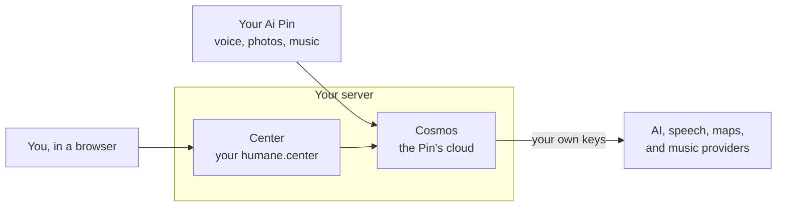
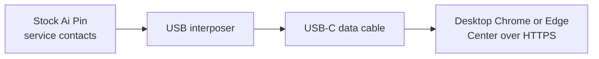

<div align="center">
  <h1>Luma</h1>
  <p><strong>Your Ai Pin. Yours again.</strong></p>
  <p>
    Luma brings back the Humane Ai Pin's assistant, photos, notes, music, and
    humane.center, running on a server you own.
  </p>
  <p>
    <a href="https://github.com/TheAndersMadsen/luma/releases/latest"></a>
    <a href="LICENSE"></a>
    <a href="https://github.com/TheAndersMadsen/luma/actions/workflows/ci.yml"></a>
    
  </p>
  <p>
    <a href="#quick-start">Quick start</a> ·
    <a href="#connect-a-pin">Connect a Pin</a> ·
    <a href="docs/README.md">Docs</a> ·
    <a href="docs/faq.md">FAQ</a> ·
    <a href="#for-developers">Develop</a>
  </p>
</div>

> [!IMPORTANT]
> Luma is a free, non-commercial community project. It is not affiliated with
> or endorsed by Humane or HP. It is for people who own an Ai Pin and want to
> keep using it after Humane shut its service down on 28 February 2025. You are
> responsible for your device, server, and the accounts you connect. See
> [NOTICE](NOTICE) and [TRADEMARKS.md](TRADEMARKS.md).

## What Luma is

Humane's cloud is gone, so a stock Ai Pin can no longer answer you. Luma
rebuilds that cloud as software you run yourself. Your Pin talks to **Cosmos**,
the cloud on your server, and you manage everything in **Center**, your own
humane.center in the browser.



| On the Pin | In Center |
| --- | --- |
| Voice questions, web search, weather, places and directions, calls, translation, Catch Me Up, and Vision | Captures with favorites, tags, search, and share links |
| Photos and videos sent to your Center | Notes, contacts, My Data, and Memories |
| Notes and contacts by voice, the food log, fitness sessions | Provider and music settings |
| Music from Spotify, YouTube Music, or TIDAL | Installing and updating the Pin over USB |

Everything runs on your server with your own provider accounts. The Pin never
holds a provider key, and it talks to no one but your server. More detail is in
[What your Center does](docs/center.md) and
[The assistant runtime](docs/assistant.md).

## Quick start

Pick the path that matches what you have:

| You have | Start here | Time |
| --- | --- | --- |
| Nothing yet | [Server from nothing](guides/server-from-nothing.md): rent a server, get a free domain, install Luma | About 1.5 hours |
| An Ubuntu 24.04 server and a domain | The steps below | About 30 minutes |
| A server running Umbrel OS | [Get Luma](#get-luma) | Varies |

You can set up the server and Center before you have a Pin, and connect the
Pin later.

### Before you start

- [ ] **A server** running a fresh 64-bit Ubuntu 24.04 (`amd64` or `arm64`),
      with a public IPv4 address, ports 80 and 443 open, 8 GiB of free disk,
      and 4 GB of RAM (8 GB is comfortable). Expect about €4 to €12 a month.
- [ ] **A domain name** with an A record pointing at that address. A free
      `name.duckdns.org` works.
- [ ] **An assistant key** for any OpenAI-compatible service (OpenRouter or
      OpenAI, for example) and an **Azure Speech** key and region. Everything
      else is optional. You don't need a GitHub account.

### Install

1. **Point your domain at the server.** At your DNS provider, add an A record
   for `center.example.com` with the server's IPv4 address. **Using
   Cloudflare?** Turn the proxy (the orange cloud) off for this record, or
   Let's Encrypt can't issue your certificate.

   Check it from any computer. It should print your server's address:

   ```sh
   dig +short center.example.com
   ```

2. **Download the latest release.** On the server:

   ```sh
   mkdir -p ~/luma && cd ~/luma
   curl -fsSL https://api.github.com/repos/TheAndersMadsen/luma/releases/latest \
     | grep browser_download_url | cut -d '"' -f 4 | xargs -n 1 curl -fsSLO
   ```

   You now have five files: the operator archive, the Pin archive,
   `luma-VERSION.release.json`, `SHA256SUMS`, and `SHA256SUMS.sigstore.json`.

3. **Check and unpack it.** Unpack it into Luma's own folder, where updates
   look for it:

   ```sh
   sha256sum --check SHA256SUMS
   install -d -m 0700 ~/.local/share/luma ~/.local/share/luma/operators ~/.local/share/luma/build
   tar -xzf luma-operator-*-linux.tar.gz -C ~/.local/share/luma/operators
   cd ~/.local/share/luma/operators/luma-operator-*/
   ```

   Every file should end in `: OK`. Stop if one says `FAILED`, and download
   it again.

4. **Install Bun and Docker.**

   ```sh
   bash ./bootstrap --tools-only
   ```

   Press Enter at `Ready to start?`, then answer `y` to install Bun and `y`
   to install Docker. It ends with `Bun and Docker are ready.` If it also
   prints `Reconnect over SSH so this session picks up Docker group
   membership.`, type `exit`, sign in again, and run
   `cd ~/.local/share/luma/operators/luma-operator-*/`. Ubuntu may also show a
   `Pending kernel upgrade!` notice. It is harmless, and you can reboot later.

5. **Set up and deploy.**

   ```sh
   ./luma onboard production --pin-release-archive ~/luma/luma-pin-*.tar.gz
   ```

   It asks for your domain, two email addresses, the features (press Enter
   for the defaults), the server's public IPv4, where to look for updates,
   and whether to install them at night (press Enter for both). Use real
   email addresses: Let's Encrypt refuses `example.com`. Check the
   `[8/8] Review` summary, then answer `y` to `Write this production
   configuration?` and to `Deploy this verified release now?`. It ends with
   `Setup complete: https://center.example.com/login?...`.

   If deploying stops with `The operation timed out.` or says nothing answered
   at your domain, the internet can't reach ports 80 and 443 on your server.
   Open them in your provider's firewall and run the same command again.

6. **Sign in to Center.** Show your first sign-in details:

   ```sh
   cat ~/.config/luma/production/first-login.txt
   ```

   Open the address it shows and sign in. Change the password in
   **Settings → Passcode & password**, then delete the file:

   ```sh
   rm ~/.config/luma/production/first-login.txt
   ```

7. **Add your keys, then your Pin.** In **Settings → Assistant & voice**,
   enter the assistant key and the Azure Speech key and region, and choose
   **Save changes**. If you do not have those yet, follow the
   [provider setup guides](guides/providers/README.md). When you're ready,
   [connect your Pin](#connect-a-pin).

> [!TIP]
> Something didn't match? When a `./luma` or `bootstrap` step stops, it says
> what went wrong and what is safe to retry. The fixes for common problems are in
> [Troubleshooting](docs/troubleshooting.md), and unfamiliar words are in the
> [glossary](guides/glossary.md).

## Get Luma

The Quick start above is one of several ways to install. They all end in the
same place:

- **Step by step from nothing:** [Server from nothing](guides/server-from-nothing.md)
  walks through renting a server and a domain, with a screen-by-screen guide.
- **One-line installer or Hetzner cloud-init:** see
  [docs/install.md](docs/install.md), which also explains each command and
  helps you choose a server, domain, and providers.
- **Umbrel OS:** the community app store
  [Perseu5/umbrel-apps](https://github.com/Perseu5/umbrel-apps) repackages
  Luma for Umbrel. Add `https://github.com/Perseu5/umbrel-apps` as a community
  app store in Umbrel, then install and set up Luma from there. Its packager
  builds their own images, so it is not this project's signed release, and it
  is still being tested.

Releases and container images are public and signed, so installing and
updating need no account or token.

<details>
<summary>Running a private fork?</summary>

The installer accepts a classic GitHub token with the `repo` and
`read:packages` scopes, through the GitHub CLI or `LUMA_GITHUB_TOKEN_FILE`.
`./luma registry login` saves one for later updates. The public release needs
none of this.

</details>

## Configure services in Center

The Pin needs two services to answer you: an assistant model and Azure Speech.
Everything else is optional and can be added at any time.

| Service | Needed? | Options |
| --- | --- | --- |
| Assistant | Yes | [OpenRouter](guides/providers/openrouter.md), [OpenAI API](guides/providers/openai-api.md), [another compatible API](guides/providers/openai-compatible.md), or a [Codex subscription](guides/providers/codex-subscription.md) |
| Speech | Yes | [Azure Speech](guides/providers/azure-speech.md) |
| Search | Optional | [SearXNG](guides/providers/searxng.md) (included) or [SerpAPI](guides/providers/serpapi.md), plus [Perplexity](guides/providers/perplexity.md) |
| Maps and places | Optional | [Google Maps](guides/providers/google-maps.md) |
| Weather | Optional | [Pirate Weather](guides/providers/pirate-weather.md) |
| Knowledge | Optional | [Wolfram\|Alpha](guides/providers/wolfram-alpha.md) |
| Food | Optional | [Open Food Facts](guides/providers/open-food-facts.md) |
| Music | Optional | [Spotify](guides/providers/spotify.md), [YouTube Music](guides/providers/youtube-music.md), [TIDAL](guides/providers/tidal.md) |
| Agent | Optional | [Rabbit OS3](guides/providers/rabbit-os3.md) |

You add every key in Center's settings. Keys stay in Cosmos on your server and
never reach the Pin. Use the [provider setup guides](guides/providers/README.md)
to get each account or key; [Configure services in Center](docs/services.md)
explains how the services work together.

## Connect a Pin

> [!WARNING]
> Installing Luma replaces what is on the Pin. If it runs PenumbraOS, FusionOS,
> or OpenPin, back it up first: see
> [Coming from PenumbraOS or another Ai Pin project](guides/connect-your-pin.md#coming-from-penumbraos-or-another-ai-pin-project).

One Luma server serves one Pin. The first Pin you connect is reserved for that
server for good. You can repair or reactivate the same Pin, but a different
Pin is refused, even after you remove the pairing.

Center installs Luma on the Pin from your browser, over a USB cable. Your Wi-Fi
password and the apps travel over that cable and never pass through the server.



The [Connect your Pin guide](guides/connect-your-pin.md) walks through every
screen. The short version follows.

### 1. Prepare and connect

You need:

- [ ] The [PenumbraOS USB interposer](https://github.com/PenumbraOS/interposer).
      A stock Pin has no USB socket. The interposer sits on the service
      contacts under the small moon sticker; follow its
      [preparation guide](https://github.com/PenumbraOS/interposer/blob/master/preparation.md).
- [ ] A USB-C **data** cable (charge-only cables don't work), plugged straight
      into the computer.
- [ ] Desktop **Chrome**, **Chromium**, or **Edge**. Safari, Firefox, and
      phones can't talk to USB devices.
- [ ] The Pin charged, switched on, unlocked, and finished booting.
- [ ] Your Wi-Fi name and password, unless the Pin has a working mobile line.

Place the Pin on the interposer and open **Guided setup**: in Center, choose
**Settings → Set up a Pin**, or **Settings → My Ai Pin → Open guided setup**.
Then choose **Connect over USB**. Continue only when the serial Center shows is the
one on your Pin. Linux USB permissions and other details are in
[docs/connect-a-pin.md](docs/connect-a-pin.md).

### 2. Follow Guided setup

Guided setup has seven stages and counts them (**0 of 7 steps complete**).
Each turns green only after Center has checked it on the Pin or your server,
and **Check again** reads everything again.

| Stage | What happens |
| --- | --- |
| 1. **Connect your Pin.** | You pick the Pin in the browser's USB prompt. |
| 2. **Network & time.** | The Pin joins Wi-Fi, and Center fixes its clock if needed. |
| 3. **Install Luma.** | **Open installer**, then **Install Luma VERSION**, installs the five Luma apps. Keep the tab open and the cable in while the Pin restarts. |
| 4. **Required services.** | Center checks the assistant and speech are ready. |
| 5. **Connect to your Luma.** | You choose a four-digit passcode, and the Pin is paired with your server. |
| 6. **Pin passcode.** | You enter the same four digits once more, and they go straight to the Pin. |
| 7. **Try it.** | You ask a question and confirm the microphone, speaker, and gesture work. |

<details>
<summary>More about each stage</summary>

- **Network & time.** A Pin that knows a nearby network rejoins it by itself.
  Otherwise pick your network and type its password. The password goes from
  the browser to the Pin over USB, and Center never sends it to your server.
  A Pin that sat unused often thinks it is February 2025, which makes your
  server's certificates look invalid, so Center checks the clock once the Pin
  is online. Without a cable, **Wi-Fi QR code** (`/wifi`) makes a code the Pin
  can scan.
- **Install Luma.** On a new Pin the confirmation is titled **Install Luma on
  this Pin?** and its button is **Install Luma**. If apps from another Ai Pin
  project are present, the button is **Remove and install**. A Pin with only
  part of Luma, or a broken Luma, gets **Recover this Pin?** instead, because
  recovery erases Luma's app data. Center reconnects to the same serial after
  each restart. Never pick a different device to continue. When the install
  finishes, **Continue Guided setup** takes you back to the checklist. If
  your server has no Pin release yet, this stage tells you to run
  `./luma pin release acquire --archive` with the Pin archive from your
  release files.
- **Connect to your Luma.** Cosmos stores the passcode only as an OPAQUE
  password file and can't show it again, which is why stage 6 asks for it once
  more.
- **Pin passcode.** A Pin that already finished Humane's original setup skips
  this and keeps its current passcode. Guided setup tells you when that
  happens.

</details>

### 3. Activate and prove the device

Set your Pin passcode before this step. After the Pin connects to your Luma,
Guided setup asks you to re-enter those digits once and hands them directly to
the Pin over USB. Center never sends that copy to the server or stores it.

1. Keep the Pin connected over USB and choose **Open Provisioning** in stage 5
   (or open **Settings → Advanced → Connect to your server**). The page is
   headed **Connect your Pin**. If needed, choose **Connect over USB** and
   select the same Pin.
2. Choose **Connect this Pin to Cosmos**. Center reads the Pin's hardware ID,
   pairs it with your account, creates its one-time identity, installs the
   Cosmos address and trust roots, and checks the whole activation on that
   exact Pin.
3. Choose **Open Guided setup**, enter the same four digits under **Pin
   passcode**, and choose **Finish setup on this Pin**. Then ask the Pin one
   real question and choose **Confirm microphone, speaker & gesture**.

The Pin stores that final confirmation itself. It is tied to the Pin's serial,
the installed release, and your server, so changing any of them asks you to
confirm again.

<details>
<summary>Reconnecting, recovery, and mobile lines</summary>

- **Restore remote access** to the same Pin: connect it over USB and open
  **Guided setup**. If its pairing was removed, choose **Pair this Pin**, then
  **Turn on remote access**.
- **If USB connects but Luma stops answering,** Center tries to restart Device
  Services. Keep the Pin connected and unlocked, and choose **Check
  connection** on **Connect your Pin** to retry.
- **Mobile lines:** the Pin rechecks its LTE settings at boot and when the SIM
  changes. If the carrier doesn't publish the phone number, Cellular Settings
  says so instead of making one up.

</details>

The **Create an activation file instead** section is a fallback for recovery or headless activation.
Normal setup stays in Center and needs no ADB commands or private keys moved by
hand.

## What your Center does

Center is your humane.center: captures, notes, contacts, My Data and Memories,
provider and music settings, the Pin installer, and your account. It reads all
cloud data from Cosmos and keeps none itself. The full tour is in
[docs/center.md](docs/center.md).

## Run your server

You run Luma from Center in the browser and from the `./luma` command on the
server. The full reference is in [docs/operations.md](docs/operations.md).

### Update Luma

`./luma update production` downloads the newest release, checks its
signature, takes a backup, and installs it. A nightly timer can do this for
you. See the [Update guide](guides/update.md) and
[docs/operations.md](docs/operations.md#update-luma).

### Back up and restore

`./luma backup production` copies everything Luma can't recreate. Take one
before any risky change. A backup restores only with the release that made
it. See [docs/operations.md](docs/operations.md#back-up-and-restore).

### Reset a lost password

You can reset the Center owner's password from the server. See
[docs/operations.md](docs/operations.md#reset-a-lost-password).

## The assistant runtime

The Pin's assistant runs in Cosmos, never on the Pin. Simple, fixed requests
take a direct route, and everything else goes to your assistant model, with
hard time and action limits. How it routes requests, its deadlines, and its
safety checks are in [docs/assistant.md](docs/assistant.md).

## For developers

Set up a checkout, run the checks, and add features that match the stock
Pin's behaviour. Start with [CONTRIBUTING.md](CONTRIBUTING.md). The full
reference is [docs/developers.md](docs/developers.md).

### Configuration

Every `LUMA_` and `COSMOS_` setting, where it lives, and what it changes. See
[docs/developers.md](docs/developers.md#configuration).

### Stock reference

`./luma stock decompile` builds the decompiled stock apps outside the
checkout. They are the specification every stock behaviour cites. See
[docs/developers.md](docs/developers.md#stock-reference).

### Build the Pin apps

Build the five companion APKs in the pinned container. See
[docs/developers.md](docs/developers.md#build-the-pin-apps).

### Publish a release

`./luma release publish` builds, signs, and publishes a tagged release from
the maintainer's machine. See
[docs/developers.md](docs/developers.md#publish-a-release).

### Keep root access after reboot

The optional on-device root flag and the `./luma pin dock` helper, limited to
one attempt per boot. See
[docs/developers.md](docs/developers.md#keep-root-access-after-reboot).

## Troubleshooting

Start with [docs/troubleshooting.md](docs/troubleshooting.md), which lists
common symptoms and their fixes. The [Troubleshooting guide](guides/troubleshooting.md)
goes through problems step by step. Still stuck? Open an
[issue](https://github.com/TheAndersMadsen/luma/issues), and attach the file
`./luma support-bundle` writes. It leaves out your secrets.

## Contributing

Fixes, features that match the stock Pin, and clearer documentation are all
welcome. [CONTRIBUTING.md](CONTRIBUTING.md) covers setting up a checkout and
the checks to run before a pull request. Two rules matter most: stock APKs and
decompiled stock code never enter the repository, and stock `humane.*` names
stay exactly as they are. [AGENTS.md](AGENTS.md) holds the full rules for
contributors and coding agents, and [llms.txt](llms.txt) indexes the docs for
AI tools. The [Code of Conduct](CODE_OF_CONDUCT.md) applies everywhere.

## Security

Luma runs your cloud, so a security problem in Luma is a problem on your
server. Report one privately through GitHub's private vulnerability reporting,
never in a public issue. [SECURITY.md](SECURITY.md) says what to include and
what to expect.

## Credits and legal

Luma exists because of the work around [Penumbra](https://github.com/PenumbraOS)
and its [USB interposer](https://github.com/PenumbraOS/interposer), which make
a stock Ai Pin reachable again. The Pin apps, the Device Installer, and
Center's Pin-setup flow come from that PenumbraOS work and keep its MIT
licenses ([pin/LICENSE](pin/LICENSE),
[pin/device-installer/LICENSE](pin/device-installer/LICENSE)). The interface
uses [Inter](https://github.com/rsms/inter) under the SIL Open Font License.
Vendored third-party code keeps its own license files, and [NOTICE](NOTICE)
lists them all.

Luma is an independent reimplementation, built so Ai Pins their owners
lawfully possess keep working after Humane shut the original cloud down on
28 February 2025. It contains no Humane source code, firmware, binaries,
fonts, or design assets. The `humane.*` protocol names, Android package
identities, and the device's own build strings appear only where an unmodified
Pin needs them exactly. Every product, configuration, and operator-facing name
is Luma's own.

Luma is not affiliated with or endorsed by Humane or HP. “Humane”, “Ai Pin”,
“CosmOS”, and related marks belong to their owners and are used only to
describe compatibility. See [TRADEMARKS.md](TRADEMARKS.md).
