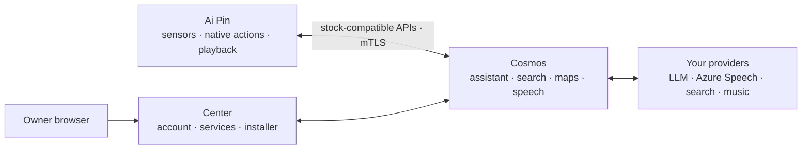
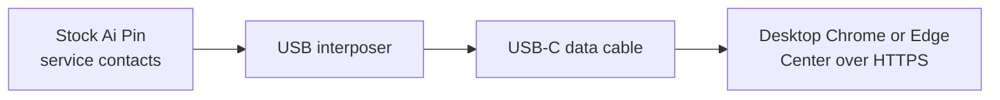

<div align="center">
  
  <h1>Ai Pin Revival</h1>
  <p><strong>Your Ai Pin. Yours again.</strong></p>
  <p>
    Keep the familiar experience. Run Center, Cosmos, and the signed five-app
    Pin runtime on infrastructure you control.
  </p>
  <p>
    <a href="https://github.com/TheAndersMadsen/ai-pin-revival/releases/latest"></a>
    <a href="https://github.com/TheAndersMadsen/ai-pin-revival/actions/workflows/ci.yml"></a>
    
    
  </p>
  <p>
    <a href="#deploy-cosmos">Deploy Cosmos</a> ·
    <a href="#connect-a-pin">Connect a Pin</a> ·
    <a href="#ai-assisted-setup">Use an AI agent</a> ·
    <a href="#development">Develop</a>
  </p>
</div>

> [!IMPORTANT]
> This is an independent community project. It is not affiliated with or
> endorsed by Humane. You are responsible for the device, server, accounts,
> credentials, and third-party services you connect.

## Choose your path

| I want to… | Start here | What happens |
| --- | --- | --- |
| **Run Cosmos** | [Deploy Cosmos](#deploy-cosmos) | Download one verified operator bundle; the server does not clone or compile this repository. |
| **Connect my Pin** | [Connect a Pin](#connect-a-pin) | Acquire the matching signed five-app release, install through Center, then activate one exact serial. |
| **Change the project** | [Development](#development) | Clone the repository and use the root `revival` CLI with external build caches. |
| **Let an agent help** | [AI-assisted setup](#ai-assisted-setup) | Give Claude, Codex, or another agent the outcome-based prompt and required inputs. |

## Architecture



| Part | Runs on | Purpose |
| --- | --- | --- |
| Center | Your server | The owner control plane: sign-in, Cosmos integration settings, music connections, Pin installer, and provisioning |
| Cosmos | Your server | The runtime authority: assistant, search, maps, speech, enrollment, media, and storage |
| Server | Ai Pin | Device-local settings, captures, diagnostics, and native action bridges; it holds no provider key |
| Hook | Ai Pin | Routes stock cloud calls only to the activated Cosmos server and fails closed before activation |

Search, maps, weather, language-model work, transcription, and speech synthesis
run in Cosmos. The Pin keeps microphone and sensor capture, cached location,
native actions, maps presentation, and audio playback close to the hardware.
Activation copies only the Cosmos endpoint, operator trust root, and that Pin's
device identity. It never copies an assistant, search, maps, or speech
credential to the device.

On the Ambiance development branch, photo selection uses local image-quality
scoring. Provider-based captions and visual indexing are disabled until an
origin-scoped runtime semantic service can mediate access.

The repository retains required stock `humane.*` protocol names and Android
package identities because the original software calls them byte-for-byte.
Product, deployment, configuration, and operator-facing names use Cosmos.

### Product direction

The target is one context-aware assistant across the wearer's devices. The
original CosmOS demonstration supplies product scenarios: understand a reference
to what is currently on the TV, recall an authorized earlier recipe, and combine
an explicitly selected email with calendar availability and a confirmed RSVP.
These are acceptance targets, not capabilities established by the demonstration
or by this repository's current server preview.

Cosmos coordinates models, semantic services and device capabilities through one
runtime. Clients supply explicitly authorized context and local evidence;
Center exposes tasks, connections, permissions and outcomes. Context must retain
its source, capture time, exact content version and relevant playback position.
Resolving “he” on TV needs evidence identifying the relevant person or moment;
a programme title alone is insufficient. When that context is unavailable or
ambiguous, the assistant must say so or ask for clarification.

Cross-session memory and preferences remain scoped to the admitted origin and
purpose. A selected personal output does not grant a shared-origin request
private memory. Multi-service work must preserve these boundaries between steps;
models propose intents while Cosmos authorizes effects. Consequential actions
require the appropriate exact confirmation, and completion claims require
committed matching evidence. Device and model independence mean shared contracts
with explicit capabilities, not a promise that every platform exposes every
sensor, third-party app or effect.

The owner's four cross-device scenarios are product acceptance gates:

| Scenario | Required behavior | Evidence required for completion |
| --- | --- | --- |
| Film suggestions from Pin to Shield, then “play number two's trailer” | Keep a versioned recommendation list with stable item/content IDs; render it on the approved TV surface and resolve “number two” against that exact list. Authorize playback on the selected Shield through a supported player integration. | Matching TV render acknowledgment and observed playback of the selected trailer. A sent link or player launch alone is not playback. |
| Explain the document on MacBook and continue on the Omarchy desktop | Capture the explicitly authorized current document/selection with its exact version; keep the explanation, task and permitted document reference together and deliver them to the approved desktop. | The destination opens the matching version and task; changed or unavailable source content, permissions and interrupted transfers are handled without substituting another document. |
| Navigate on Pixel to the restaurant selected on the computer | Retain the selected place's stable identity, address and coordinates as scoped task context; resolve the Pin's reference and dispatch a maps action to Pixel. | The intended place is opened on the selected phone. Opening an app is distinct from starting navigation; ambiguous places require clarification. |
| View a private message while guests are present | The shared-origin request can invite a personal continuation on Pixel. Retrieve the message only through a new linked request after fresh local authentication, with permission to access that source and a currently eligible private output. | No private content enters the original shared request, TV, audible Pin reply or notification preview. Lock, backgrounding, guests and revocation suppress disclosure; unlocking alone never upgrades the old turn. |

Implement the common native conversation first, then immutable task/context
references and follow-up resolution, then native rendering and typed media/maps
actions with observed outcomes. Add authenticated personal continuation and
scoped document/message services before private scenarios. These are pending
product outcomes, not abilities inferred from the existing text renderer. Test
them through native desktop/phone clients before final physical Pin acceptance.

The private-message scenario also needs an explicit policy resolution: the
paper's formal occupied/unknown-room rule blocks private content on every
channel in that room, including an authenticated phone. Fresh authentication is
necessary for a personal continuation but cannot satisfy that separate physical
privacy gate. Keep the scenario pending until a permitted private context is
established or an explicit specification change resolves the conflict.

The desktop client direction is a shared Rust connection/state core with small
platform shells: a macOS menu-bar app and assistant panel, and an Omarchy tray
app and keyboard-invoked panel. Each installation has its own approved identity,
local permissions and lifecycle. Capture is explicit and bounded; a screenshot
is not the underlying document, and a Mac filesystem path is not a transferable
document reference. Local files need authorized content transfer, cloud documents
need recipient access, and unsaved changes need a supported application bridge.
Begin with explicit file/selection sharing and a destination viewer that can
verify the exact content version. Application-specific editing handoff follows
only where that application can report its current document and location.

Device coordination stays on the common Cosmos room protocol. Per the paper's
section 3.4, agent protocols complement the surface contract. Use
[MCP](https://modelcontextprotocol.io/docs/2026-07-28/learn/architecture) for
approved tool/data adapters and
[A2A](https://a2a-protocol.org/latest/specification/) for external specialist
agents when needed. [Agent Client Protocol](https://agentclientprotocol.com/get-started/introduction)
is an optional editor/coding-agent integration; the separately named
[Agent Communication Protocol](https://agentcommunicationprotocol.dev/introduction)
has joined A2A. These do not replace Cosmos's routing, context authorization,
device sequencing or observed completion rules. Clients execute specific
authorized actions through local APIs, hold no provider keys, and cannot gain
unrestricted desktop access by joining the room.

The Pixel assistant follows the owner's [visual reference](assets/pixel/assistant-reference.png):
a dark, rounded response panel with a cyan outline and a separate voice indicator.
Render live text with native controls, accessible contrast and scalable type;
the reference image's sample headlines are illustrative content. Listening,
processing and speaking are distinct states, and the voice indicator may show
speaking only while local playback is observed. Reduce decorative motion when
the system requests it.

All thin-client speech must use Cosmos to synthesize authorized text with
Azure TTS and deliver audio to the selected client. This applies to macOS,
Omarchy, Pixel, Shield and the Pin. Clients hold no Azure credentials and do not
substitute operating-system voices or another TTS provider. The existing
provider-disclosure and output-privacy gates still apply; unavailable or denied
speech remains unavailable. Audio delivery alone is not evidence of playback.

The native speech increment wires this for macOS and Android. A native
installation approved at `native-shared-speech-v3` declares one shared-room
`audio.tts` output next to its visual card. Speech is routed to it only while
its signed connection is current, it reports a visible foreground and the
origin surface's owner has granted the Azure Speech disclosure (Center:
My Ai Pin for the Pin, Devices for a client). The room coordinator
claims the exact proposed speech action through that disclosure, streams
Cosmos-synthesized `audio/mpeg` frames bound to the connection and the text
digest, and the client plays the assembled bytes once and acknowledges only
complete playback; a retired or replaced reply stops and is never
acknowledged. Speech with no eligible surface is re-proposed as the same text
on a card. A model proposal that omits its privacy estimate is accepted at the
shared-room floor instead of failing the turn. The native voice loop and
remaining legacy Pin speech paths still require migration and device
acceptance before this requirement is established everywhere.

### Ambiance v2 work in progress

The `codex/ambiance-v2-production` branch continues the Cosmos-first work from
`codex/cosmos-ambiance-v2`, whose release baseline is `v0.1.108`.
[The requirement inventory](contracts/ambiance-v2.json) pins the exact
[Ambiance v2 research draft](https://gist.githubusercontent.com/ericlewis/12e8f7d381a5d93926f4858ae2d725dc/raw/6bac46cd8251af39c40263331d7269c5e418fe8f/ambi_v2.md)
and separates its twelve invariants from Cosmos-specific product acceptance.
It tracks incomplete coverage, not passing behavior or production conformance.
Its metadata tests validate the inventory and evidence references only; the
paper's reference implementation and reported test results are unavailable for
independent reproduction.

The current server preview is published as `v0.2.0-ambiance.18` and deployed at
`https://center.andersmadsen.dk/`, reporting release
`bf2f1cd69d849bba3c7222018de664e635358d53` and environment `production`. That
release was built on the workstation after GitHub Actions minutes ran out: the
Cosmos and Center images were built and pushed locally, the other three images
were reused from `v0.2.0-ambiance.10`, and its GitHub release carries no
sigstore bundle. It carries the request's own destination, the origin's
outcome-gated status, screen context behind an owner permission, numbered
choice lists, the owner's ledger read behind the Activity page, and device
actions: the per-platform approval profiles, the two owner permissions, the
confirmation ceremony and reports believed only from the device that acted.
The three releases before it (`.16` reporting `e26f5f9`, `.17` reporting
`ff978c6`) each passed the same production verification.
The signed operator, public discovery, OIDC and configured Pin certificate chain
passed production verification. The upgrade preserved the configured profiles,
connections and nonblank credentials. Web lookup's exact-commit CI and built
Center/native-client acceptance passed with a controlled search fixture;
conversation acceptance against a real search provider remains open.
External browser RPC passed over direct TCP
7881 with observed ICE selection and increasing byte counters. UDP 7882 and
TURN/UDP 3478 remain blocked before packets reach the VPS network interface;
their acceptance remains open. Full owner conversation acceptance, native
clients, the voice loop and physical Pin acceptance remain incomplete.

Ambiance v2 is the target architecture, not an optional addition to the existing
assistant. Existing Cosmos behavior is not a correctness requirement where it
conflicts with that architecture. Preserve necessary stock wire/package
compatibility and verified release infrastructure; replace conflicting
orchestration, memory, permission, routing, and output paths. Temporary
coexistence on the development branch is not the release architecture: remove
bypasses and superseded control paths before deployment. Existing regression
tests prove compatibility only; paper-derived behavioral tests define
architectural acceptance.

Existing integrations remain product capabilities to preserve. Move their
provider adapters behind the shared runtime's scoped services and typed actions,
then verify the conversational path for each one. Public information lookups,
authorized personal-data retrieval and device/external actions have different
permission and completion requirements. A saved connection is configuration;
Center must also make its current conversational availability clear. Replacing
the old orchestrator must not silently turn working integrations into settings
that the assistant cannot use.

The integration inventory for the new conversation is:

| Capability to preserve | Runtime work and current boundary |
| --- | --- |
| SearXNG / SerpApi web search | First scoped lookup increment below; real provider conversation acceptance remains open. |
| Pirate Weather and places/maps | Named-place lookup and weather are next. Precise wearer location needs separate authorized context; opening navigation on Pixel is a separate device action. |
| Wikipedia, Wolfram and Perplexity | Pending scoped query adapters with bounded evidence; generated analysis must retain actual citations. |
| Nutrition and visual shopping | Pending scoped product lookup. Images, health context and meal logging need their own admission. Shopping lookup does not imply purchasing. |
| MusicBrainz and Spotify / YouTube Music / TIDAL / Apple connections | Preserve catalog identities and accounts; conversational search, versioned selections and observed playback on the selected device remain pending. |
| Notes, memory, captures, contacts and messages | Pending source- and purpose-scoped retrieval and separately authorized writes/actions. Stored backups do not establish email integration. |
| Calendar and device actions | A real calendar provider is still required. Timers, settings, calls, sending and navigation need typed actions with appropriate confirmation and observed outcomes. |
| Composition, translation and notification triage | Explicit current text can use bounded analysis. Stock transformation services and selected personal content still need scoped admission. |
| Azure speech | Cosmos-mediated spoken replies now reach approved macOS and Android installations under the origin's disclosure; Pin, Linux and TV playback acceptance remains open. |

Web lookup is the first conversational integration being restored. Under My Ai
Pin, open Web lookup permission for the Pin; under Devices, turn on **Look
things up on the web** for a phone, TV or computer. Each grant names one
configured provider and endpoint and allows shared query text only. A SearXNG
grant names its Bing request profile; a SerpApi grant names Google search.
Cosmos does not switch providers when a lookup fails. Saving a provider key
alone leaves every device's lookup permission off.

The next development increment adds conversational named-place lookup with an
independent Google Maps permission while preserving Web grants. It accepts one
explicitly named place/locality query and displays a basic address list on the
approved Center screen, with Google Maps and supplied third-party attribution.
This permission covers query text and visual output, not wearer location,
navigation, spoken place results or personal history. It is included in the
deployed v7 preview together with the shared-display increment below.

Place results use a bounded process-local cache and expire after 60 seconds.
The durable action contains only an expiring content reference and digest;
results never enter model messages, stored conversation text or browser storage.
Cancellation, revocation and expiry retire the display. A periodic cleanup
removes expired entries; database waits are bounded so they cannot indefinitely
delay cleanup. Process loss makes a
pending result unavailable and never repeats its provider request. Center
acknowledges the complete address card and its attribution only after DOM
commit; unsupported attribution rejects the card without hiding required credit.
The
[Maps terms](https://cloud.google.com/maps-platform/terms) and
[service terms](https://cloud.google.com/maps-platform/terms/maps-service-terms)
do not permit treating names and addresses as reusable stored conversation
content; the explicit 30-day caching exception covers coordinates, and place
IDs may be retained indefinitely. The existing durable text outbox therefore
cannot carry these results. Applicable
[EEA uses](https://cloud.google.com/terms/maps-platform/eea-places-api-permitted-uses)
depend on the billing account and integration, which remain unverified.
Google Maps content must not enter the Azure speech path under the standard
terms. Keep these provider limits separate from Ambiance's origin and output
permissions; a disclosure grant does not resolve either limitation.

The runtime admits one bounded query from the current request, commits its
provider disclosure before network access and records a result digest before
proposing a sourced text card. Sources are actual provider URLs and plain text;
they do not become instructions or trigger another model/tool call. Normal
browser heartbeats preserve permission, while re-enrollment and revocation fence
it. Permission changes bind to the reviewed browser incarnation so ordinary
heartbeats do not invalidate the review. Pending work is cancelled when its
origin or permission changes. Retries of the same sequenced Browser, Native or
Pin input cannot issue another provider call; unsequenced stock Understand RPCs
have no stable input identity and each admission creates a separate turn.
Privacy classification covers the full bounded provider response before source
filtering, truncation or card-size limits, including empty result sets.
The first output is the existing approved Center display; native rendering of
the same cards is the shared-display increment below. Spoken search summaries,
weather/music services and personal-data integrations remain separate
increments. This source path does not establish a live provider conversation.

Validation for this increment passed 43 focused Cosmos tests and the built
Center/native-client acceptance harness. The latter used real HTTPS/WSS,
PostgreSQL, LiveKit, owner controls and DOM acknowledgment with synthetic
cognition and one local SearXNG HTTP fixture. It verified the committed query
and evidence digests, permission changes, cancellation and recovery from a
failed client-journal save without repeating the provider request. This is
application-path evidence; actual provider availability, owner login and
physical device behavior still need their separate acceptance.

The shared-display increment makes an approved native installation a visual
surface and gives requests a bounded routing hint. The native approval profile
is now `native-shared-speech-v3`: it declares one shared-room `visual.card`
output, one shared-room `audio.tts` output, a `state.visibility` input and the
`visible_foreground_only` and `no_background_output` constraints. Persisted
`native-shared-display-v2` approvals keep rendering cards but play no speech
until the owner reapproves at the current revision, which bumps the revision
and drops the current connection; older text-only approvals are no longer
recognized. A native surface is an eligible card target while its signed
connection is current; visibility lives on the connection, not on the owner's
registry record, and it is attention only, never eligibility, occupancy,
privacy or actor evidence. An installation reporting no foreground still
receives the card when it comes forward and meanwhile carries a bounded rank
penalty. Losing the foreground after a card is shown fails dispatch-time
revalidation, so a shown card is cancelled and the logged fallback receives its
own new action.

The device-action increment gives a surface a third thing it can be asked to
do. An action travels the same pipeline as a card and a spoken reply: cognition
proposes, the runtime binds, policy decides, and only the device's own report
may say it happened. The runtime now binds, decides, confirms, dispatches and
records the outcome; what is still missing is the other half of every effect —
no client carries a command out yet, so a dispatched action reaches an approved
installation and waits there for an executor that has not been written.

The native approval profile is now `native-audience-v6` and it differs per
platform, because what a device may be asked to do depends on what its
operating system can honestly report, and because who its output reaches
differs by what kind of screen it is. Each output channel carries an
`audience` word — `desk` for the Mac and the Omarchy PC, `handheld` for the
phone, `room` for the Shield — and `native-voice-input-v5` joins the earlier
rungs as a legacy profile that keeps everything it had and declares no
audience until the owner reapproves. macOS declares `action.open`,
`action.run` and a `confirm.tap` venue that can ask for device-owner
authentication; the Omarchy PC declares `action.open` and a keyboard-first
`confirm.tap`; the phone declares `action.open` and `action.route`; the Shield
declares `action.play` and no ceremony venue at all, because a television is
bystander-perceivable by construction. Every channel declares the shared-room
ceiling, which only the owner's own `approve-private-display-v1` for that
installation lifts. Persisted `native-shared-speech-v3` and
`native-shared-display-v2` approvals keep connecting, rendering and speaking and
declare no action channel until the owner reapproves: the challenge now carries
the approval the record actually holds, so publishing a new profile never stops
an installation on an earlier one from connecting. Reapproval bumps the
installation's revision and therefore drops its private-display, screen-context,
speech-disclosure, lookup and device-action permissions, which have to be
granted again.

Two owner permissions live under Devices, each with its own editor on the
device's card. **Let this device act** (`approve-device-actions-v1`, route
`/surface-api/v1/surfaces/:surfaceId/device-actions`, 2048 bytes) names the
hosts, applications and directory roots it may open, whether it may route to a
place, and which media providers it may play; only the operations that
installation's approved manifest declares are offered, and its class is capped
by that installation's private-display ceiling — an action permission spends a
posture, it never raises one. **Tasks on this device**
(`approve-device-command-v1`, macOS only, route `…/device-commands`, 4096
bytes, which the editor counts down as the list grows) is a list of at most
eight commands the owner authored, each with a fixed `argv` array written one
part per line — there is no shell string and no model-supplied parameter, at
any risk level — a working directory, a millisecond budget and whether it
changes files. A task label the runtime would classify as sensitive is refused
when it is saved, with the message that names the fix, because a silently
unrunnable task is indistinguishable from a missing capability. Both editors
say once, above them, that they apply to that device only. The Shield's card
carries its playback prerequisite where the providers are chosen rather than
buried: without notification access on the TV, media sessions cannot be read
and the honest report is always "Cannot confirm", because a launched player is
not playback.

Reapproval drops what a device already holds, so Devices reads those
permissions *before* the owner clicks, lists them under the fingerprint, and
offers **Put its permissions back** afterwards — each one granted again against
the new approval, in an order that restores a class ceiling before anything
capped by it, with a per-permission result rather than a single claim.

The owner's committed policy reaches the installation it belongs to on the
room that installation is already connected to, as a `policy` frame: the same
object Center writes, naming that surface and the approval revision the
connection was opened at, with a SHA-256 digest of its compact document that
both implementations recompute from their own struct so a serialization drift
refuses the policy instead of quietly widening it. A section the installation's
approved manifest does not declare is never in it, so a television is never
told it could run a command. It is delivered once per change of that digest,
which makes redelivery idempotent, and both fields null withdraws it. Nothing
about the delivery is authority: the client verifies every command against the
copy exactly as it did against a file, refuses a host, application, root,
provider or entry the copy does not name whatever the runtime said, and
carries nothing out at all while it holds no copy. Reapproving an installation
bumps its revision, which closes its connection and drops both permissions, so
the copy goes with it and the device does nothing until the new policy
arrives; no client persists it. The whole document is bounded at 8192 bytes so
it fits the 12 KiB envelope with its frame, and because the command list is
the half that grows, a policy that would not fit is refused with
`invalid_request` where the owner writes it in Center rather than arriving
truncated — half an allowlist is worse than none. Linux still keeps its own
local `openers` file: how that desktop opens a `.pdf` is an execution detail
of the machine, not a permission Cosmos holds.

Cognition proposes `device_action` with an operation and a *reference*, never an
argument. The reference names a candidate the runtime itself put in front of it
this turn: an item of an acknowledged choice list (bound to that list's content
digest, so "number two" resolves against exactly the list that was shown or
against nothing), the document handle the origin attached with its screen
context, a stored continuation, or one of the owner's own task labels. Locators,
`argv`, coordinates, package names, place ids and file paths are minted by the
runtime from state it committed under a permission of its own. A command
candidate is offered on no turn that carries screen context, so a page the owner
is reading cannot name a process; a document is named to cognition by identifier
and kind only, never by title, application, path or line. An unresolvable
reference is a parse failure, and a device action combined with any other
proposal branch is rejected rather than silently reduced to the action. A
`place_lookup` may carry `then: "route"` in the same call, before any provider
result exists, and a receipt with exactly one place becomes a route the runtime
binds from its own evidence.

A dispatched command reaches its device as an `act` frame carrying the bound
operation, the key the device deduplicates on and how long it has to say what
happened; the device answers with the same transport receipt a card does, which
is transport evidence and never completion. It then acknowledges the binding —
on an action channel that means "I bound this exact command and it is legal
here", it is not an outcome, and it sets none — and afterwards reports what it
actually observed. Only that report may claim an outcome, and only with
evidence that shows what it claims: a launch the device could not observe
further is `unknown` with the launch recorded, never `completed`; a refusal is
exactly the declined evidence; a non-zero exit code is a command that ran, so
it is a completed command with its exit code as evidence, not a failure. A long
command stays alive on its own unsequenced `progress` messages, which consume
no ordered slot, claim nothing and renew both its deadline and the turn's
worker lease, so a fifteen-minute task no longer needs the assistant to invent
an effect timer.

Visibility is required to begin an effect and never to continue one. A command
is eligible while the installation's signed connection is current, whatever its
class, and it is claimed only once that installation reports a foreground — so
a sleeping phone holds the command with the same content-free invitation a
private card already gets (`invite` now says whether a card or a task is
waiting), and launching Maps or a player does not retire the effect the instant
it succeeds. A side-effecting action never repairs to another device; its
fallbacks are still computed and logged in the decision and simply never
dispatched to. Only a channel that declares itself idempotent retries, once, on
the same surface with the same key; `action.run` never retries, because a
missing report is unknown and never a second run. Six device actions per
principal per rolling ten minutes, one in flight; the seventh is skipped and
logged rather than failing the poll. A new request while an effect is running
preempts that turn instead of being refused: the effect is revoked as
preempted and reported cancelled, never completed.

**Tasks on this device** always confirm, at the machine that will act. The
runtime asks for the confirmation only once that installation's own foreground
reports, so the thirty-second clock starts at the sentence a person can read
rather than at the proposal; the words are composed by policy from the bound
command and the owner's own label, never by the model, and each client renders
them from its own strings file. The answer binds to the exact sentence read,
carries the actor evidence the platform obtained — a command that changes files
needs device-owner authentication, and a bare tap cannot stand in for it,
because every Cosmos manifest declares `actor_unknown` — and is consumed in the
same transaction that dispatches the command. Dismissing the panel answers
nothing: the ceremony expires, which denies. A restart mints a fresh worker, so
every unconsumed grant is void; unconfirmed is denied. A television declares no
ceremony venue at all.

A shared-perceivable origin hears exactly two sentences and nothing else, and
only once the report commits: **"Done on your approved device."** for a
committed completed outcome, and **"Heard. Handled on your approved device."**
for everything else — a refusal, a failure, a cancellation, an unknown outcome,
a class nothing could carry, an exhausted budget, a decline, an expiry and a
capability miss are byte-identical from a shared surface. The richer account
travels on the origin's own status frame, which gained `confirming`, `acting`,
`done` and `refused`, names a kind of device and never a reason.

Five canonical content digests bind a command to its exact arguments across the
runtime, the shared client and Center, with coordinates as fixed six-digit
decimal strings because float formatting is the one conversion that drifts
between languages. The vectors are checked in against the first commit, in
[`contracts/fixtures/ambiance-device-action-digests-v1.json`](contracts/fixtures/ambiance-device-action-digests-v1.json),
and the per-platform manifests, statuses and owner routes are published in
[`contracts/ambiance-native.json`](contracts/ambiance-native.json).
Transient content references now carry the surface the decision named and are
refused to any other, which is what makes a reference authority for a channel
rather than for anyone who holds it.

A completed place lookup now leaves bounded recent context for the owner: the
user's own query text with its source surface and privacy class, for ten
minutes, in the durable runtime state (provider content stays transient). The
next request from any surface at or below the shared-room ceiling is offered
that context as one sentence of cognition context, and the offer is logged
against the turn. "Show me the way to the restaurant I just found on the
computer" therefore becomes a new place lookup under the asking origin's own
lookup permission, routed by the usual policy and an explicit target such as
the phone. Owner listing and deletion of this memory beyond expiry, and other
context kinds, are later increments.

Private replies follow the paper's routing rather than a separate flow. A
request above the shared-room ceiling ("read my private notes", "min private
besked") is answered in the same turn: Cosmos retrieves the owner's saved notes
itself, logs that offer against the turn, and proposes the reply at the
request's class. Policy admits only a personal installation the owner declared
for that class in Center ("Show private replies here", a statement about the
device that Cosmos cannot verify and never grants to a TV), on its visual card
channel and never as speech; every shared surface is suppressed with a privacy
blocker. The personal phone holds the card while its signed connection is
current: it is told only that something is waiting (a notification may say
that much and nothing else), receives the card once its unlocked foreground
reports visible, and loses it as soon as that foreground goes away. Sensitive
content has no display ceiling, a request with no personal surface for its
class is refused before cognition, and the shared origin expresses nothing that
names privacy: a Pin hears the same outcome-gated "Displayed on your approved
screen" it hears for any card acknowledged elsewhere. Owner listing and
deletion of what was offered, and private sources beyond notes, are later
increments.

A phone, Mac or Linux PC may also use what is on its own screen. In Center,
each such device's Manage panel offers **Use what's on the screen**: when the
owner asks about what is on that device's screen, Cosmos may read the visible
text once and send it to the assistant model, and the reply is private to that
device. The permission is one owner statement per installation, read before it
is written and confirmed by Cosmos at the next revision, and it is never
offered for a TV or a browser. Set up the usual permissions turns it on for
phones only.

**Settings → Account → Activity** lists recent turns from the runtime ledger,
newest first and grouped by day: when and from which kind of device each was
asked ("Asked from your phone"), what happened to the reply ("Shown on your
Mac", "Spoken on your Ai Pin", "Private reply on your phone", "Nowhere to show
it", "Cancelled", "Cannot confirm"), and a Why disclosure naming each candidate
device in a sentence ("Your TV could not show a card — its app was not in
front."), the routing hint and what the request's class meant. The ledger holds
no request text or reply content, so the page shows none; an empty or unreadable
ledger says so in plain words and offers the one thing to do next. The page is
rendered on the server in UTC and reads without JavaScript; once it hydrates the
viewer's own clock relabels each row ("Just now", "12 minutes ago", "Yesterday
22:41") and groups the rows into local days.

The page reads the chain through `GET /surface-api/v1/ledger`, the one
owner-authenticated route that returns it: at most 300 events, oldest first,
only the calling owner's own, and the whole query it accepts is a whole
`limit` in that range. It hands back the committed events exactly as they were
hashed, which is why the page can say where a reply went and cannot say what
was asked.

#### Where a reply goes, without naming a device

The runtime decides which screen or speaker an answer belongs on, and naming a
device is never required. Two things make that possible.

First, the runtime binds a **content shape** for every reply, from the intent it
has already validated and never from the model: `utterance`, `note`, `passage`,
`roster`, `place`, `play`, `route`, `open` or `run`. A card at or under 280
bytes is a note and anything longer is a passage; a set of options is a roster;
a bound command is its own kind. The same step binds the channel: an answer
longer than a glance becomes something to read rather than twenty titles spoken
aloud, and a short, shared-safe answer to a question asked out loud is said back
instead of shown.

Second, every output channel of the current native profile
(`native-audience-v6`) declares an **audience** the owner approves at
reapproval: `room`, `handheld` or `desk` — who that channel's output reaches. It
is a closed published set and it names no product, platform or place, so a new
platform shipping the room profile routes exactly like the television. A
browser display is a desk and a worn Pin is handheld by their own class; an
installation still on an earlier profile declares nothing, and is scored at the
floor of whatever shape is being routed, so it stays eligible, still wins when
nothing better is connected, and never outranks an installation that did
declare. Reapproving it is what teaches Cosmos the room.

`shape_fit` is then a published table over shape and audience, and it is the
largest term in the score after an explicit destination. A list goes to the
television, a long read to the desk screen, a route to the phone, a short answer
to whichever personal screen the request came from.

Availability splits in two. **Reachable** — a current signed connection or
lease — is an eligibility blocker. **Attended** — the installation's own
foreground report — is a bounded rank penalty smaller than the origin term, so
a Mac with its lid shut is ranked below the screen that suits the answer instead
of vanishing from the fleet. A card, a ceremony and a command are held for a
reachable installation and delivered when its foreground reports, for twenty
seconds at the shared class and five minutes above it; when nobody comes the
card repairs to the next logged fallback. Speech is the one channel nothing can
hold, so an installation reporting no foreground is blocked for it with the
distinct `unattended` reason.

Nothing in the decision reads occupancy, actor identity, trust level, which
device was used last, or where a surface runs. The complete published weight
vector is the eligible floor 1000, shape fit 40–200, origin affinity 30, hint
400 and attention −20, with learned preference a permanently zero logged slot;
the constants are chosen so a named destination always outranks a fit
preference, being the asking device never overturns a shape band, and attention
only breaks ties. The whole vector is logged per candidate with the decision.

Cognition may propose `target` (`browser`, `macos`, `linux`, `android` or
`android_tv`) only from explicit request text such as "show this on the TV",
and the request may carry its own. Policy treats it as the paper's hint: it adds
a bounded rank component to eligible non-origin surfaces of that kind and
nothing else. It cannot make a hidden, blocked or unapproved surface eligible,
nominating the origin earns nothing, and every decision records the hint with
the per-candidate score vector so a hint-free replay over the same state selects
a surface that is also eligible. Class-zero surfaces still contribute no hints
of their own; trust-gated device hints, hint budgets and learned preference
remain open, and cognition never chooses among the ranked candidates.

Delivery reuses the browser room wire shape. The shared native client accepts
a render or `act` frame only for its exact surface and incarnation, recomputes
the text, place-card or device-action digest byte-for-byte against the checked-in
vectors, refuses an ambiguous locator or an operation kind it does not know,
rejects unsupported credit before display and answers with the transport
receipt; the platform then renders verbatim and submits the sequenced
acknowledgment after its own commit. Its C boundary gained
`cosmos_surface_acknowledge_task`, `cosmos_surface_report`,
`cosmos_surface_progress`, `cosmos_surface_grant` and
`cosmos_surface_device_policy`, and its snapshot gained `task`,
`confirmation`, `revoked` and `policy`. `cosmos_surface_report` now takes the
action its report is about and refuses one for anything but the current task,
so a task the runtime replaced between the platform's own read and the worker
draining its queue closes nothing. A fresh enrollment from that client now
asks the owner to approve `native-audience-v6`, and it still holds a
connection under any earlier published profile, so an installation that has
not been updated keeps connecting, rendering and speaking. The phone and the television now carry commands
out, and each verifies every command against its own copy of the owner's
policy — the same object Center holds — which the runtime now delivers rather
than a person writing it on each device. The phone opens an allowed `https` link and starts navigation
to a place the runtime bound; opening Maps is not navigating, so a launch it
cannot observe further is `unknown` with the launch recorded, never a
completion. The television plays through an owner-approved provider and claims
playback only from a media session whose own title contains the bound one, which
needs the owner's notification-listener grant in the television's settings;
without that grant every play is honestly `unknown`. Its confirmation sheet
answers only to a deliberate tap, Back dismisses it and answers nothing, and the
task card carries the state word, one sentence, the elapsed time and Cancel
task, while Close only hides it and the command carries on. A television never
explains a refusal at all. The macOS and Linux clients still have to verify a
command against the delivered policy, carry it out without
building anything from strings, obtain the actor attestation and report only
what they observed. Center's Activity page reads the new ledger kinds — a requested and
resolved ceremony with the dwell time it took, a device's own report, a revoked
effect, an exhausted action budget and a preempted turn — and says each in one
plain sentence in the turn's Why disclosure; a kind it has never seen is still
skipped rather than rejected. The macOS panel
renders text and place cards with their credit, reports visibility from its
window occlusion state and acknowledges each card once. Native surfaces cannot
acknowledge cards dispatched elsewhere. Android, Android TV and Linux clients
still need their own apps; the runtime already treats them as the same kind
of surface.

Validation for this increment passed the focused policy, native-room, native
client and Center native-surface tests plus the full Cosmos and Center checks.
It proves runtime authority, receiver identity and exact digests with a
MemoryStore and synthetic cognition, not a physical screen, real occupancy or
the macOS app's actual render on a device.

A native client can now name the destination itself. The room input message
carries an optional `target` (`browser`, `macos`, `linux`, `android` or
`android_tv`) that is the request's own explicit hint: it weighs exactly like
cognition's target, outranks it when both exist, is logged as the decision's
hint, and can no more revive a hidden or unapproved screen than the model's
can. The shared client exposes `send_text_to`, the C ABI
`cosmos_surface_send_text_to` and JNI `sendTextTo`; the target is journaled
with the request so an exact retry replays it, and the same sequence with a
different target is refused as a different request.

The origin now hears what became of its turn, and nothing more. The room
coordinator sends the native member that originated a turn a `status` frame
once per committed state change: `working` when the turn begins, `waiting`
while an action is proposed or dispatched to a surface of a named kind,
`shown` or `spoken` once that surface acknowledged it, `nowhere` when nothing
could take it, `unknown` when delivery deadlines ran out. The frame names the
kind of device only, never a surface identity, content or a reason, and its
class is capped by the origin's own ceiling: a private card shown on the phone
reaches a shared Mac as "shown on an android surface" at the shared class,
and a privacy-refused request looks exactly like one with no visible screen.
That is the paper's "heard, handled elsewhere": suppression, capability misses
and ordinary re-routing are indistinguishable on a shared surface. The shared
client exposes `status_changes`/`turn_status`, and the C and JNI snapshots
carry `status` with operation `status`. Browsers receive no status frames.

Screen context is the owner's own data and follows the private policy. A native
installation may send bounded text from its own screen (`context: {kind:
"screen", app, text}`, at most 64 and 8000 UTF-8 bytes) with a request; the
turn starts at the `private` class, needs a personal surface declared for that
class, and the reply is routed like any private card: only personal surfaces,
never speech, every shared surface suppressed. The text reaches cognition only
if the origin installation holds the owner's screen-context permission at its
current approval revision (`approve-screen-context-v1` under Devices, route
`/surface-api/v1/surfaces/:surfaceId/screen-context`, native only), and then
as a delimited untrusted block after the user's request that the prompt names
as data, never instructions; the ledger records `screen_context_offered` with
the app digest and byte count and never the text. Without the permission the
runtime proposes a private card explaining that screen context must be
allowed for this device in Center, and the text goes nowhere. Sensitive
screen text is refused before cognition, lookups derived from a private turn
are refused by the existing lookup ceilings, and the shared client exposes
`send_text_with_context`, `cosmos_surface_send_text_with_context` and JNI
`sendTextWithContext`.

"Find a good film for tonight" on the TV now produces a numbered choice list.
Cognition proposes `choice_list` (a title and two to eight items with a title
and detail) as its own branch; the runtime numbers the items `1`..`8`, binds
the card to the digest of `["cosmos.choice-list", 1, title, [[id, title,
detail], ...]]`, renders it as content kind `choices` and routes it like any
card. When the shown list is acknowledged at or below the shared class, the
runtime remembers its title and numbered titles as recent context of kind
`choices` for ten minutes and offers the next turn one sentence naming them, so
"play trailer for number two" resolves into a web lookup for "<title> trailer"
under the origin's own lookup permission or an informational answer. Nothing
is played yet; media playback on the Shield remains a separate increment, and a
private list is never remembered.

The implementation plan keeps Cosmos as the runtime authority and thin clients
responsible for local permissions, capture, rendering, and playback evidence:

1. **Provenance — implemented in `5ea98384`.** Authentication preserves device
   evidence through the real plaintext, encrypted, and bidirectional Ai Bus
   paths. Focused transport tests and broad source checks passed for that
   increment. Actor identity and physical privacy remain unknown: preserving
   provenance is not privacy enforcement.
2. **Phase 2A: durable surface enrollment — implemented, enrollment only.** The owner explicitly
   approves the current Center browser as a shared visual surface through a
   verified bearer session, never a share token or forwarded certificate
   header. Cosmos approves the six-dimensional manifest's capability ceiling,
   owns its class-0 trust floor, and grants neither hints nor autonomy.
   Occupancy remains unknown; account ownership does not establish privacy.
   The PostgreSQL Store atomically commits each registry transition with its
   per-principal hash-chain event. Connection credentials bind the account,
   surface, and connection incarnation, with a fixed one-hour expiry separate
   from 45-second liveness. Enrollment starts hidden; hiding, leaving, or
   revoking makes the surface ineligible. Becoming visible restores only
   availability under the approved ceiling, never private-room status.
   Center exposes join, leave, revoke, and a surface list without stored
   content. Enrollment alone does not prove that a channel can render.
   PostgreSQL is the durable default; the snapshot-backed registry is unsupported
   and fails closed, while default MemoryStore is ephemeral. The current cap is
   16 active approvals, not the paper's 50-surface evaluation. This registry hash
   chain has no independent anchors, retention or privacy-filtered audit views;
   it is not yet the complete routing and policy ledger.
3. **Phase 2B: shared runtime and Pin-to-Center presentation — implemented foundation; not realtime acceptance.**
   Plaintext, encrypted, bidirectional and stateful stock text converge on
   AmbianceRuntime and the Store's durable, per-principal transitions. The
   runtime admits the authenticated, currently paired and explicitly approved
   Pin before cognition. Browser text requires the verified owner and that
   approved browser's current connection capability. Actor identity and physical
   occupancy remain unknown. Cognition receives only current text and a bounded
   informational-intent schema; client history, prompts, observations, location,
   saved notes and photos are not loaded into its context. There is no
   unconfigured demo model fallback.
   Informational speech and visual text cards are the initial none-risk intents.
   The model proposes shape and content; policy joins provenance over
   public/shared_room/near_user/private/sensitive, permits only monotone model
   raises, filters eligibility, and commits routing before dispatch. Conservative
   text checks can raise privacy but do not prove arbitrary text is correctly
   classified. Unknown rooms cannot carry content above shared_room.
   Center receives bounded room commands and acknowledges the exact action, generation,
   channel, incarnation and content digest after render commit. A Pin display
   request waits for the committed acknowledgment, including a logged repair's
   exact lineage, before emitting the controlled display-confirmation sentence.
   Direct stock speech is recorded with playback unknown; enqueue is not played
   audio. Each dispatch has a three-second deadline, distinct from liveness;
   the stock display wait has a thirty-second overall bound.
   Worker/generation fencing rejects stale results. A replacement text request
   on the same admitted stream cancels only that stream's pending fence; it is
   not inferred speaker identity or a learned preference. Unsupported stock
   observations grant no playback evidence or authority.
   Regression coverage exercises the real AuthLayer and all three stock
   transport encoders, zero private-store reads before inference, invalid typed
   intents, late-model revocation and exact browser acknowledgment gating.
   Terminal action payloads are cleared from runtime projections in the same
   transaction as cancellation or unknown outcome; an acknowledged browser card
   remains only while its display is valid, for at most 60 seconds. An indexed
   cleanup queue runs on startup and once per second, processing at most 128
   due principals per tick. Expired content is cleared on the next successful
   bounded sweep; backlogs, database outages, or a stopped runtime delay cleanup.
   Digests and outcome metadata remain in the ledger. This is logical payload
   cleanup, not secure erasure of database storage or complete audit retention.
   Passing evidence must come from the current focused and broad checks.
   Center now uses room RPC; the stock speech seam, media and native-client
   paths still require work before deployment acceptance.
   Runtime dispatch also records a bounded fingerprint of each outgoing speech
   action. During the next 30 seconds, a matching normalized Pin utterance from
   the same principal is rejected and logged before cognition. Case, punctuation
   and whitespace are ignored; partial or fuzzy matches are not inferred. The
   guard survives turn replacement and database reopen, holds at most 32 entries,
   and expires through the existing cleanup queue. Typed browser requests remain
   eligible. This bounds one stock self-echo path; it does not attest a live
   microphone, actual playback duration, acoustic echo cancellation or actor
   identity. Speech outcome remains unknown.
4. **Phase 3: realtime Pin interaction and semantic services.** Integrate
   self-hosted LiveKit rooms, participant identity, media tracks, text streams
   and RPC as the paper's shared substrate. Bind cognition dispatch to the
   admitted origin, issue role-scoped permissions, prohibit unrestricted media
   subscriptions, and verify boot epochs, monotonic sequences and idempotency.
   Replace interim polling coordination rather than retaining parallel
   authoritative buses. Implement and test stock PCM framing, correlation and
   interruption while preserving wire identities and all five APK roles;
   reserve actual hardware playback verification for final Pin acceptance.
   The realtime text front can request one bounded larger-model analysis with
   no executor capability. Cosmos commits the analysis start before provider
   input, retains the original current request, checks the current turn and
   origin while awaiting inference, and commits the result's privacy join before
   routing. The tool-free HTTP analysis adapter uses the selected
   OpenAI-compatible assistant provider; Codex analysis remains unavailable
   until its app-server tool boundary is established. Service completion does
   not establish rendering or playback.
   Implement typed runtime semantic services for completion, child-agent
   experiences, device actions, composition, translation, vision, food and
   music work; the current unsupported responses are temporary safeguards,
   not completed product behavior. Consequential actions require exact
   action-instance/epoch-bound, single-use expiring confirmation grants that
   restart invalidates. Add origin-scoped retrieval with the memory/service
   provenance join before inference; selecting a private output must never
   grant a shared-origin request private-memory clearance.
5. **Phase 4: thin native clients and scoped intelligence.** macOS and Android
   use the same runtime with native permission and lifecycle handling. Complete
   the versioned scorer and per-term ablations, calibration, counterfactual
   lift, coverage and tenure evidence for earned authority. Add privacy-filtered
   audit views, redaction/retention, signed checkpoints and independent anchors.
   Offline operation permits only preapproved none-risk reflexes. Native clients,
   audio and hardware acceptance remain outstanding. Measure the paper's
   expression-under-200-ms, median durable-routing-under-50-ms and median
   voice-first-dispatch-under-2.5-s gates; current coordination tests prove none of them.
6. **Phase 5: staged acceptance and release.** Implement and verify Cosmos, then
   Center, and deploy the verified server release without waiting for physical
   Pin access. Build and test macOS and Android clients against the same
   contracts. Exercise all twelve invariants on real paths, including
   performance, 50-surface and ablation evaluations and isolated database
   restart/failure tests; physical Pin connection, installation and observations
   come last and remain required for final end-to-end conformance.
   Deploy the authenticated signed operator archive and verify the intended
   release ID with `environment: "production"` at the existing production
   origin, `https://center.andersmadsen.dk/`. No new domain or identity migration
   is requested. An unchanged descriptor-bound five-APK set may remain in a
   server-only release until the native Pin version deliberately advances;
   server deployment does not require a new Pin archive or installation.

Each phase has behavioral gates, not just inventory updates. Phase 2A tests deny
another account, share tokens, unsupported capabilities, stale incarnations,
and self-elevation; failed durable commits do not acknowledge success.
Actual isolated PostgreSQL tests exercised concurrent pools, reopen, and
rollback; visibility does not establish privacy. Physical devices and database-server
restart remain unverified. The isolated Center application test below now covers
a real browser session. Phase 2B must reject private
output into an unknown room and hints that override eligibility, leave dropped
acknowledgments unresolved instead of guessing completion, and enforce memory
scope from the origin rather than the chosen output. Do not run these failure
tests against the production database.

The occupied-room/private-headset conflict remains unresolved and new routing
must fail closed pending an explicit policy decision. A private output never
grants private-memory access to a shared-origin request. Arbitrary model prose
is not proven universally truthful about outcomes. These gaps prevent a full
conformance claim; this branch does not change the release/deployment or
explicit physical-device confirmation requirements below.

### Cosmos-first realtime implementation gates

Implementation proceeds through Cosmos backend, Center, and their verified
server deployment; native macOS and Android clients use the same contracts. Physical
Pin connection, installation and hardware acceptance come last, not as a blocker
to server deployment or native client builds. These gates refine the
[requirement inventory](contracts/ambiance-v2.json), not its conformance status.
The direct Rust LiveKit SDK is selected for the isolated transport adapter;
cognition framework compositions below remain research candidates.
Self-hosted LiveKit is our implementation direction; the paper
uses it as a research substrate, not a proposed production dependency, and its
transport-agnostic semantics make LiveKit neither proof nor a universal
requirement of conformance. The paper also permits cognition and runtime in one
process with separate interfaces: management-secret isolation for separate jobs
is our least-privilege deployment gate, not a claim that process separation is
required or that the stock SDK alone violates the paper.

The supplied `ambiance-blueprint` package is additional design inspiration.
Its independently reproduced 30-test model suite checks simulated state, not
this product or the paper's reference implementation. Adopt explicit immutable
task context, exact action-bound confirmation, endpoint-specific completion and
read-only reconciliation of unknown outcomes within the existing Rust,
PostgreSQL and LiveKit authority. The package's proposed Node/SQLite runtime,
Omarchy hosting and separate WSS coordination bus do not replace the current
VPS deployment or room protocol.

The native enrollment slice uses installation-key challenge proof with explicit
owner approval and revocation in Center. Its
[wire contract and shared signature vectors](contracts/ambiance-native.json)
bind the approved key, server audience, approval revision, challenge, boot epoch,
previous connection and new session-secret digest. Cosmos consumes the challenge
and opens the connection in one Store transaction; an exact retry recovers the
same current connection without renewing its deadlines. Enrollment and current
connection evidence remain separate from actor identity and physical privacy.

On this branch, **Settings → Devices** is the owner's everyday view: one card
for the Ai Pin, one per approved phone, TV or computer, and one for this
browser. Each card is titled the
way the owner would say it (Ai Pin, Phone, TV, Mac, Linux PC, This browser — the
same names the clients use) and shows a plain status read from the runtime's
own connection state (Connected, Connected · in the background, Offline), one
line naming what the device may do, and a **Manage** panel with plain switches:
Speak replies, Look things up on the web, Find places, Show private replies here
and Use what's on the screen (a TV is a shared screen and never offers the last
two). Each switch carries one sentence on what it allows and one, quieter, on
what it means for privacy. **Add a device** is three numbered steps ending in
the comparison: the device shows a QR code or an “Approve in Center” link during
its own set-up, and that link's `#descriptor=` fragment is consumed once in the
browser and never sent to the server. The review step names the kind of device
and shows the key fingerprint in 4-character groups to compare with the device
before **Approve this device**; one further click can record the usual
permissions in sequence, each confirmed by Cosmos separately and reported
honestly when a step did not commit. Entering the device details by hand, the
enrollment ID, fingerprint, approval revision and **Remove this device** sit
behind disclosures. A list that a hidden tab invalidated says it is out of date;
only a failed read uses failure words. Every switch reads its saved state before
writing, and a missing write response requires a fresh read before another
change. Approval is never proof of a connection or of delivery, and the native
profile still grants no microphone, screen/media context, private memory or
device actions.

The **Ai Pin** card is the same card for the wearable. It says whether a Pin is
paired (Not set up · Waiting for approval · Approved · Not paired · Status
unread) and offers the permissions the Pin actually holds: Speak replies, Take
spoken requests, Look things up on the web and Find places, each with the same
sentence on what it allows and the same quieter one on privacy as every other
device. A paired Pin that has no approval yet is one calm sentence and one
action, **Approve this Pin**; it is not an error. Approval is a separate owner
gesture that pairing never implies, and revoking it leaves pairing untouched. A
Pin whose pairing is gone or unreadable can only have permissions taken away,
and an approval list Cosmos could not read says so instead of reading as "no
Pin". The device ID, the approval revision and **Remove this approval** sit
behind the same Details disclosure the other cards use. Trust stays where the
[wire contract](contracts/pin-surface.json) puts it: shared speech only, no
occupancy or actor identity, no private-memory clearance and no autonomy.

The **Ask Cosmos** panel in Center's own chrome follows the same words as the
native clients. One switch makes this tab a shared display for an hour; until
then the panel shows the welcome state — a nebula, "Ask anything", and three
prompts that work with the permissions a browser can hold. A sent line is
acknowledged the instant it leaves as the **Now** line, and the field and Send
stay down until Cosmos admits or refuses it, so nothing double-submits. Where
the turn stands is one reserved two-part line in the shared state vocabulary
(Working, Waiting for a device, Waiting for you, Completed · Shown on your Mac,
Cannot confirm, Disconnected), so no status arriving moves the card under it. A
choice list is numbered 1–8 and answered by clicking a row, pressing Enter on
it, walking it with the arrow keys, or typing its number into an empty prompt;
the client sends the item's exact title. Closing the panel hides it and does not
cancel a running turn — **Cancel task** is its own explicit action, offered only
while a turn is open.

Native applications remain unfinished. This branch connects authenticated native current text to the
existing Center renderer through one shared principal room coordinator. After
challenge/open, the native room endpoint authenticates the raw session secret
and checks the current approval, connection and boot epoch. The stored digest
and an owner browser token cannot substitute for that secret. Text, heartbeat
and cancel use one durable room-RPC sequence; exact retries do not repeat
cognition or renew liveness. Fresh heartbeats renew only the bounded liveness
lease, never the connection's fixed expiry. Native peers cannot report browser
visibility or render acknowledgments. Closing or revoking a native connection
fences its work while preserving an independently valid browser connection.
There are no native REST input, control, state or close routes. Focused native,
built-Center and full repository checks passed for this increment, which is
included in the deployed `v0.2.0-ambiance.5` server preview.
A native client must verify the configured HTTPS audience before signing and
retain its pending attempt before sending it. Private keys and raw session
secrets never pass through Center.

Immutable task/context handoff follows with revision fencing and observed
completion, alongside real desktop/Pixel clients and Shield context integrations.
The blueprint's controlled Shield player does not provide playback context from
YouTube, Stremio, TV2 Play, Netflix or Spotify: each requires its own permitted,
current context source and honest missing-data behavior. Physical Pin acceptance
remains last. General confirmation/effect/recovery support must precede any
consequential connector; the blueprint's milestone ordering is not sufficient
evidence that those dependencies exist.

1. **Cosmos transport.** The `cosmos-rtc` crate owns the direct Rust LiveKit SDK
   0.8.4/API 0.6.4 at
   [pinned revision `2d9f01ab`](https://github.com/livekit/rust-sdks/tree/2d9f01ab1e933a86a8a5c53805ee29ee58b9be1b).
   The published crates match this revision's source. The adapter uses ordinary
   participants, bounded attributed RPCs, no automatic media subscriptions and
   coordination-only tokens. It has a localhost integration test for real RPC
   delivery, payload bounds and disconnect state. The Cosmos application now
   exposes authenticated browser room bootstrap, sequenced input/control RPCs
   and targeted visual delivery through the
   [room contract](contracts/ambiance-room.json). Center now uses the room client,
   and canonical Compose includes the self-hosted service. External-network and
   media acceptance remain separate gates.
   `cosmos/native/webrtc.json` pins native bytes; acquisition verifies the
   archive and every extracted compiler input. The patched upstream build helper
   cannot download native code. Linux uses Clang 21/lld with target GLib headers
   in the pinned Trixie builder. macOS links Objective-C categories for both
   ordinary binaries and doctests. A token-only cognition process remains a
   candidate. Stock Node
   Agents 1.8.0 at
   [pinned revision `67fa5e03`](https://github.com/livekit/agents-js/tree/67fa5e031e324cef8fccaf4939960542c7ed6d5e)
   forwards the SFU management signing secret to jobs; `workerToken` does not
   replace it. Do not adopt that job boundary. An ordinary-participant RTC
   connection with public `AgentSession` and explicit `RoomIO` needs original
   source and typecheck proof, without shared admin credentials or a speculative
   proxy.
2. **Cosmos admission and coordination.** Keep Rust Store and its ledger as the
   single authority. Bind roles, current enrollment and incarnation, device boot
   epoch and monotonic sequence; explicitly authorize publication and
   subscription. Never infer the origin from the first room participant. Prove
   actual sender identity: SDK-attributed identities alone are insufficient with
   AGENT publishers. Verify the transport identity design before freezing its
   schema. Verify room permissions and ordinary delivery using an isolated
   local SFU and synthetic accounts, never production credentials or media.
   The durable browser ingress foundation now binds one boot epoch to an
   approved incarnation. Input sequence advancement and turn admission commit
   together. Exact retries return a prior admission without resuming cognition;
   changed retries and old sequences fail. At most 32 digested admission records
   remain for five minutes, and expiry never resets the sequence high-water
   mark. Rebooting into a new epoch requires renewed owner connection approval.
   The same durable cursor now covers acknowledgments, cancellation and state
   messages. Visibility and its sequence commit with the registry transition;
   an old cancellation cannot affect a replacement turn. Exact acknowledgment
   retries still require a current eligible render. PostgreSQL notifications
   wake dispatch after commit, including changes from another Store instance;
   notification loss closes the room. Runtime RPC receipt remains separate from
   the committed DOM acknowledgment. Actual localhost tests cover admission
   during a paused model, replay, caller attribution, disconnect cancellation,
   render receipt versus acknowledgment and hide-to-clear delivery. Isolated
   PostgreSQL tests cover rollback, competing workers, reopen and notification
   delivery; these are backend tests, not real Center or Pin acceptance.
   LiveKit 1.13.6 batches non-media participant updates for up to three seconds
   ([server source](https://github.com/livekit/livekit/blob/v1.13.6/pkg/rtc/room.go)).
   Admission therefore waits for the actual peer session; a runtime reconnect
   is permanently fenced. There is one connected coordinator per principal,
   not an active-active room deployment. The new endpoint uses `COSMOS_RTC_URL`,
   `COSMOS_RTC_PUBLIC_URL`, `COSMOS_RTC_API_KEY` and `COSMOS_RTC_API_SECRET`;
   the signing secret remains in Cosmos. Production Compose wiring is deployed in
   the server preview; the remaining acceptance boundaries are listed above.

   The native Pin runtime API in the Rust library now binds one client boot epoch
   to a server-issued connection incarnation and the exact owner-approval
   revision. Native clients must retain that incarnation and name it when
   reconnecting; a lost incarnation requires owner reapproval. A reconnect retires
   the previous connection and cancels its turn. An exact open retry returns the
   existing incarnation without renewing its one-hour expiry or taking ownership.
   Sequenced Pin requests share the durable, bounded input cursor: input admission
   and the turn commit together, changed retries fail, and echo rejections consume
   their sequence without repeating cognition or the rejection event. Reconnecting
   within the same boot preserves its sequence high-water mark and receipts. Approval
   revision, transport authentication and current device pairing remain separate
   mandatory checks. This does not retrofit epochs into the unchanged stock wire.

   The library can claim an isolated media room once per native Pin incarnation.
   Its token is released only after durable admission and a second pairing and
   approval check after signaling. Notifications and a 250 ms check loop retire
   rooms on revocation, reconnect or pairing loss; failed or one-second-timeout
   Store checks also close the transport. A failed competing attach cannot close
   the successful owner's room. Unjoined rooms close after 60 seconds, and at most
   64 room owners exist in one process. Tests use an isolated SFU and PostgreSQL;
   these bounds do not establish production timing. The media owner exposes no
   raw session. Turn-authorized local PCM consumption is described below;
   application bootstrap and playback wiring remain unfinished. Membership grants no microphone
   subscription, private-memory access, playback evidence or physical privacy.

   The supplied `Ambiance-Implementation-Plan.zip` is additional design inspiration;
   its RFC and proposed tests are not the paper's reference implementation. Its
   cached-token rejoin case (T-018) now has a bounded local test: an unexpired
   revoked token can rejoin the self-hosted SFU, while the runtime refuses a new
   media grant and keeps its old room closed. Full data/effect and residual-window
   acceptance remain outstanding. ADR-006/T-032 also sharpens the freshness limit:
   physical capture time remains unverified, and delayed-input authority needs
   separate checks. For cloud speech, we adopt ADR-004/T-013's proposed
   source/class/purpose/provider disclosure gate before provider work. The native
   synthesis helper now enforces this gate; raw-audio capture and transcription
   admission remain unwired. Classifying a transcript cannot authorize its earlier
   audio upload.
3. **Cosmos realtime cognition.** Do not automatically forward
   `RoomSessionTransport`, control events or history. Manual `RoomIO` with a
   no-room `AgentSession.start` is a public-composition candidate requiring
   proof. Models propose typed semantic intents only. Before any proposal,
   require matching final `response.done` with completed status, exact IDs,
   bounded payloads and the current generation. Cancelled, expired or replaced
   turns cannot execute. Scope input audio and retention to the admitted origin;
   choosing private output grants no private memory. Native audio enqueue proves
   neither playback nor an action outcome. Verify recorded provider-protocol
   fixtures offline first; actual provider access and billing are a separate
   gate.

   [OpenRouter's API reference](https://openrouter.ai/docs/api_reference/overview)
   and [audio guide](https://openrouter.ai/docs/guides/overview/multimodal/audio)
   document HTTP Chat Completions, with
   [SSE streaming](https://openrouter.ai/docs/api_reference/streaming); they do
   not document OpenAI's Realtime WebSocket session protocol. OpenAI's
   [`response.done` event](https://developers.openai.com/api/reference/resources/realtime/server-events#response.done)
   also occurs for unsuccessful responses, so its completed-status gate stays
   specific to that adapter. An explicitly selected Chat Completions front is
   a viable shared-text implementation of the paper's
   [cognition-without-authority boundary (§§4.4, 5.1, 11)](https://gist.githubusercontent.com/ericlewis/12e8f7d381a5d93926f4858ae2d725dc/raw/6bac46cd8251af39c40263331d7269c5e418fe8f/ambi_v2.md):
   accept only one `propose_information` call with `finish_reason: "tool_calls"`, enforce input/output
   byte limits and a deadline, and leave provenance, disclosure, generation,
   routing and outcome checks with Cosmos. The dedicated text adapter owns an
   18-second request with a 64 KiB response limit and refuses redirects. It forces the
   [named client tool](https://openrouter.ai/docs/guides/features/tool-calling),
   rejects multiple calls and exposes no executor, server tools or history.
   [Provider routing](https://openrouter.ai/docs/guides/routing/provider-selection)
   pins one selected upstream, requires supported parameters and disables fallback;
   it never substitutes a different credential or Codex session. The selected
   [OpenAI gpt-4.1-mini endpoint](https://openrouter.ai/api/v1/models/openai/gpt-4.1-mini/endpoints)
   advertises `tools`, `tool_choice` and `max_tokens`, but not `parallel_tool_calls`.
   That optional parameter and the undocumented `n` field are omitted; Cosmos
   rejects the whole response unless exactly one choice and one call completed.
   A real synthetic request through that endpoint passed. It also caught the
   provider's rejection of root-level schema unions: the shared tool schema now
   lists its optional branches, while the strict runtime parser still requires
   exactly one of `intent`, `analysis`, `web_lookup` and `place_lookup`. This is provider compatibility evidence,
   not a voice loop, latency result or full paper conformance.

   In **Settings → Services → Cosmos → Ambiance conversation**, explicitly select
   **OpenAI Realtime** or **OpenRouter · text**, supply that provider's key and model,
   and, for OpenRouter, one upstream endpoint slug such as `openai`. Both currently
   serve the admitted text path. Provider changes clear the retained key and require
   explicit model coordinates; Assistant and Codex credentials are never inherited.
   Center checks the saved coordinates and requires refresh after an uncertain save.
   The selected Codex analysis provider remains unavailable to the bounded analysis
   service; selecting an OpenRouter conversation front does not enable it. Provider
   configuration also does not complete the paper's disclosure/retention invariant.

   The next bounded voice loop is capture, authorized transcription, the existing
   structured proposal, runtime-authorized text, then synthesis. Azure's
   [short-audio endpoint](https://learn.microsoft.com/en-us/azure/ai-services/speech-service/rest-speech-to-text-short)
   adapter now validates the actual PCM payload's 60-second limit, RIFF lengths,
   16 kHz mono encoding, complete samples and a single data chunk before HTTP.
   Recognition takes an explicit locale, bounds its response and transcript,
   and preserves an empty no-match result without claiming silence. Stock
   conversation translation supplies its device locale; the unchanged stock
   transcription message has no locale and retains explicit `en-US`. Its
   [raw 48 kHz synthesis format](https://learn.microsoft.com/en-us/azure/ai-services/speech-service/rest-text-to-speech#supported-audio-formats)
   remains the planned native output profile; all four stock format mappings
   stay unchanged. Synthesis streaming now owns its pending HTTP response, with
   bounded chunks and no detached producer. A local HTTP test proves dropping a
   stalled stream closes that response; this cannot prove provider-side compute
   or billing stops. Native output can drain accepted frames without unpublishing
   (see below).

   Following [Ambiance's privacy, memory and disclosure invariants (§§4.3, 4.6, 9.2)](https://gist.githubusercontent.com/ericlewis/12e8f7d381a5d93926f4858ae2d725dc/raw/6bac46cd8251af39c40263331d7269c5e418fe8f/ambi_v2.md),
   the native synthesis helper requires a separate owner policy for the Pin's
   approval revision, Azure region, maximum class and speech purpose. It durably
   claims the exact proposed speech action and payload once per turn before HTTP.
   Notifications and 250 ms checks revalidate pairing, origin, generation and
   policy, with a one-second check timeout. Each chunk also requires a fresh
   authority check when consumed; a policy revoked before that check cannot
   release previously queued bytes. The background watcher closes idle provider
   work after observing invalidation. Already-consumed bytes cannot be recalled.
   Dropping the stream also requests durable turn retirement, which is best effort
   during Store failure. Neither speech approval nor private output grants memory
   access. Labeling all unclassified audio `sensitive` is our conservative interim
   rule; the paper assigns classes from provenance, not microphone modality
   (§§4.2–4.3). That label currently raises the turn's class, while cognition and
   output allow at most `shared_room`, so this is not a working voice loop.
   The native library now has a separate pending local-transcription intake.
   It requires a revision-bound owner intake policy and the runtime's observed
   current Pin media publication, then consumes one input sequence and commits
   its turn before accepting a transcript. Pending intake grants no cognition,
   analysis, proposal or provider-disclosure authority. Exact source checks,
   pairing, policy, incarnation and a 35-second capture/transform deadline fence
   completion; dropping the media owner retires source authority synchronously.
   A one-use server capability finalizes the transcript and resumes that same
   turn without another admission or sequence increment. Runtime classification
   joins the source floor and content raises; local STT cannot lower an existing
   class, and capture approval does not certify the content as shared.
   Raw PCM and transcript text are not persisted by this intake. The media
   owner now subscribes to that exact publication and resamples its bounded
   48 kHz PCM into the local decoder's 16 kHz input. The caller primes with
   synthetic zeros before enabling the microphone after readiness, then sends
   an end signal belonging to that invocation. Capture allows at most 15 seconds
   including a 300 ms receive tail; recognition uses at most the remaining
   35-second intake budget, capped at 20 seconds. Missing end, overflow, source
   loss, revocation and cancelled work retire the intake. A receive interval
   does not prove complete delivery: RPC does not order RTP, and decoder jitter
   adaptation and concealment prevent sample counts from proving completeness.
   Native application bootstrap/playback and physical Pin evidence remain
   unfinished. Keyword-based content raises do not establish arbitrary Danish
   or English transcript classification.

   The isolated `cosmos-stt` adapter pins `whisper-rs` 0.16.0 and the multilingual
   Whisper base model by immutable URL, exact size and SHA256. It initializes
   from the same verified bytes and accepts at most 15 seconds of normalized
   16 kHz mono PCM, with explicit Danish or English decoding and no history.
   One process-wide worker bounds native inference; cancellation retains its
   capacity until native exit and discards late results. Recognition requires
   at least one sliding 20 ms window at or above -60 dBFS RMS (normalized 0.001);
   shorter buffers use their actual length. This is the product's minimum
   supported input level, not a standardized recognition threshold. Lower-level
   buffers return no match. Transport fixtures exposed sparse one- and two-count
   decoder residue on zero-input streams and resulting hallucinated transcripts.
   The input-quality guard is not voice activity detection; natural silence,
   noise, quiet speech and television hallucinations remain unverified.
   The adapter's synthetic language and cancellation fixtures passed on macOS.
   The real localhost SFU capture test also passed its combined failure/positive
   cases and three repeated English, Danish and zero-input runs with this floor.
   These synthetic fixtures establish bounded source-to-turn integration,
   not general recognition accuracy or microphone hardware behavior.
   `cosmos/native/stt-model.json` owns the pinned model coordinates used by Rust
   and image acquisition. The build verifies the model and copies it read-only
   into the authenticated Cosmos image; service startup never downloads it.
   The decoder rechecks the exact size and checksum before loading.
   `cosmos/native/whisper-source.json` pins the published native source archive
   and a checked-in patch that forwards cancellation through the encoder and
   decoder compute graphs. Verified acquisition applies that exact patch outside
   the checkout and checks every compiler input again on cache reuse. The small
   vendored Rust build wrapper compiles a private copy and generates bindings
   from those verified headers; it never changes the Cargo registry cache.
   Native callbacks are cleared before their caller-owned state can expire.
   Cancellation remains cooperative: model-state creation, mel processing and
   the current native operation can still delay exit. The unchanged three-second
   cancellation assertion passed for commit `5d30ebb` on macOS (20 ms), native
   Linux AMD64 CI (130 ms) and native Linux ARM64 (59 ms). Fresh recognition after
   abort also passed. The exact-source ARM64 image passed model/package checks,
   read-only unprivileged startup without networking, readiness and clean
   shutdown. These isolated checks do not establish production speech behavior.
   Runtime bootstrap and the paper's end-to-end voice
   latency target also remain open; isolated adapter timings are not production
   latency.

   In **Settings → Devices**, the Ai Pin card's **Take spoken requests** switch
   allows shared local voice requests, and turning it off revokes them. This is
   separate from cloud speech permission, pairing and provider settings.
   Center verifies the committed approval and policy revision; an uncertain
   write requires a fresh read. Revocation remains possible after pairing loss,
   and reapproving the Pin invalidates the old grant. This permits native intake;
   it does not itself establish speaker identity, physical privacy, cloud
   disclosure authority or playback.

   In **Settings → Devices**, the Ai Pin card's **Speak replies** switch allows
   shared reply text for an approved Pin, using the Azure Speech region recorded
   in Services or entered on the switch; turning it off revokes it. Center
   verifies the exact committed approval and policy revision; an uncertain write
   requires a fresh read. Revocation remains available after pairing loss, and
   reapproving the Pin invalidates its old speech policy. This control grants
   synthesis only; it does not authorize microphone upload, enable native voice
   capture or change the existing stock speech service. Cosmos's bounded owner
   API keeps those permissions separate from provider configuration and device
   pairing.
4. **Cosmos services and policy.** Rebuild completion, child agents, composition,
   translation, vision/food, music and native actions through typed services.
   Require exact single-use action/epoch grants, provenance-scoped retrieval,
   the full scorer and earned-authority evidence, durable repair, audit
   anchoring and retention, and behavioral coverage of all twelve invariants.
   Never restore old bypasses merely to pass compatibility tests.
5. **Center after Cosmos — room client and isolated application acceptance implemented.**
   One SDK adapter owns LiveKit imports. Authenticated bootstrap binds runtime
   identity and boot epoch; one bounded sequence covers input, visibility,
   cancellation and acknowledgment, including exact retries after a lost reply.
   Runtime stamps deduplicate frames; a clear or hidden page cannot revive a
   retired card. React's actual text commit remains the acknowledgment boundary.
   Hiding clears output immediately and sends state through the room; losing the
   connection or unmounting fences further work and requires new approval.
   HTTP poll/input/ack/state routes are removed. Owner approvals, provider
   configuration and redacted status remain HTTP operations. Focused rendered
   tests exercise these boundaries. The actual browser SDK and native Rust SDK
   exchanged attributed RPC in both directions through the isolated local SFU;
   native disconnect fenced the browser. The fixture waits for both replies
   before shutdown, so closing a peer cannot race an outstanding response.
   Run `center/verify/browser-room-live.mjs` with Node 22, an isolated SFU JSON
   and the verified native WebRTC directory, then open its loopback URL. This
   transport check does not prove the full authenticated UI or media playback.
   `center/verify/center-runtime-live.mjs` additionally runs a built Center image,
   native Cosmos, isolated PostgreSQL and a local SFU through a same-origin HTTPS
   gateway with `/livekit` WebSocket forwarding. In Chrome it approves and revokes
   a native installation and verifies that enrollment alone grants no room or
   input authority. The production Rust client joins the same room as the
   approved browser over certificate-verified HTTPS/WSS using a disposable CA
   and server certificate. The default-trust client must reject that CA before
   signing. The fixture recovers a failed admission-journal save with one total
   cognition call, checks the actual Center DOM acknowledgment and cancellation,
   then reconstructs the client after a crash and retries its exact pending
   heartbeat without advancing the server cursor or lease. Revocation and a
   fresh browser heartbeat follow completed native SDK shutdown. It also grants
   and revokes separate local voice and
   speech permissions through the owner UI. Authentication and the cognition response are
   synthetic; no provider, real account, Pin, external-network or media acceptance
   is implied. Supply `COSMOS_TEST_DATABASE_URL` pointing to isolated loopback
   PostgreSQL, then run with Node 22 and Playwright available through `NODE_PATH`:

   ```sh
   node --experimental-strip-types center/verify/center-runtime-live.mjs CENTER_IMAGE SFU_JSON VERIFIED_WEBRTC_DIR
   ```

   The SFU JSON supplies `url`, `key` and `secret` for an isolated loopback SFU.
   The driver creates disposable local authentication and TLS credentials, writes
   bounded status and screenshot artifacts outside the checkout, and removes its
   container and transient credentials. Native client-library acceptance passed on
   the unchanged built Center image
   `sha256:309c0ceb752bf30aa01c016f0ec5aadb66f52a5eec757756b096371a87e5726d`,
   including independently observed native approval/revocation revisions 1/2,
   both voice policy revisions 2, strict TLS, persisted admission recovery,
   crash/reconnect recovery, render acknowledgment, cancellation clearing and
   continued browser heartbeat after native shutdown. The preceding 40-test
   native server gate also passed against isolated
   PostgreSQL and the local SFU, including both peer join orders and reconnect.
   Its ignored native test fails if those
   dependencies are absent; an ordinary unit-test pass does not run this gate.
   To exercise one actual OpenRouter request in the same browser flow, append
   `--openrouter-stdin` and supply the explicitly selected `realtime` configuration
   JSON through stdin. Credentials are passed to the native fixture through stdin,
   not written to its files. The result records `modelMode: "openrouter-text"`;
   default runs record `synthetic`. Both use synthetic authentication and public
   test content; no physical device is involved.
6. **Thin native clients and Pin preparation.** Deliver macOS and Android
   clients using the shared contracts, with local permissions, capture,
   rendering/playback, lifecycle handling, protected credential storage,
   packaging and tests. Their builds do not require a connected Pin. Preserve
   stock Pin identifiers and all five APK roles while implementing native
   capture/framing, scoped room join, interruption, disconnect/reboot behavior
   and offline none-risk reflex limits. Physical Pin connection and installation
   happen last, require an exact serial and explicit confirmation, and must
   verify observed playback; simulations are not hardware evidence.
7. **Server/client release, then final hardware acceptance.** After Cosmos and
   Center implementation and verification, produce both architecture server
   images and the authenticated operator archive. Keep the exact signed,
   descriptor-bound five-APK set unchanged for server-only releases until the
   native Pin version deliberately advances; do not require a new Pin archive
   or installation to deploy the server. Extend preflight and
   verification for media routing, ICE and TURN without inventing a DNS migration
   or a conflicting port-443 binding. Deploy only that archive, never a checkout,
   to the existing `https://center.andersmadsen.dk/` origin. Require the intended
   release ID and `environment: "production"` and real browser evidence for
   server acceptance. Verify and package the thin native clients separately.
   Physical Pin evidence comes last, together with remaining end-to-end and
   measured paper latency, 50-surface and ablation gates for final conformance.
   Hardware absence does not block an otherwise verified server deployment;
   incomplete backend behavior still does. Unresolved paper conflicts and
   missing physical evidence explicitly block a 100% conformance claim.

### Native audio transport — adapter implemented

`cosmos-rtc::audio` now owns a separate two-party media connection with manual
PCM publication, exact publisher/track binding, explicit subscription and
generation cancellation. The tests in
`cosmos/crates/rtc/tests/audio.rs` cover decoded synthetic audio, replacement
publication IDs, stopping, queue bounds, receive overflow, peer disconnect and
cross-room isolation, plus normal input completion with a distinctive queued
terminal tone using odd/even frame counts. Coordination tokens still carry no media permission.
This adapter is not yet exposed by Cosmos application admission or native
clients; transport tests do not establish policy-granted audio, microphone
capture, provider voice dialogue or physical playback.

Mint one fresh token pair per approved connection incarnation. The caller must
authorize the runtime epoch/generation before publication or subscription and
check the immutable binding when consuming PCM. The adapter permits one sender
and receiver per connection, requires the exact peer's observed session before
publishing, and permanently fences peer loss or SDK reconnect. Waiting for
observed presence matters: a non-publishing peer can otherwise join and leave
inside one SFU presence batch without a disconnect event reaching the publisher.
The native decoder attaches after the first RTP packets; prime an authorized
output with silence and establish receiver attachment before sending content.
Attachment is transport readiness, never playback evidence.

The sender has at most ten queued frames plus one paced frame, uses no native
source buffer, and never catches up with a burst after a scheduling delay. The
native receive queue holds at most ten frames; the application receive queue
holds ten more and retires the generation on overflow. Cancellation clears the
application queue even when its consumer is not polling, then closes the native
stream. The upstream native queue can drop oldest frames and Opus is lossy;
these bounds do not establish lossless audio. Device permission, capture, audio
focus and speaker queues remain each client's responsibility. Device playback
must still be stopped/flushed when a generation is retired.

`cosmos-rtc::audio::pcm` frames signed little-endian PCM bytes with at most
959 pending bytes, emits one 480-sample frame per call, and requires an explicit
choice to reject or silence-pad a final partial frame. An unmatched final byte
always fails. Its streaming 48-to-16 kHz mono converter filters before
decimation, holds 127 samples and preserves the delayed tail on normal EOF.
The profile adds 1.3125 ms of lookahead and produces `ceil(N/3)` samples; an
aborted capture discards the converter instead of flushing into another turn.
Seven deterministic tests cover byte and chunk boundaries, duration/alignment,
speech-band gain and sampled alias rejection. Conversion grants no capture,
transcription, disclosure or playback authority.

`AudioSender::finish_input()` closes input and drains its accepted frames on the
sample clock, then supplies 200 ms of paced silence. This bounded padding is a
tested transport profile, not a codec-flush or delivery guarantee. Finishing
retains the source, publication and exclusive send slot; it never calls stop at
provider EOF. The application must observe recipient completion or reach its
own bounded deadline before calling `stop()`, which discards queued content and
unpublishes. A cancelled finish wait retains ownership and can be resumed or
interrupted. Local SFU tests distinguish a received terminal tone from discarded
queued content and reject completion after disconnect or interruption. No
application completion protocol or physical speaker evidence is established yet.

The pinned [zero-buffer source](https://github.com/livekit/rust-sdks/blob/2d9f01ab1e933a86a8a5c53805ee29ee58b9be1b/webrtc-sys/src/audio_track.cpp#L194-L228)
offers samples synchronously to attached sinks but can succeed with none.
[WebRTC encoding](https://github.com/webrtc-sdk/webrtc/blob/89d790b40447c3c5c54c3edd58aa53d285e35fa7/audio/channel_send.cc#L859-L940)
continues asynchronously; [stopping](https://github.com/webrtc-sdk/webrtc/blob/89d790b40447c3c5c54c3edd58aa53d285e35fa7/audio/channel_send.cc#L601-L628)
discards encoder and pacer work. LiveKit exposes no complete codec/network drain
primitive. These source facts are why input consumption, remote decoded receipt
and physical playback remain separate evidence.

| Operation | Exact API at revision `2d9f01ab` |
| --- | --- |
| Publish | `NativeAudioSource::new(options, rate, channels, queue_ms)`, `LocalAudioTrack::create_audio_track(name, RtcAudioSource::Native(source))`, then `LocalParticipant::publish_track(LocalTrack::Audio(track), TrackPublishOptions { source: TrackSource::Microphone, ..Default::default() })` |
| Push PCM | `NativeAudioSource::capture_frame(&AudioFrame).await`; `clear_buffer()` clears its sender buffer |
| Limit recipients | `LocalParticipant::set_track_subscription_permissions(false, Vec<ParticipantTrackPermission>)`; each permission has `participant_identity`, `allow_all: false`, and exact `allowed_track_sids` |
| Select reception | Keep `RoomOptions::auto_subscribe = false`; call `RemoteTrackPublication::set_subscribed(true)` for the admitted publication and verify `RoomEvent::TrackSubscribed { participant, publication, track }` |
| Receive PCM | `NativeAudioStream::with_options(track.rtc_track(), rate, channels, NativeAudioStreamOptions { queue_size_frames: Some(positive_bound) })` yields owned `AudioFrame<'static>` values |
| End transport | `set_subscribed(false)`, `NativeAudioStream::close()`, and `LocalParticipant::unpublish_track(&track_sid).await`; unpublish takes one argument in this revision |

See the pinned [publication and recipient APIs](https://github.com/livekit/rust-sdks/blob/2d9f01ab1e933a86a8a5c53805ee29ee58b9be1b/livekit/src/room/participant/local_participant.rs#L358),
[subscription implementation](https://github.com/livekit/rust-sdks/blob/2d9f01ab1e933a86a8a5c53805ee29ee58b9be1b/livekit/src/room/publication/remote.rs#L236),
and [PCM stream API](https://github.com/livekit/rust-sdks/blob/2d9f01ab1e933a86a8a5c53805ee29ee58b9be1b/libwebrtc/src/audio_stream.rs#L33).

Keep coordination tokens media-disabled. A separate admitted audio role needs
explicit [`can_subscribe` and `can_publish_sources` grants](https://github.com/livekit/rust-sdks/blob/2d9f01ab1e933a86a8a5c53805ee29ee58b9be1b/livekit-token/src/access_token.rs#L64).
LiveKit 1.13.6 requires both `can_publish=true` and the matching source in its
[source permission check](https://github.com/livekit/protocol/blob/17c16cf496fd/auth/grants.go#L326),
despite the Rust token comment claiming the source list supersedes the flag.
The local SFU rejected publication with the flag false. Keep data publication
explicitly disabled and validate both audio track kind and microphone source;
source labels do not prove physical microphone origin. The SDK initially permits every subscriber: set
deny-all before publishing, then allow the granted recipient and returned track
SID. Permission/subscription methods send signaling requests; their return is
not an SFU enforcement acknowledgment. Verify initial denial and revocation in
the isolated room. [Server permission checks](https://github.com/livekit/livekit/blob/v1.13.6/pkg/rtc/uptrackmanager.go#L359)
apply to ordinary participants; [egress/recorder participants bypass them](https://github.com/livekit/livekit/blob/v1.13.6/pkg/rtc/room.go#L2205).
Keep `recorder`, room administration and management credentials out of clients.
The server-side API 0.6.4 exposes
[`RoomClient::update_participant(room, identity, UpdateParticipantOptions)`](https://github.com/livekit/rust-sdks/blob/2d9f01ab1e933a86a8a5c53805ee29ee58b9be1b/livekit-api/src/services/room.rs#L376)
for live permission changes and `update_subscriptions(room, identity,
track_sids, subscribe)` for explicit server control. These require room-admin
authority held by Cosmos; token expiry alone is not live media revocation.

`update_subscriptions` changes requested state, not authorization: the normal
[subscription path still checks `CanSubscribe`](https://github.com/livekit/livekit/blob/v1.13.6/pkg/rtc/subscriptionmanager.go#L751).
The receiver grant has no exact-track allowlist, and an ordinary publisher can
replace its own [recipient policy through signaling](https://github.com/livekit/livekit/blob/v1.13.6/pkg/rtc/signalling/signalhandler.go#L101).
Cosmos therefore cannot make a client-owned microphone's recipient list a
runtime-enforced boundary inside a multiparty media room. Keep the shared
coordination room media-disabled and isolate media in one two-party room per
client incarnation: that client and trusted Cosmos, with room-scoped tokens.
Cosmos publishes only currently granted output there, using a fresh track per
generation and retiring it on cancellation. These transport rooms belong to
the same logical Ambiance session; they do not create separate policy or memory
authorities. This is our transport adaptation to the paper's privacy invariants,
not its literal single-room topology. Server API success does not establish
media delivery or a durable receiver allowlist.

Use a fixed initial speech profile of 48 kHz, mono, signed 16-bit interleaved
PCM in 10 ms frames: 480 samples, 960 bytes. Convert device formats explicitly;
validate frame lengths before the FFI boundary. [`AudioFrame`](https://github.com/livekit/rust-sdks/blob/2d9f01ab1e933a86a8a5c53805ee29ee58b9be1b/libwebrtc/src/audio_frame.rs#L18)
holds `Cow<[i16]>`; borrowed input must remain valid until capture completes,
while received frames copy the native callback into owned storage. A zero
source queue requires exactly 10 ms frames and caller pacing. A positive queue
must be a multiple of 10 ms; the [native implementation](https://github.com/livekit/rust-sdks/blob/2d9f01ab1e933a86a8a5c53805ee29ee58b9be1b/webrtc-sys/src/audio_track.cpp#L147)
can buffer twice that configured duration. Capture completion signals buffer
capacity, not complete transmission. The receive queue defaults to ten roughly
10 ms frames and drops oldest frames on overflow; `Some(0)` means unbounded.

Media attribution comes from the [authenticated publishing connection](https://github.com/livekit/livekit/blob/v1.13.6/pkg/rtc/participant.go#L3503)
and the SDK's [participant/track association](https://github.com/livekit/rust-sdks/blob/2d9f01ab1e933a86a8a5c53805ee29ee58b9be1b/livekit/src/room/mod.rs#L1312).
Carry publisher identity, participant SID and track SID alongside the authorized
origin, boot epoch and generation. PCM itself contains no identity, timestamp or
generation. Bind each output generation to a fresh publication SID before
accepting its frames; delayed frames from a retired SID remain retired. This
attributes the transport publisher, not the person whose voice is present.

Interruption first fences the generation and stops its producer, then clears
the sender buffer, unsubscribes/closes the receiver, and stops/flushes the device
output queue. Serialize producer cancellation with clearing: a pending
multi-chunk capture can otherwise refill a cleared buffer. Closing the
[native stream](https://github.com/livekit/rust-sdks/blob/2d9f01ab1e933a86a8a5c53805ee29ee58b9be1b/libwebrtc/src/native/audio_stream.rs#L64)
removes its sink and clears queued frames; it cannot retract samples already
sent to a speaker. Mute/unpublish also does not stop an independently owned
microphone. Preserve the adapter's permanent disconnect fence because the SDK
can automatically republish tracks with new SIDs during reconnect.

The SDK's [PlatformAudio](https://github.com/livekit/rust-sdks/blob/2d9f01ab1e933a86a8a5c53805ee29ee58b9be1b/livekit/src/platform_audio/mod.rs#L432)
enables shared process-wide recording and playout. Manual PCM keeps those
lifecycles explicit for macOS, Linux, Android/Shield and the Pin. Android still
needs JVM initialization; the platform-audio option additionally needs the
application context and OS-controlled routing. Prove bounded synthetic PCM
delivery, denied subscriptions, recipient revocation, interruption, overflow
and reconnect fencing on the local SFU first. OS permission behavior, audio
focus, echo control, device routing and observed playback remain per-device
acceptance; no physical device or external provider was used for this audit.

Reusing this Rust adapter on Android requires a separate integration step. The
Pin launches its Rust runtime as a
[standalone process without a JVM](pin/runtime/android/src/main/kotlin/com/penumbraos/server/NativeBridge.kt).
Manual PCM avoids the platform audio device, but the pinned SDK still constructs
[Android Java codec factories](https://github.com/livekit/rust-sdks/blob/2d9f01ab1e933a86a8a5c53805ee29ee58b9be1b/webrtc-sys/src/peer_connection_factory.cpp#L179).
Its [mobile example](https://github.com/livekit/rust-sdks/tree/2d9f01ab1e933a86a8a5c53805ee29ee58b9be1b/examples/mobile)
uses a JVM-loaded native library, JNI initialization, matching `libwebrtc.jar`
and final-link JNI symbol retention. The Server APK can host that integration
while preserving all five Pin APK roles; adding LiveKit to the current Rust
executable alone is insufficient. The
[pinned WebRTC release](https://github.com/livekit/rust-sdks/releases/tag/webrtc-89d790b)
provides Android ARM64, ARM and x64 artifacts, but their verified acquisition
and Pin packaging remain unwired. The container has NDK r28c and native build
tools. Upstream
[reports Java 21 bytecode](https://github.com/livekit/rust-sdks/blob/2d9f01ab1e933a86a8a5c53805ee29ee58b9be1b/webrtc-sys/libwebrtc/prefixed-jni/build.gradle#L3);
compatibility with the current JDK 17/AGP 8.7.3 pipeline remains unverified.
No Android build or device operation was performed for this source audit.

### LiveKit production topology — TCP verified, UDP acceptance pending

The canonical single-node design keeps Traefik on ports 80/443 and the existing
`center.andersmadsen.dk` origin. LiveKit 1.13.6 uses the pinned multiarch image
`livekit/livekit-server@sha256:e37d68f172556d02aa77968b9fc55ef481468c0315fa38e4fa6c56ce72e3a815`;
its image index includes Linux amd64 and arm64. The server preview runs the
ARM64 image. External browser data RPC has passed over direct TCP; this does
not establish native media or physical playback.

Cosmos connects internally to `ws://livekit:7880`; clients receive
`wss://center.andersmadsen.dk/livekit`, without a trailing slash or `/rtc` suffix.
The [pinned Rust SDK](https://github.com/livekit/rust-sdks/blob/2d9f01ab1e933a86a8a5c53805ee29ee58b9be1b/livekit-api/src/signal_client/mod.rs)
and [JavaScript 2.22.2](https://github.com/livekit/client-sdk-js/blob/v2.22.2/src/api/utils.ts)
append `/rtc` or `/rtc/v1`, followed by `/validate` for connection diagnostics.
Traefik strips exactly `/livekit` before forwarding HTTP/WebSocket traffic;
the [server registers both protocol versions](https://github.com/livekit/livekit/blob/v1.13.6/pkg/service/rtcservice.go).
Rust preserves a trailing empty path segment, so `/livekit/` would produce a
double slash. JavaScript normalizes that case; use the same unambiguous base URL.

Center retains `connect-src 'self'`: [CSP3](https://w3c.github.io/webappsec-csp/#match-url-to-source-expression)
and the checked [Chromium 153](https://github.com/chromium/chromium/blob/153.0.8010.12/third_party/blink/renderer/core/frame/csp/csp_source_test.cc#L377),
[Firefox 155](https://hg.mozilla.org/releases/mozilla-release/file/FIREFOX_155_0_1_RELEASE/dom/security/nsCSPUtils.cpp#l555)
and [WebKit](https://github.com/WebKit/WebKit/blob/WebKit-7622.2.11.14.6/Source/WebCore/page/csp/ContentSecurityPolicySource.cpp#L52)
implementations permit HTTPS to same-host WSS on port 443. This is source and
upstream-test evidence; full production-browser acceptance remains required.
The browser client currently accepts text only; its microphone permission policy
must be deliberately updated when browser audio capture is implemented.

| Traffic | Canonical route |
| --- | --- |
| Signaling | HTTPS/WSS 443 through Traefik to internal LiveKit TCP 7880 |
| Direct WebRTC | Host TCP 7881 and UDP 7882 mapped to the same container ports |
| Embedded TURN | Host UDP 3478 mapped to container UDP 3478 |

Both the provider network and the host's forwarding firewall must permit these
ports. Docker publication alone does not establish reachability: a hardened
`DOCKER-USER` chain can drop forwarded traffic even while HTTPS and service
health checks pass. Scope host exceptions to the realtime bridge network and
the three published destination ports; preserve unrelated firewall policy.

[UDP mux configuration](https://github.com/livekit/livekit/blob/v1.13.6/config-sample.yaml)
uses `rtc.udp_port: 7882` with no ICE port range. `use_external_ip: true` discovers
the public address through STUN at startup; it requires working outbound UDP.
`advertise_internal_ip: true` retains private candidates for Cosmos on the
shared Docker network, as implemented by the [pinned transport library](https://github.com/livekit/mediatransportutil/blob/f234b534b095/pkg/rtcconfig/webrtc_config.go).
`enable_loopback_candidate` concerns loopback addresses, not adjacent containers.
STUN discovery does not prove inbound reachability, NAT hairpin behavior or
recovery after a public-IP change. Actual WebRTC bridge and external-network tests remain.

Embedded TURN uses `tls_port: 0` for this increment. Despite the sample config's
wording, [1.13.6 advertises TURN/TLS on port 443](https://github.com/livekit/livekit/blob/v1.13.6/pkg/service/roommanager.go#L1068)
regardless of its listening port; placing TLS termination on 5349 is insufficient.
Networks that permit only TCP 443 remain unsupported until a working TURN/TLS
route is implemented and tested. A `stun.turn` ALPN match has not been established
for both stock browser and native clients; do not infer TURN from absent ALPN.

The operator generates configuration outside the archive/checkout in its
mode-0700 directory and mounts only the required file read-only into LiveKit.
`--config /etc/livekit/config.yaml` puts a path, not signing credentials, in argv;
[the server accepts YAML with a `keys` map](https://github.com/livekit/livekit/blob/v1.13.6/pkg/config/config.go).
The mounted file's readability must match the unprivileged container UID.
Traefik access logs explicitly drop query parameters using
`accessLog.fields.queryParameters.defaultMode: drop`: [its logger](https://github.com/traefik/traefik/blob/v3.6.25/pkg/middlewares/accesslog/logger.go#L223)
otherwise includes query-carried credentials in `RequestPath` by default.

[LiveKit's readiness check](https://github.com/livekit/livekit/blob/v1.13.6/pkg/service/server.go#L406)
is `GET /` on port 7880: 200 with `OK`, or 406 when node statistics are stale.
The pinned ARM64 image was locally checked for `/livekit-server` version 1.13.6
and `/bin/busybox wget`; its local root endpoint returned `OK`. This does not
establish RPC delivery, media connectivity or TURN operation. The opt-in
`platform/deploy/acceptance/rtc-deployment.test.mjs` separately starts the
canonical unprivileged service with generated configuration and the actual
Traefik image. It verifies root health through `/livekit/`, authenticated
WebSocket signaling, rejected invalid credentials, and absence of synthetic
join credentials from proxy logs. Its proxy uses loopback HTTP in place of
public TLS/ACME; it does not establish WebRTC connectivity.
Run it with `REVIVAL_TEST_RTC_DEPLOYMENT=1 node --test
platform/deploy/acceptance/rtc-deployment.test.mjs` using Node 22 and the local
Docker context (`REVIVAL_TEST_DOCKER_CONTEXT` defaults to `desktop-linux`).
Before server acceptance, verify both SDKs through the real prefix, internal
Cosmos peers, external direct UDP/TCP and forced TURN/UDP, token expiry and
disconnects, and absence of synthetic credentials from logs. Production still
consumes the authenticated operator archive and verifies its exact release ID.

The opt-in `center/verify/rtc-network-live.mjs` probes the public data transport
using the pinned browser SDK and two synthetic, data-only participants. Pass the
exact SFU URL and `udp`, `tcp` or `turn-udp` as arguments, and a bounded JSON
object containing `url`, the expected public `serverIp`, a fresh
`revival-acceptance-<UUID>` room, and two
`participants` (`identity: <room>-0` / `<room>-1`, `token`) through stdin. Tokens
must authorize only that room, expire within five minutes, and permit neither
media nor administration. Playwright must be available through `NODE_PATH`.
The probe verifies attributed RPC in both directions, the actual selected ICE
path and increasing byte counters; its output omits credentials and raw stats.
The probe waits for committed ICE statistics after RPC because a successful
reply can precede Chrome reporting the candidate pair as succeeded. Failure
diagnostics expose only allowlisted states, protocols, candidate types, ports
and whether the selected address matches; they omit addresses and credentials.
TCP forcing uses the SDK's participant-scoped test reconnect; product clients
retain their permanent reconnect fence. TURN credentials come from authenticated
signaling. The operator must delete the exact synthetic room afterward and check
that its join credentials did not enter server logs. This developer probe is
separate from Cosmos application acceptance and proves no native media or Pin
playback behavior.

### Companion device targets — planned

The owner's target devices are a MacBook Pro M5 Pro, an Omarchy Linux PC, a
Pixel 10 Pro and an NVIDIA Shield 4K TV Pro, alongside the Ai Pin. Build thin
macOS, Linux, Android and Android TV clients against the same runtime contract.
The macOS preview and the Android client already enroll, send public text and
render shared cards on the shared native client; the Android APK installs on
the Pixel 10 Pro and offers the default-assistant role for its compact panel.
The same APK carries a leanback launcher entry and enrolls as `android_tv` on
the Shield, so "show it on the TV" can target it; its D-pad layout is built
from the owner's TV kit, while Shield verification and playback context remain
open. The Linux client has its Qt Quick shell and installer (see Development);
its Omarchy acceptance is open.
Each device needs separate owner approval and honest local permission,
availability and playback reporting. Installable packages and actual device
checks remain deliverables; the browser and synthetic clients do not establish
native support. For Omarchy, verify the installed compositor and its microphone
and screen-sharing permission paths before selecting the native capture APIs.

### Shield playback context — planned

The NVIDIA Shield 4K TV Pro is a planned Android thin client, not a verified
release artifact. [NVIDIA lists Android TV 11](https://www.nvidia.com/en-us/shield/shield-tv-pro/)
for Shield TV Pro; the installed firmware and all five app versions still need
device verification. The intended flow is owner approval in Center, explicit
local media access on Shield, then questions through the Ai Pin using eligible,
fresh playback context in Cosmos. The Shield holds no model credentials.

Start with read-only [Android media sessions](https://developer.android.com/reference/android/media/session/MediaSessionManager#getActiveSessions(android.content.ComponentName)).
Cross-app access requires an enabled notification listener; the alternative
`MEDIA_CONTENT_CONTROL` permission is [signature/privileged](https://android.googlesource.com/platform/frameworks/base/+/refs/heads/android11-release/core/res/AndroidManifest.xml).
Verify an owner-mediated permission flow on NVIDIA's firmware: the upstream
[Android 11 TV settings manifest](https://android.googlesource.com/platform/packages/apps/TvSettings/+/refs/heads/android11-release/Settings/AndroidManifest.xml)
does not declare the notification-listener settings action. If access cannot be
granted, report unavailable; do not assume a phone's settings screen exists or
silently require root. Notification access must not export unrelated notifications.

Use allowlisted app packages and [MediaController callbacks](https://developer.android.com/reference/android/media/session/MediaController)
to report only published title, media ID, artist, duration and playback state.
Episode/season fields require actual app evidence; absent metadata stays unknown.
[Position, speed and last-update time](https://developer.android.com/reference/android/media/session/PlaybackState)
permit a labelled playback estimate, not proof of the current video frame.
Bind observations to the approved device, incarnation, boot epoch, sequence and
media session, with bounded age and payloads. Clear current context on session
loss, permission revocation or disconnect; preserve missing, stale and ambiguous
states. A priority-ordered session list does not prove which app is on screen.

| App | Evidence and implementation boundary |
| --- | --- |
| YouTube | Probe the installed TV app's media-session fields. The [IFrame API](https://developers.google.com/youtube/iframe_api_reference) observes its own embedded player, not the separate TV app. Official [caption download](https://developers.google.com/youtube/v3/docs/captions/download) requires permission to edit the video; arbitrary transcripts are not assumed available. |
| Stremio | Probe the built-in player and each selected external player separately. Its [add-on protocol](https://github.com/Stremio/stremio-addon-sdk/blob/master/docs/protocol.md) supplies catalog, metadata, streams and subtitles, not a live playback-state subscription. [Season/episode metadata](https://github.com/Stremio/stremio-addon-sdk/blob/master/docs/api/responses/meta.md) alone does not establish what is playing. |
| TV2 Play | No supported cross-app playback contract has been verified. Test published channel/title, episode, live/on-demand state and position; expose only observed fields. |
| Netflix | No supported cross-app playback contract has been verified. Test published title/episode, state and position; do not infer access to video frames or dialogue. |
| Spotify | Its OAuth [playback-state API](https://developer.spotify.com/documentation/web-api/reference/get-information-about-the-users-current-playback) exposes track/episode, progress and active device. Account playback is not proof of Shield playback; device binding, app access and applicable terms must be verified. |

[Spotify's policy](https://developer.spotify.com/policy) prohibits ingesting Spotify
Content into AI models and voice-assistant control integrations; its
[terms include metadata in Spotify Content](https://developer.spotify.com/terms).
Keep Spotify-derived data outside model input, retrieval and analysis. A
deterministic status display with attribution/link-back is a candidate requiring
implementation review, not an established permission for Ai Pin voice integration.
Android metadata is not an alternative route around the same restrictions.

Title-based questions can use verified, permitted context and identified sources;
"who is in this scene?" requires separately available scene evidence.
[Screen capture requires user consent](https://developer.android.com/media/grow/media-projection),
[secure windows restrict capture](https://developer.android.com/security/fraud-prevention/activities),
and [audio capture depends on the playing app's policy](https://developer.android.com/media/platform/av-capture).
Do not bypass protected output or assume a transcript from a title and timestamp.
Cosmos joins this shared-room context with the request's provenance; an approved
Shield does not establish occupancy, speaker identity or private-memory access.

Acceptance requires real Shield checks of all five apps: grant/revoke access,
pause/seek, ads, live streams, episode changes, competing sessions, external
players, sleep/reboot and network loss. Any later playback controls need the
runtime's action authorization and observed state changes; sending a command
does not prove success. Client build tests and mock metadata cannot replace
these checks or final Ai Pin microphone/playback acceptance.

## Deploy Cosmos

Production supports 64-bit Ubuntu 24.04 on both `amd64` (`x86_64`) and `arm64`
(`aarch64`). Every project image in a release is published as a multi-platform,
digest-pinned manifest; this project's production deployment runs the ARM64
variant.

| Host architecture | `uname -m` | Support |
| --- | --- | --- |
| Intel/AMD 64-bit | `x86_64` | Supported |
| ARM 64-bit | `aarch64` or `arm64` | Supported |

### Newcomer setup

Start with a fresh 64-bit Ubuntu 24.04 VPS with at least 8 GiB of free disk
space, point a domain at its public IP, then SSH into it as your normal
sudo-capable user and run one command:

```sh
bash <(curl -fsSL https://center.andersmadsen.dk/install.sh)
```

Do not run the whole command with `sudo`. The bootstrap asks before installing
missing host tools, uses an existing authenticated GitHub CLI session or asks
for a token with hidden input, authenticates the latest immutable release,
logs into the private container registry, and runs the complete production
journey. It asks only for the Center domain, certificate email, first owner,
public Pin IPv4, optional features, and the two explicit confirmations that
write configuration and deploy production. Tokens are not printed or placed in
arguments. The bootstrap keeps the token only in memory while Docker stores the
registry login in its standard protected credential file.

When verification passes, open the printed **Guided setup** link. Center then
walks through service accounts, the physical Pin connection, installation,
Cosmos activation, Wi-Fi or LTE, and one real voice check. A normal newcomer
does not need to copy the release-verification recipe, install Docker or Node
manually, move an Iroh ticket or private key, or run ADB commands.

The journey is safe to rerun after an interruption. A failure ends with the
stage that stopped, what may have changed, what was preserved, one focused
recovery check, and the exact safe retry command. Setup never deletes a working
configuration, server deployment, or Pin state because a later check fails.
The normal retry is the same one-line bootstrap; once the operator has been
authenticated, `./revival onboard production` is also resumable and keeps
existing nonblank configuration.

The repository and packages are currently private, so the GitHub account used
during bootstrap must have read access. That access requirement disappears if
the project artifacts are made public; the setup flow itself does not change.

<details>
<summary><strong>Manual deployment and verification reference</strong></summary>

The production host also needs:

- Node.js 22.14 or newer on the Node 22 line.
- Docker Engine and Docker Compose 2.34 or newer.
- A domain whose DNS points to the server.
- Public ports 80 and 443 available.
- A public IPv4 address when the `pin` profile is enabled.

Confirm the two architecture-sensitive prerequisites before downloading a
release:

```sh
uname -m
docker version --format '{{.Server.Version}}'
docker compose version
```

### 1. Download a verified release

Choose a version from
[GitHub Releases](https://github.com/TheAndersMadsen/ai-pin-revival/releases).
Authenticate its descriptor before trusting any download coordinate. The
following bootstrap pins Cosign itself by size and SHA-256, then binds the
proof to this repository, release workflow, and exact tag:

```sh
read -r -s -p 'GitHub token with read access: ' GH_TOKEN
export GH_TOKEN
printf '\n'
RELEASE_VERSION=0.0.0
RELEASE_TAG="v${RELEASE_VERSION}"
RELEASE_REPOSITORY="TheAndersMadsen/ai-pin-revival"
DESCRIPTOR="ai-pin-revival-${RELEASE_VERSION}.release.json"
PROOF="ai-pin-revival-${RELEASE_VERSION}.release.sigstore.json"

RELEASE_METADATA="$(mktemp)"
trap 'rm -f "$RELEASE_METADATA"' EXIT
curl --fail --proto '=https' --tlsv1.2 --max-filesize 2097152 \
  --header "Authorization: Bearer $GH_TOKEN" \
  --header 'Accept: application/vnd.github+json' \
  --header 'X-GitHub-Api-Version: 2022-11-28' \
  --output "$RELEASE_METADATA" \
  "https://api.github.com/repos/${RELEASE_REPOSITORY}/releases/tags/${RELEASE_TAG}"

download_release_asset() {
  asset_name="$1"
  maximum_size="$2"
  IFS="$(printf '\t')" read -r asset_url asset_size <<EOF
$(node --input-type=module - "$RELEASE_METADATA" "$RELEASE_REPOSITORY" "$RELEASE_TAG" "$asset_name" "$maximum_size" <<'NODE'
import { readFileSync } from 'node:fs';
const [file, repository, tag, name, maximumText] = process.argv.slice(2);
const release = JSON.parse(readFileSync(file, 'utf8'));
const maximum = Number(maximumText);
const matches = Array.isArray(release.assets)
  ? release.assets.filter((asset) => asset?.name === name)
  : [];
if (release.tag_name !== tag || release.draft !== false || matches.length !== 1) throw new Error('release metadata does not name one expected published asset');
const asset = matches[0];
const api = `https://api.github.com/repos/${repository}/releases/assets/${asset.id}`;
const browser = `https://github.com/${repository}/releases/download/${tag}/${name}`;
if (!Number.isSafeInteger(asset.id) || asset.id < 1 || !Number.isSafeInteger(asset.size) || asset.size < 1 || asset.size > maximum || asset.url !== api || asset.browser_download_url !== browser) throw new Error('release asset metadata is invalid');
console.log(`${api}\t${asset.size}`);
NODE
)
EOF
  curl --fail --location --proto '=https' --proto-redir '=https' --tlsv1.2 \
    --header "Authorization: Bearer $GH_TOKEN" \
    --header 'Accept: application/octet-stream' \
    --header 'X-GitHub-Api-Version: 2022-11-28' \
    --max-filesize "$asset_size" --output "$asset_name" "$asset_url"
  test "$(stat --format='%s' "$asset_name")" = "$asset_size"
}

download_release_asset "$DESCRIPTOR" 2097152
download_release_asset "$PROOF" 8388608

case "$(uname -m)" in
  x86_64) COSIGN_ASSET=cosign-linux-amd64; COSIGN_SIZE=141178250; COSIGN_SHA256=4629c757b7618056f8ddd7e2625ae9fdd94c0372a65049520bc7d9df9efc7f71 ;;
  aarch64|arm64) COSIGN_ASSET=cosign-linux-arm64; COSIGN_SIZE=132747403; COSIGN_SHA256=c5d324e091826b0d7a78eb16fef316450b4eb9aaec045611c08ba06f5e73220a ;;
  *) echo "unsupported host architecture" >&2; exit 1 ;;
esac
curl --fail --location --max-filesize "$COSIGN_SIZE" --output cosign \
  "https://github.com/sigstore/cosign/releases/download/v3.1.3/${COSIGN_ASSET}"
test "$(stat --format='%s' cosign)" = "$COSIGN_SIZE"
printf '%s  %s\n' "$COSIGN_SHA256" cosign | sha256sum --check --status
chmod 0700 cosign

./cosign verify-blob \
  --bundle "$PROOF" \
  --certificate-identity "https://github.com/TheAndersMadsen/ai-pin-revival/.github/workflows/release-cli.yml@refs/tags/${RELEASE_TAG}" \
  --certificate-oidc-issuer https://token.actions.githubusercontent.com \
  --certificate-github-workflow-repository TheAndersMadsen/ai-pin-revival \
  --certificate-github-workflow-name "immutable release" \
  --certificate-github-workflow-ref "refs/tags/${RELEASE_TAG}" \
  --certificate-github-workflow-trigger push \
  "$DESCRIPTOR"

OPERATOR_ARCHIVE="$(node --input-type=module - "$DESCRIPTOR" "$RELEASE_TAG" <<'NODE'
import { readFileSync } from 'node:fs';
const [file, tag] = process.argv.slice(2);
const descriptor = JSON.parse(readFileSync(file, 'utf8'));
if (descriptor.schemaVersion !== 3 || descriptor.source?.repository !== 'TheAndersMadsen/ai-pin-revival' || descriptor.source?.tag !== tag) throw new Error('verified descriptor coordinates are invalid');
const value = descriptor.operator?.archive;
if (typeof value !== 'string' || !/^[A-Za-z0-9][A-Za-z0-9._-]*$/u.test(value)) throw new Error('operator archive is invalid');
console.log(value);
NODE
)"
OPERATOR_SIZE="$(node --input-type=module - "$DESCRIPTOR" <<'NODE'
import { readFileSync } from 'node:fs';
const descriptor = JSON.parse(readFileSync(process.argv[2], 'utf8'));
if (!Number.isSafeInteger(descriptor.operator?.size) || descriptor.operator.size < 1) throw new Error('operator archive size is invalid');
console.log(descriptor.operator.size);
NODE
)"
download_release_asset "$OPERATOR_ARCHIVE" "$OPERATOR_SIZE"
test "$(stat --format='%s' "$OPERATOR_ARCHIVE")" = "$OPERATOR_SIZE"

node --input-type=module - "$DESCRIPTOR" "$OPERATOR_ARCHIVE" <<'NODE'
import { createHash } from 'node:crypto';
import { readFileSync } from 'node:fs';
const [descriptorFile, operatorFile] = process.argv.slice(2);
const descriptor = JSON.parse(readFileSync(descriptorFile, 'utf8'));
const bytes = readFileSync(operatorFile);
if (descriptor.operator?.archive !== operatorFile || bytes.length !== descriptor.operator?.size || createHash('sha256').update(bytes).digest('hex') !== descriptor.operator?.sha256) throw new Error(`${operatorFile} does not match the authenticated descriptor`);
NODE

tar -xzf "$OPERATOR_ARCHIVE"
cd "ai-pin-revival-operator-${RELEASE_VERSION}"
```

Replace `0.0.0` with the chosen release version. Do not skip the proof or the
descriptor-bound archive check. Setup acquires only that exact Pin
archive when the `pin` profile is selected.

### 2. Create the production configuration

For a fresh server, use the guided setup. It asks for the public domain,
certificate email, first owner, Pin address, and optional features, shows one
review, then writes the same production configuration as the noninteractive
command. It never deploys or changes a Pin.

```sh
./revival setup production --guided
```

For automation, pass those public values explicitly:

```sh
./revival setup production \
  --domain center.example.com \
  --acme-email admin@example.com \
  --operator-email owner@example.com \
  --public-ip 203.0.113.10 \
  --profile pin \
  --profile search \
  --profile spotify
```

The command writes configuration, secrets, certificates, and runtime data to
owner-controlled directories outside the extracted release. It prints the path
to a mode-0600 first-login file containing a direct Guided Setup sign-in URL.
Use that file once, sign in, then remove it. Rerunning setup preserves existing
nonblank values.

Optional profiles are `pin`, `search`, `spotify`, and `observability`. Center
creates the private Pin bridge identity during server setup and pairs it from
the existing “Connect this Pin to Cosmos” action; no ticket file or device ID
has to be copied by hand.
When the host cannot download the Pin asset directly, download the archive
named by the authenticated descriptor and pass it once with
`--pin-release-archive FILE`; setup applies the same size, digest, identity,
signer, and APK checks without a network fallback.
The `spotify` profile owns the complete music bridge: Spotify plays natively on
the Pin, while Center keeps YouTube Music and TIDAL account state and catalog
logic. YouTube player requests and both providers' audio bytes leave through
the Pin's active Wi-Fi or LTE connection and feed the stock Music player through
an opaque loopback stream. Apple Music can be linked in Center, but cannot be
selected for playback until Apple's official Android playback runtime is
available; previews and web players are not used as a fallback.

`REVIVAL_SPOTIFY_ADAPTER_TIMEOUT_MS` remains the general control-route timeout
and defaults to 10 seconds. The YouTube Music Pin-egress playback path uses a
separate route-specific ladder: 25 seconds for the Pin provider request, 30 for
Iroh, 35 for adapter egress, 40 for Center resolution, 50 for the Pin music
gateway, and a 60-second Android read-idle timeout. The Android value limits how
long a response-body read may stay idle; it is not a strict total request
deadline. Raising the general timeout does not extend playback and should not
be used to mask a provider or Pin connectivity problem.

### 3. Deploy and verify

```sh
./revival doctor production
./revival deploy production --dry-run
./revival deploy production --confirm
./revival verify production
```

`--dry-run` changes nothing. `--confirm` pulls the release's digest-pinned OCI
application, starts it, and runs the same public verification used by
`verify production`; it does not compile source.

If GHCR packages are private, first run:

```sh
./revival registry login --username YOUR_GITHUB_USER
```

Enter a package-read token only at Docker's hidden prompt.

</details>

### Configure services in Center

Sign in as the operator, then open **Settings → Services → Cosmos**. This is the
normal configuration path for every Pin-facing cloud capability:

- **Assistant:** choose an OpenAI-compatible API or a Codex subscription.
  OpenAI-compatible covers OpenRouter, OpenAI, a compatible gateway, and a
  self-hosted endpoint; enter its base URL, API key, exact model ID, reasoning
  effort, and response limit. For Codex, select **Codex subscription**, choose
  **Connect Codex**, and finish the device-code sign-in in the linked browser
  page. Cosmos runs the official Codex app server and refreshes that session.
  Its separate **Speed** selector can opt supported Codex models into Fast mode;
  Fast is about 1.5 times faster and uses more ChatGPT credits than Standard.
- **Search, maps & knowledge:** add SearXNG or SerpAPI for web results and any
  optional Perplexity, Google Maps, Pirate Weather, or Wolfram credentials.
- **Speech:** add the Azure Speech key, region, and voice.
- **Food & nutrition:** optionally connect and test an Open Food Facts account.
  Cosmos keeps both credentials private and sends them only in the provider's
  POST login body. Nutrition reads remain keyless, as required by the Open Food
  Facts API, and use its dedicated search and product endpoints.

Secret fields are never returned to the browser. A configured field says so;
leave it blank to keep the stored value or choose **Remove** to clear it. Saving
takes effect for new Cosmos requests without restarting or re-provisioning the
Pin.

Center sends settings over the private operator API to Cosmos. Cosmos stores
them in its owner-only state volume; Center does not retain a second copy and
the Pin receives none of them. Existing provider environment values are
imported only as the initial Cosmos configuration, so upgrades keep working.
The `./revival config` commands remain available for headless bootstrap and
automation, but they are not part of normal Pin setup.

## Cosmos assistant runtime

Cosmos admits browser text through the shared LiveKit coordination room and
uses the explicitly selected OpenAI Realtime or OpenRouter text adapter for
bounded semantic proposals. The server preview selects OpenRouter text,
`openai/gpt-4.1-mini`, with the `openai` upstream. This configuration is separate
from the legacy Assistant/Codex selection and supplies no native microphone or
playback capability.

Conversation credentials are separate persisted Cosmos settings. Configure
them through **Settings → Services → Cosmos → Ambiance conversation**. Provider
changes require explicit model coordinates and a provider key; no Assistant or
Codex credential is inherited automatically. Omitted secrets are preserved and
an explicit empty secret removes the key; reads expose only configured status.
An unconfigured conversation front is unavailable.

The realtime front may request a single larger-model analysis for deeper
reasoning, summarization, composition or translation of the current text. The
service receives the original current request plus at most 1000 bytes of model
suggestion, within an 8 KiB input limit. It receives no tools, saved data,
device identities or execution capability. The response must be one completed,
tool-free result, at most 64 KiB on the wire and 4000 bytes of answer text.
Redirects, extra calls, incomplete generations and unknown result fields fail
closed. Each inference has a 20-second bound; origin approval and the durable
turn are checked before and after inference and every 250 ms while pending.
Cancellation drops the HTTP future; that does not prove a provider stopped
processing or billing. Ledger events retain only digests and privacy metadata.
The current analysis adapter supports the selected OpenAI-compatible assistant
provider. It does not fall back to Codex's existing app-server adapter, whose
tool-free execution boundary remains a separate implementation gate.

The Ambiance development branch replaces the old Engine/Bidi control path with
one durable runtime. Its current text foundation supports informational speech
on the live origin Pin and bounded visual text cards on an eligible approved
Center browser. Model proposals cannot name device operations or read saved
wearer data. Provider configuration remains in Center; an unconfigured provider
returns unavailable rather than a demo answer.

Legacy completion, child-chat execution, raw function execution, composition,
translation, vision and semantic memory-search paths currently return
unsupported before cognition or private-store reads. Local photo quality
selection remains available, but automatic provider-based visual indexing is
disabled. These experiences must be rebuilt as typed, origin-scoped runtime
semantic services; their removal is not final Ambiance acceptance.

A display-completion statement requires the exact committed render
acknowledgment. Direct stock speech has unknown playback status. Arbitrary
informational model prose is not proven universally truthful about outcomes.
See the phased requirements above for the LiveKit substrate, realtime audio,
native clients, scoped memory, confirmation ceremonies and release gates still
required. The legacy trace-based assistant evaluator must be replaced before
release; it does not certify the new architecture.

### Public verification and agent discovery

Center publishes a small unauthenticated discovery surface. It contains no
wearer data and is useful for release checks, search engines, and setup agents:

| URL | Purpose |
| --- | --- |
| `/api/version` | Product, immutable release ID, and runtime environment |
| `/api/pin/releases/current` | Current verified five-APK release manifest, when active |
| `/developers` or `/developers.md` | Deployment, CLI, API, and agent guidance |
| `/openapi.json` | Typed OpenAPI 3.1 contract for public read operations |
| `/llms.txt` | Concise when-to-use instructions and canonical links |
| `/sitemap.xml` and `/robots.txt` | Public page discovery and crawler policy |

Public information pages are server-rendered and return Markdown when requested
with `Accept: text/markdown`. Unknown paths return HTTP 404 rather than the app
shell. Public API responses include `RateLimit-Policy` and `RateLimit`; a 429
also includes `Retry-After`.

## Connect a Pin



The installer runs in a desktop Chromium browser over HTTPS and talks directly
to the Pin through WebUSB. The APKs travel from Center to the browser and then
over the local USB cable; the production server never needs physical access to
the device.

### 1. Prepare and connect

The normal path stays in **Center → Settings → My Ai Pin → Guided setup**. Have
these ready:

- A compatible Ai Pin USB interposer. A stock Pin exposes its USB service
  contacts beneath the small moon sticker rather than through a USB-C socket;
  follow the maintained [interposer guide](https://github.com/PenumbraOS/interposer)
  and its illustrated [stock-Pin preparation](https://github.com/PenumbraOS/interposer/blob/master/preparation.md)
  before connecting it.
- Current desktop Chrome, Chromium, or Edge. The page checks both HTTPS and
  WebUSB before enabling installation.
- A known-good USB-C **data** cable between the interposer and computer,
  connected directly when possible. Disconnect other Android devices while installing.
- A powered-on, unlocked Pin that has finished booting.

Follow the illustrated preparation, place the Pin on the interposer, open
Guided setup in desktop Chrome or Edge, choose **Connection help** if needed,
then choose **Connect over USB**. Center checks the browser, exact device,
signed release, package service, installed applications, and activation state
itself. Continue only against the serial Center displays.

<details>
<summary><strong>Troubleshooting only: Linux USB, release, and ADB checks</strong></summary>

Only one program can own the Pin's USB ADB interface at a time. Close Android
Studio, scrcpy, phone-management tools, and terminals streaming `adb` output
before using Center. The preparation commands below deliberately stop native
ADB before the browser claims the device.

WebUSB is available only in a [secure context](https://developer.mozilla.org/en-US/docs/Web/API/WebUSB_API),
which is why production installation uses Center over HTTPS. The Linux setup
below follows Android's [official Ubuntu device guidance](https://developer.android.com/studio/run/device.html).

### 1. Verify the matching signed Pin release

`./revival setup production --profile pin ...` downloads the exact signed
five-APK archive named by the verified operator release. It checks the
descriptor-bound byte size and SHA-256, internal release ID and version,
manifest digest, signer receipts, package roles, and every APK digest before
publishing it to Center. Confirm the release remains compatible with:

```sh
./revival pin release acquire --check
```

It never searches a release page or chooses the first matching filename. A
different valid Pin release blocks setup and deployment before either can mix
server and device releases. For an offline host, pass the exact archive once
with `./revival pin release acquire --archive FILE`; the same binding and
verification rules apply. A partial set is never published.

### 2. Prepare Linux USB permissions

Ubuntu users should install the standard Android udev rules and join the USB
device group:

```sh
sudo apt update
sudo apt install adb android-sdk-platform-tools-common
sudo usermod -aG plugdev "$LOGNAME"
```

Log out and back in after changing the group, then verify the workstation sees
the Pin:

```sh
id -nG | tr ' ' '\n' | grep -x plugdev
lsusb
adb devices -l
```

The Pin must appear in the `device` state. `unauthorized` means the device still
needs to be unlocked or authorized; `no permissions` means the udev rule or
group has not taken effect.

<details>
<summary><strong>Linux fallback: add a device-specific udev rule</strong></summary>

Use this only when `lsusb` sees the Pin but the standard Android rules do not
grant access. Read its hexadecimal vendor and product IDs from `lsusb`, then
create `/etc/udev/rules.d/51-ai-pin.rules` with those exact lowercase values:

```udev
SUBSYSTEM=="usb", ATTR{idVendor}=="vvvv", ATTR{idProduct}=="pppp", MODE="0660", GROUP="plugdev", TAG+="uaccess"
```

Do not copy `vvvv` or `pppp` literally. Reload the rules, unplug the Pin, and
reconnect it:

```sh
sudo udevadm control --reload-rules
sudo udevadm trigger
```

</details>

macOS does not use udev rules. Windows may require a compatible Android/WinUSB
driver before a Chromium browser can claim the device.

### 3. Confirm Android finished booting

The installer waits for the same package-manager path it will use for the real
installation. You can prove that path is ready before opening Center:

```sh
adb wait-for-device
adb shell cmd package path android
```

A ready Pin prints an absolute package path such as:

```text
package:/system/framework/framework-res.apk
```

If it prints `cmd: Can't find service: package`, reboot the Pin once, leave it
powered on and unlocked, and retry after Android finishes starting. Do not begin
installation until the absolute package path appears.

Finally release the USB interface for WebUSB:

```sh
adb kill-server
```

</details>

### 2. Install from Center

1. Sign in to `https://center.example.com/settings/pin/install` in the Chromium
   browser on the computer physically connected to the Pin.
2. Select **Connect**, choose the Pin in the browser's USB chooser, and verify
   the displayed serial before continuing.
3. Review the detected current and target versions, then run the Center
   installer. Keep the tab open, the Pin unlocked, and the cable connected.
4. If the Pin reboots, wait for Center to reconnect to the same serial. Do not
   select a different device to continue a plan.

Center performs a bounded package-service readiness wait and rechecks it just
before the first mutation. If Android becomes unavailable, installation stops
before package changes begin and tells you to wait and retry.

### 3. Activate and prove the device

1. Keep the Pin connected over USB and open **Center → Settings → My Ai Pin →
   Provisioning**. If needed, choose **Connect over USB** and select the same Pin.
2. Choose **Connect this Pin to Cosmos**. Center reads the connected hardware ID,
   pairs it with your signed-in account, creates its one-time identity, installs
   the Cosmos address and trust roots, and verifies the complete activation on
   that exact device.
3. Return to **Guided setup** and choose **Check again**. When this Pin reports
   online, make one real voice request, verify its microphone, speaker, and
   gesture response, then choose **Confirm microphone, speaker & gesture**.

That final human observation is stored on the Pin, not in browser storage. It
is bound to the Pin's hardware serial, the authenticated release ID, the
locally installed runtime version, and the active Cosmos edge. Guided setup
reads it back from the Pin; changing any of those identities requires a fresh
physical confirmation.

The **Create an activation file instead** section is a fallback for recovery or
headless activation. Normal stock-Pin setup stays in Center and does not require
native ADB commands or moving a private key by hand.

Activation stores the server hostname, device-status endpoint, trust roots, and
device identity as one transaction. Provider credentials stay in Cosmos and
are managed from Center. Installation and activation both bind to the exact
serial and plan without changing the device until explicitly confirmed.

Penumbra also rechecks the replacement-carrier LTE/VoLTE compatibility values
at boot and whenever Android reports a SIM or carrier-configuration change. If
the carrier does not publish the line's phone number, Cellular Settings reports
the validated LTE state or says that the number is unavailable; it never
invents a phone number.

## Build the Pin apps

Building signed Pin apps requires the external signing material and private
native assets already authorized for the project:

```sh
./revival pin doctor
./revival pin release build --version YYYY-MM-DD.N --version-code INTEGER
./revival pin release export --output ai-pin-revival-pin-YYYY-MM-DD.N.tar.gz
```

The pinned builder uses JDK 17, Android SDK 34, NDK r28c, Rust 1.91.1, and
external caches. It always signs and verifies installer, bootstrap, Hook,
Server, and injector as one release. The Server APK no longer embeds the old
on-device Codex executable; only the TFLite native runtime remains an external
private build input. Building never runs ADB.

Operator releases republish the exact pinned signed Pin archive until the Pin
version is deliberately advanced. A server-only release therefore does not
replace an unchanged Pin build or require the wearer to reinstall it.

## AI-assisted setup

The following prompt is intentionally outcome-based and gives Claude, Codex, or
another coding agent the constraints it needs without prescribing every shell
step. Fill in the bracketed values and run it on the target server:

```text
Set up the latest stable Ai Pin Revival release on this Ubuntu 24.04 64-bit
Linux server. It may be amd64/x86_64 or arm64/aarch64.

Outcome:
- Cosmos and Center run at https://[DOMAIN].
- The deployment reports environment "production" and one immutable release ID.
- The pin and search profiles are enabled.
- My existing external Ai Pin Revival configuration and provider credentials are
  preserved if this is an upgrade.

Inputs:
- Domain: [DOMAIN]
- ACME email: [ACME_EMAIL]
- First operator email: [OPERATOR_EMAIL]
- Public IPv4: [PUBLIC_IPV4]
- I will connect assistant, search, maps, and speech providers in Center after
  deployment. Do not ask for or place provider secrets on the Pin.

Rules:
- Read the repository README first.
- After deployment, read https://[DOMAIN]/llms.txt and use the linked developer
  index and OpenAPI document as the public machine-readable authority.
- Deploy only the checksum-verified operator archive from the latest stable
  GitHub release. Do not clone or deploy a source checkout.
- Use the bundled ./revival commands and their --help output as authority.
- Never print, log, commit, or place a secret in argv or shell history.
- Treat Center as the provider control plane and Cosmos as the runtime
  authority. Provision the Pin only with the Cosmos endpoint, trust root, and
  device identity.
- Do not add compatibility, migration, backup, or alternate deployment paths.
- Run one narrow diagnostic after a failure; fix the cause and resume.
- Ask me only for a missing input, credential, DNS change, firewall change, or
  device interaction you cannot perform.

Success evidence:
- ./revival config check passes.
- ./revival doctor production passes.
- ./revival deploy production --dry-run passes before confirmation.
- ./revival verify production passes after deployment.
- GET https://[DOMAIN]/api/version returns the expected release and
  environment "production".
- The operator can open Settings → Services → Cosmos and choose either an
  OpenAI-compatible provider or Codex subscription, plus search, maps, and
  speech settings.
- https://[DOMAIN]/llms.txt, /openapi.json, /sitemap.xml, and /developers.md
  return successful machine-readable responses.

Continue until all success evidence is green or report one exact blocker and
the command/output that proves it.
```

For a new Pin, follow with: “Verify the descriptor-bound Pin release acquired
by production setup, guide me through Center's USB installer, and activate the
exact connected Pin directly in Center. Use an activation file only as a
recovery fallback.”

## Development

Clone only when changing source:

```sh
git clone https://github.com/TheAndersMadsen/ai-pin-revival.git
cd ai-pin-revival
./revival setup contributor
./revival doctor
```

Run Center with hot reload:

```sh
./revival dev center
```

Run only what your change needs:

```sh
./revival check changed
./revival check center
./revival check cosmos TEST_FILTER
./revival check platform
./revival pin check
```

On an Apple Silicon Mac with full Xcode installed, build the native desktop
preview through the same CLI:

```sh
./revival client check macos
./revival client build macos
```

The builder uses `/Applications/Xcode.app`; `DEVELOPER_DIR` may select an
installed `/Applications/Xcode_VERSION.app/Contents/Developer`. It leaves the
system's developer-tool selection unchanged. Command Line Tools alone omit
the XCTest framework needed by the client tests.

The Android client (Pixel and, later, Android TV) reuses the same shared Rust
client, cross-compiled with the NDK release the Pin builder pins and wrapped in
a Kotlin shell. It needs an Android SDK at `ANDROID_HOME` with platform 35,
build-tools 35.0.0 and `ndk;28.2.13676358`, plus
`rustup target add aarch64-linux-android` for the pinned toolchain:

```sh
./revival client check android
./revival client build android
./revival client install android --serial SERIAL --confirm
```

The verified `android-arm64` libwebrtc input is pinned in
`cosmos/native/webrtc.json` like the desktop inputs. Installation targets one
exact `adb` serial and prints only a plan without `--confirm`. The app keeps
its P-256 installation key in the Android Keystore, stores the client journal
encrypted in app-private storage, reports the foreground activity as visible
and acknowledges each delivered card once it is composed. It offers to become
the default digital assistant so the panel opens over the current app.

Held as the assistant (`dk.andersmadsen.cosmos.android/.assist.CosmosInteractionService`,
a `VoiceInteractionService` with an assist-only session; the `ACTION_ASSIST`
activity stays as the fallback for devices that grant the role to an activity),
long-pressing Home opens the same panel over the current app with the screen the
owner was looking at: the session reads the visible text nodes of the assist
structure once, skipping password fields, de-duplicated in order and bounded to
8,000 bytes, and shows an honest chip, **Using: Gmail screen**, with the line
that this is the text on screen when Cosmos opened and that the reply stays on
this phone. Removing the chip sends the request bare; a locked screen or absent
assist data gets one calm line instead of a chip; the fallback activity says the
role is needed and offers it. No screenshots are read and no audio is captured;
the recognition service the role requires refuses every request. Beside the ask
field, **Continue on** offers This phone (no target), Mac, Linux PC, TV or
Browser as plain labels; Cosmos decides eligibility. Above it, the status line
follows the turn in fixed words: Working, Waiting for a device (or for your Mac
when the platform is known), Shown on / Spoken on your Mac, Linux PC, phone, TV,
browser or Ai Pin, Nowhere to show it, and Cannot confirm, which adds that the
request was not sent again and is never styled as an error. A build whose native
library predates screen text or targets refuses those two locally with the same
calm notice and sends nothing.

The phone shows one calm screen per state, drawn with the owner's Android kit
(bottom nebula, crescent wordmark, NinePatch response panel, seven-bar
waveform): **Set up this phone** names the server and prepares the
installation; **Approve in Center** shows the public-key fingerprint in
4-character groups (SHA-256 over the raw SEC1 point, the same digest Center
and the Mac show), opens the approval link, renders it as a QR code for
approval from another device, keeps Copy/Share under Advanced, and tries to
connect once when the owner returns from Center; **Connected** carries the
status pill (Connected, Reconnecting…, Disconnected), the delivered card or
spoken reply with the waveform, the ask field and an overflow menu with
Disconnect, the default-assistant role and the descriptor. Pending, retry,
unknown-outcome and failure messages stay visible as a quiet notice. From
Connect until Disconnect a `specialUse` foreground service posts one quiet
"Cosmos · Connected" notification with a Disconnect action so the joined room
survives the screen turning off; Android 13+ asks for the notification
permission when it starts.

On a leanback device the same activity renders the TV stage: the graphite
ready screen (or a supplied content slot) fills the screen with one faint
focusable crescent in the corner. Asking from it, or a request in flight,
shrinks the content into a rounded inset above a black nebula band that
carries the white waveform while the request is sent and the typed question
while Cosmos works; the reply returns the content to full screen as a bottom
subtitle, two lines at most, with More opening a paged full-size view. Cosmos
retires the reply; Back closes the paged view, then the ask field, then the
reply. A `choices` card, the film suggestions of the first scenario, fills the
content slot instead: a row of two to eight large cards, each with its number,
the crescent mark and its title, the focused one lifted inside a glow ring with
its detail underneath; OK sends that title as the next request with no target,
and Ask in the band takes the follow-up ("play trailer for number two", typed
for now). Cards above shared_room never appear on the TV. Set-up and approval
keep their status line, QR code and one D-pad button on the same graphite stage.
Debug builds also honour
`adb shell am start -n dk.andersmadsen.cosmos.android/.MainActivity --es cosmos.layout tv`
so the TV layout can be checked on a phone in landscape; release builds ignore
the extra. The Shield itself has not been exercised yet.

The check compiles and tests the Rust core, C bridge and Swift shell. The build
replaces `Cosmos.app` at one stable path under the external build directory and
verifies its signature; neither command launches or installs the app.
Distribution signing, notarization and physical permission/lifecycle acceptance
remain separate. The client accepts explicitly submitted public text, renders
shared cards and plays Cosmos-synthesized spoken replies once the installation
is approved at the speech profile; installation approval grants nothing beyond
that.

The connected panel adds three bounded pieces. "Use selection" (⇧⌘U, also in
the menu-bar menu) reads the current selection of the app the owner was using
through the Accessibility API and only when macOS has granted Cosmos that
permission; without it the panel explains where to add Cosmos in System
Settings and never opens that pane or prompts on its own. "Use clipboard" is
the only path that reads the pasteboard. Either shows a removable chip,
"Using: Selected text · 1.2 KB", capped at 8,000 UTF-8 bytes; sending with it
uses `cosmos_surface_send_text_with_context` with the source app's name, and
the panel says the reply stays private to this Mac. "Continue on" offers This
Mac (the default, no target), Phone, Linux PC, TV and Browser as plain kinds
of device; a choice other than This Mac is sent as the request's `target`
through `cosmos_surface_send_text_to` and resets after the send. The response
card repeats Cosmos's `status` report in fixed words (Working; Waiting for
your phone / your TV / your Linux PC / your browser / your Ai Pin / this Mac;
Shown on…; Spoken on…; Nowhere to show it; Cannot confirm, with "I can't
confirm whether that request was handled. It was not sent again.") as
information, never as an error, and renders a `choices` card as a numbered
list under its title; a private card keeps its "Private reply" label. The two
newer library calls are looked up by name at launch, so against a library
without them the panel reports the feature as not available in this build and
sends nothing rather than narrowing the request to plain text.

A reply routed to this Mac shows itself. When Cosmos delivers a card, a spoken
reply, a task or a confirmation, the panel fades in under the menu-bar item on
its own as a non-activating panel: the owner keeps typing in whatever
application they were using and Cosmos never comes forward. It fades out again
over 400 ms after a dwell taken from the reply itself — a moment to notice it
plus its reading time at 200 words a minute, held between 6 and 20 seconds —
and every sign of attention starts that countdown over: the pointer over the
panel, a click on it, a keystroke while it takes keys, a scroll, text in the
ask field, an open "Continue on" picker, playback still running or a command
still running here. Escape dismisses it at once; a click hands it the keyboard;
a panel the owner opened by hand behaves exactly as it did before and is never
taken away. A confirmation ceremony presents itself and never fades, because
dismissing it would answer it. Nothing presents itself while the screen is
locked, while Do Not Disturb or another Focus is on (read from the system's own
Focus assertions), while an application is in full screen on that display, or
where the menu-bar item is out of reach; and a card above `shared_room` never
reaches a panel that is not already on screen, because the runtime releases
private content to an unlocked foreground and the owner's own open is what
makes one. In each of those cases the menu-bar glyph shows the waiting state —
as it now does for any reply that landed while the panel was closed — and the
reply is there when the owner opens Cosmos. "Show replies automatically" in the
menu-bar menu turns the whole behaviour off and is remembered across launches.

The Mac can also listen for "Hey Cosmos". "Listen for “Hey Cosmos”" in the
menu-bar menu is off until the owner turns it on and remembered from then on;
turning it off stops the audio stream itself rather than hiding an indicator,
so it is the mute as well as the switch. While it is on, a `SpeechDetector` and
a `SpeechTranscriber` run in one `SpeechAnalyzer` on this Mac — no model is
downloaded by this repository and no audio leaves the device — and the app
holds a `ProcessInfo.beginActivity` assertion (`userInitiatedAllowingIdleSystemSleep`)
so App Nap does not throttle the listener. What the recogniser writes is a
rolling window of about six seconds, in memory, replaced on every result and
emptied whenever the detector reports that the room is quiet; nothing is
written to disk and nothing is sent anywhere until the phrase matches. The
match is generous about the two words and strict about their shape: a closed
set of greetings — including "hej" and the "here" this Mac actually wrote for a
Danish "hey" — immediately followed by the name, allowing one slip inside it,
so "hey cosmic", "hey Costco", "the cosmos" and "hey Siri" all pass without
firing. When it does fire, the panel comes up under the menu-bar item and the
words that follow are collected until 1.2 s of silence or the runtime's own
fifteen-second bound, then admitted as one ordinary request marked
`[wake_phrase, capture_indicator]` — the same shape
`cosmos/crates/cosmos/src/ambiance/native_voice.rs` states for a press, with the
phrase in place of the press. The panel shows a hollow cyan ring and "Listening
for “Hey Cosmos”" while it waits and a filled, breathing dot and "Heard “Hey
Cosmos”" while it records, and under the first it says plainly that macOS shows
the orange dot for the whole time and that closing the lid switches this Mac's
microphone off in hardware. `NSMicrophoneUsageDescription` and
`com.apple.security.device.audio-input` are on the built app; macOS asks for the
microphone at the moment the owner turns listening on and never at launch, and a
refusal is one sentence with the System Settings pane that changes it. This Mac
recognises the words itself and sends the transcript, because the shared client
library exposes no audio upload; the runtime's own attestation vocabulary has no
wake-phrase member yet either, so the mark is currently the client's own record
of the capture.

Approval no longer needs pasted JSON. Each client offers "Approve in Center",
a link to the surfaces page carrying its public descriptor as a fragment, and
the Mac panel also renders that link as a QR code to scan with a phone. Center
reads the fragment locally (it never reaches the server), fills the review,
clears it from the address bar and still shows the fingerprint next to the
installation's own so the owner confirms a match before approving.

Keychain binds the installation identity to the application that created it.
For ad-hoc signed code that is the executable path plus the exact build, so
every rebuild is a new application and the app reports the stored identity as
unusable rather than as a locked Keychain; reset the installation and enroll
again. For code signed with a team certificate, macOS instead restricts the
items to that team's Keychain partition (`teamid:…`), which survives rebuilds;
`REVIVAL_MACOS_CODESIGN_IDENTITY` (a Keychain code-signing identity name or
SHA-1, for example an Apple Development certificate) selects that signing, and
the vault verifies that the partition list names exactly its own team. The
stable app path keeps the path binding constant in both cases. The app never
substitutes plaintext storage when Keychain access is unavailable.

The Linux client for the owner's Omarchy PC is a Python 3.11+ package
(`clients/linux/cosmos_linux`: PySide6 and Qt Quick over the kit's panel,
waveform and button components) that loads the same shared Rust client as a
`cdylib` through ctypes. Build it from any host with Docker:

```sh
./revival client check linux
./revival client build linux
```

The check runs the Python unit tests and compiles every module with a host
Python 3.11 or newer; its ctypes smoke test uses the library that
`client check macos` leaves in the external Cargo target when one exists. The
build compiles `libcosmos_surface_client_ffi.so` for x86_64 Linux inside the
digest-pinned Trixie builder image (the host's own architecture cross-compiles
with `cosmos/native/linux-toolchain.sh`, the checkout is mounted read-only and
Cargo state stays external). The builder acquires the digest-verified
`linux-x64` libwebrtc archive into the `ai-pin-revival-linux-client-webrtc`
Docker volume, because that archive's i386 sysroot carries case-colliding
header names a macOS filesystem cannot hold, and writes
`~/.local/share/ai-pin-revival/build/linux-client/cosmos-linux-x86_64.tar.gz`
containing the app package, the library, `requirements.txt`, `install-user.sh`
and the optional Hyprland/Waybar examples. On the Omarchy PC:

```sh
tar xzf cosmos-linux-x86_64.tar.gz
bash cosmos-linux/install-user.sh
cosmos
```

The installer is user-local only: it creates a venv under
`~/.local/share/cosmos-linux`, installs the pinned Python dependencies there,
adds a `~/.local/bin/cosmos` launcher, a `dk.andersmadsen.cosmos.linux`
desktop entry and the Cosmos icons, refuses to overwrite an existing
installation and never touches Hyprland, Waybar, themes, autostart or the
default assistant. `integration/` holds the optional floating-window rule and
Waybar launcher module; check `hyprctl binds` before adding the candidate
shortcut.

On first run, "Set up this computer" prepares the installation against
`center.andersmadsen.dk` (Change selects another HTTPS origin). "Approve in
Center" then shows the public-key fingerprint in four-character groups and a
QR code of the approval link rendered locally; "Open in browser" uses
`xdg-open`, and one "Details" disclosure holds the fingerprint, the copy
actions and the raw descriptor. The window connects by itself once the owner
approves in Center and rejoins a dropped room with the same 1.5/3/6/12/30 s
backoff as the other clients. Connected, it sends public text, renders one
shared card verbatim, plays Cosmos-synthesized spoken replies through
QtMultimedia, acknowledges each card after it is painted and each reply only
after playback ends, and reports itself visible only while the window is shown
and active.

The connected window carries the shared state vocabulary. What was sent
appears as the "Now" line the instant it is enqueued; the header reads
Working, Waiting for you, Waiting for a device, Completed (with "Shown on your
MacBook" when the runtime placed the reply elsewhere), Cannot confirm or
Disconnected, and an `unknown` status keeps the previous line rather than
inventing one. A choice-list card is numbered 1–8; digits, the arrow keys with
Enter, or a click send that item's title as the next request. The destination
chip reads "→ This screen" and its menu names the other devices, sending
through `cosmos_surface_send_text_to` for the session only. "Use selection"
reads the Wayland selection with `wl-paste` and names the app with `hyprctl`
when both exist, off the UI thread and bounded to 64 and 8000 UTF-8 bytes; it
is attached only on that click, shows as "Using: Chrome selection" with a
remove control, and goes out through `cosmos_surface_send_text_with_context`.
A library without those two symbols hides both features instead of falling
back to a plain request. Ctrl+L focuses the ask field, Enter sends, Ctrl+Return
sends from anywhere, digits pick a choice, "Close" and Escape hide the window
without cancelling the turn ("Cancel task" is the separate explicit action, and
running `cosmos` again brings the window back), Ctrl+Q quits, and "Reduce
motion" or `--reduced-motion` stops the waveform and the transitions.

The installation key is a software P-256 key: it lives in the Secret Service
keyring when one is reachable and otherwise in a 0600 file under
`$XDG_DATA_HOME/cosmos`, next to the atomically replaced journal. The app says
which storage it uses and never claims hardware attestation. The client has
been exercised offscreen on macOS up to the approval screen against the
production Center; enrollment, speech playback, Hyprland behaviour and keyring
storage on the actual Omarchy PC remain to be verified there.

For a broad change:

```sh
./revival check platform --full
./revival test
```

Dependencies and compiler output are reused from the external build directory,
so narrow reruns avoid rebuilding unrelated components. Configuration defaults
to `~/.config/ai-pin-revival`; data and caches default to
`~/.local/share/ai-pin-revival`. Successful Cosmos checks keep the eight newest
incremental variants per crate and remove superseded ones automatically, which
prevents fast local rebuilds from growing the VPS disk without bound.

## Configuration

```sh
./revival config path
./revival config list
./revival config list --group provider
./revival config get NAME
./revival config set NAME VALUE
./revival config set SECRET_NAME --stdin
./revival config check
```

Path overrides must be set before initialization:

| Variable | Default |
| --- | --- |
| `REVIVAL_CONFIG_DIR` | `~/.config/ai-pin-revival` |
| `REVIVAL_SECRETS_DIR` | `~/.config/ai-pin-revival/secrets` |
| `REVIVAL_DATA_DIR` | `~/.local/share/ai-pin-revival` |
| `REVIVAL_BUILD_DIR` | `~/.local/share/ai-pin-revival/build` |

## Troubleshooting

- **Bootstrap rejects the host:** use 64-bit Ubuntu 24.04 on `amd64/x86_64` or
  `arm64/aarch64`, a normal sudo-capable account, and at least 8 GiB of free
  disk space. The bootstrap does not claim support for other distributions or
  remove an existing incompatible Docker package because either could damage
  unrelated workloads.
- **GitHub returns 401, 403, or 404, or GHCR login fails:** authorize a token
  for this private repository with repository read and package read access,
  then rerun the same bootstrap command. Token entry stays hidden; failed
  downloads are discarded.
- **Production preflight reports ports 80 or 443 in use:** stop or reconfigure
  the named Nginx, Apache, Caddy, or other Compose service, then run
  `./revival doctor production`. Ai Pin Revival never stops an unrelated
  listener automatically.
- **Production preflight reports that the domain does not resolve:** create or
  correct the domain's public A or AAAA record, wait for DNS propagation, and
  rerun `./revival doctor production`. Keep public ports 80 and 443 open so
  Traefik can obtain and renew the certificate.
- **Deployment or verification stops:** first run
  `./revival verify production`. If it still fails, keep the printed service
  diagnostic and rerun `./revival onboard production`; existing configuration
  and successfully started containers are preserved.
- **The browser has no USB chooser:** use current desktop Chrome, Chromium, or
  Edge over HTTPS; unlock the Pin; try a known-good data cable and a direct USB
  port; then recheck Linux `plugdev` and udev access above.
- **`Unable to claim interface`:** another program owns USB ADB. Close Android
  Studio, scrcpy, and Android management tools, run `adb kill-server`, unplug
  the Pin, reconnect it, and select **Connect** again.
- **`cmd: Can't find service: package`:** unlock the Pin, reboot it once, wait
  for the stock UI to settle, and require `adb shell cmd package path android`
  to print an absolute `package:/...` path before retrying. The installer makes
  no package changes while this service is unavailable.
- **The Pin reconnects as a different device:** stop. Disconnect other Android
  hardware and restart the plan against the original serial; installation and
  activation never switch serials implicitly.
- Center shows an old release or unknown environment: run
  `./revival verify production`, then inspect `https://YOUR_DOMAIN/api/version`.
  A production deployment must return `environment: "production"` and the
  release revision you deployed.
- Assistant, search, maps, or speech is unavailable: open **Settings → Services
  → Cosmos**, complete the field marked **Needs setup**, save, and retry. If the
  whole card is unavailable, run `./revival verify production`; changing these
  providers never requires a Pin reinstall or activation.
- A command is unclear: use `./revival COMMAND --help`. Help is read-only and
  states whether a command can change local, remote, or device state.

## Licensing

The Pin and injector components retain their upstream MIT licenses in
[pin/LICENSE](pin/LICENSE) and [pin/injector/LICENSE](pin/injector/LICENSE).
Vendored third-party code retains its own license files and notices.
