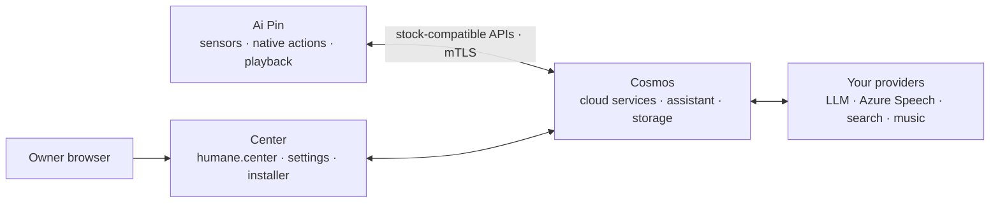

# Architecture

> Part of the [Luma docs](./README.md). See the [main README](../README.md) for the overview and quick start.

| Part | Runs on | Purpose |
| --- | --- | --- |
| Center | Your server | Your humane.center: sign-in, settings, provider and music connections, the Pin installer, and provisioning. It reads all cloud data from Cosmos and keeps none |
| Cosmos | Your server | Humane's cloud: the stock `humane.*` services the Pin calls, the humane.center web API Center reads, the assistant, enrollment, and all storage |
| Device Services | Ai Pin | Device-local settings, captures, diagnostics, and native action bridges. It holds no provider key |
| Compatibility Layer | Ai Pin | Adapts the stock apps to the activated Cosmos server and fails closed before activation |

Search, maps, weather, language-model work, transcription, and speech synthesis
run in Cosmos. The Pin keeps the work that needs the hardware: microphone and
sensor capture, cached location, native actions, maps presentation, and audio
playback.

### Code and data ownership

| Concern | Owner and boundary |
| --- | --- |
| Cloud records, filtering, counts, provider credentials | Cosmos's `Store` and PostgreSQL. Center forwards the wearer's identity and has no cloud database |
| Sign-in and roles | Keycloak and Center's server auth code. Browser controls never grant permission |
| Search, filters, page selection | The URL, so refresh and browser history keep your place |
| Unsaved edits and cached reads | Component state and React Query. A cache is a view of the server's answer |
| USB/Iroh connection and device settings | The current Pin session and Device Services, kept apart from cloud data |
| Provider quirks | Cosmos `backends/*` and Center's music adapters. Callers get normalized results |

A Center request goes from the page to an API route, then to its owning
`center/src/server/domain/*` module and the Cosmos transport in `server/cosmos.ts`.
Cosmos authenticates the caller, applies domain policy, and reads or writes the
store. For example, `/notes?page=2&query=Milk` becomes one account-scoped Cosmos
note query. Center keeps the page Cosmos returns and renders it. Stock gRPC calls
and the recovered web API stay separate compatibility boundaries.

Center's browser-safe response schemas live by feature in `src/lib/contracts/`.
Zod Mini supplies their validation and inferred TypeScript types. Cosmos
transports return `unknown`, and each domain validates its response before mapping
it. Browser queries validate again at their own network boundary. A malformed
success response cannot become a saved note or a connected service, and one
unreadable dashboard section leaves the healthy sections working. Sealed records,
optional stock fields, and additive page metadata are still supported.

Provider credentials are validated only on the server, in
`src/server/musicCredentials.ts`. Browser contracts hold only public account
status. The music adapters turn every provider's responses into the same catalog
shape. They keep requests bounded, coordinate token rotation, and never put
rejected payloads into validation errors. TypeScript enforces type-only imports,
and the Center checks reject transitive browser imports of server code.
Transport failures carry a typed status, and domain refusals carry an explicit
reason. Error handling never depends on the displayed wording.

The browser tab's `src/lib/pin-session/` owns USB. Each connection change
invalidates its derived transports and clients, including requests still in
flight. `PinDeviceProvider` owns the displayed device and service state, and
`src/lib/pin-device/events.ts` owns the USB event reader, bounded parsing, the
stall deadline, and retries. Leaving a view closes its subscription without releasing
the shared USB session. A late probe from a previous Pin cannot change the
current Pin's state.

### On your server

Traefik owns public ports 80 and 443 and sorts traffic by name:

| Traffic | Goes to |
| --- | --- |
| Your domain over HTTPS | Center, Keycloak's sign-in under `/realms/humane`, and Cosmos's two public routes: capture upload and device status |
| The stock Humane cloud names over TLS (`pin` profile) | Passed through unopened to Envoy, which requires the Pin's client certificate and forwards its gRPC calls to Cosmos |
| The stock connectivity check over HTTP (`pin` profile) | Cosmos |

Cosmos is one image that runs seven workloads (`ai-bus`, `account`,
`contacts`, `feature-flags`, `notable-events`, and, with the `pin` profile,
`provisioning` and `connectivity`) on one PostgreSQL database, beside
Keycloak. The other profiles add SearXNG (`search`), the Spotify adapter
(`spotify`), Center's encrypted Iroh bridge to the Pin and the Envoy device
edge (`pin`), and Prometheus with Grafana on `127.0.0.1:13001` by default
(`LUMA_GRAFANA_PORT`, `observability`).

## How a stock Pin talks to Luma

Luma's checked-in stock-compatibility contracts show why the device needs a
compatibility layer. The stock apps are signed together and call exact Android
packages, service classes, `humane.*` messages, cloud names, and device-identity
flows. Renaming any of those stock identifiers can turn a working call into a
silent no-op. Repacking the original apps or rewriting the system image would
change much more of the device than Luma needs.

So Luma leaves the stock experiences in place. At startup, the
Compatibility Loader applies an in-memory configuration only to known stock
packages. The Compatibility Layer can then adapt their original service calls
without changing the apps on disk. A normal request follows this path:

1. A stock experience calls the original on-device AiBus interface.
2. The stock assistant runtime reaches the Compatibility Layer using the same
   package names and message shapes it was built for.
3. After activation, the layer sends the request only to the allowlisted Cosmos
   endpoint and uses that Pin's Luma identity and operator trust root.
4. Cosmos uses the providers selected in Center and returns a stock-shaped
   response. Provider keys stay on the server.
5. Device Services handles local work such as captures, settings, playback, and
   native actions, so the original Pin experience presents the result.

The three links are kept separate on purpose:

| Link | Purpose | Compatibility rule |
| --- | --- | --- |
| Stock app interface | Original Binder and AiBus calls between stock experiences and the assistant runtime | Keep stock packages, class names, transaction codes, and message fields exact |
| Local device link | Luma-owned communication between the Compatibility Layer and Device Services | Keep its codes stable across mixed app versions |
| Remote management link | Center installation, activation, status, and recovery through the current browser connection | Bind every device change to the current browser session, exact connected serial, and reviewed plan |

If an optional in-app adapter cannot apply, the stock app must still start.
Remote routing works the other way. Before activation, with missing trust, or
for an unknown destination, it stops instead of falling back to the retired
cloud. Device-side compatibility is reapplied at startup and does not
rewrite verified firmware.

This section is the sanitized, non-identifying digest of the local device-backup
review. Raw backup material and device reports stay outside Git, and encrypted
userdata was not used. For a fresh checkout, the Tier-A registry, wire contracts,
and equivalence tests are the auditable repository authority. Any shape not
pinned there still needs a check on an exact device.

