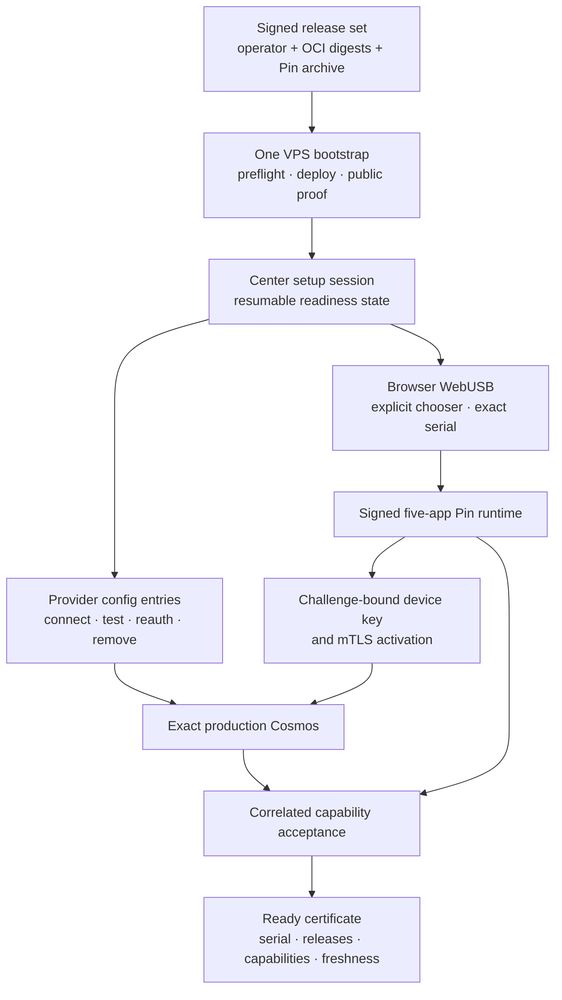

# A 10/10 newcomer onboarding for Ai Pin Revival

Research snapshot: 2026-08-31. This report uses official documentation,
standards, first-party source code, and archived copies of Humane's own support
pages. Evidence about the current repository is separated from recommendations.
The proposed experience has not been implemented or usability-tested.

Implementation note: the Phase 0 release-closure work accompanying this report
binds the operator descriptor to one exact signed Pin archive and makes its
verified acquisition the production setup path. The evidence section below is
the pre-implementation baseline that motivated that change; the remaining
recommendations still require implementation and clean-room usability trials.

## Executive recommendation

A 10/10 self-hosted experience should not pretend that DNS ownership, provider
consent, or touching a physical Pin can be automated away. It should make those
few actions obvious and automate everything between them.

The target normal path is:

1. The newcomer creates an Ubuntu VPS and points one domain at it.
2. They SSH once and run one cryptographically verified, release-pinned setup
   command. It installs or validates prerequisites, deploys Center and Cosmos,
   acquires the matching signed Pin bundle, and prints one HTTPS setup URL.
3. Center opens a resumable setup flow. It proves DNS, TLS, public reachability,
   release identity, storage, and Cosmos health before asking for provider
   accounts.
4. Each provider is connected through its native consent flow where one exists,
   tested immediately, and represented as capabilities rather than a vague
   “connected” state.
5. The newcomer plugs in and unlocks the Pin, explicitly selects it in the
   browser's USB chooser, checks the serial, and approves installation and
   activation.
6. Center runs correlated software checks; the wearer performs only the sensory
   checks software cannot do: speak, hear the reply, see Laser Ink, and make a
   gesture.
7. Center says **Ready** only when the exact Pin, exact release, exact Cosmos,
   selected providers, and enabled feature paths have all produced fresh
   evidence.

This is achievable for a VPS-capable newcomer. “No SSH, no domain, no provider
accounts, and no physical interaction” would require a hosted control plane and
would no longer be the same self-hosted product.

The highest-value work is not a redesign. The repository already has most of
the hard safety primitives. The immediate gaps are release closure, a single
cross-product readiness model, normal-path automation before Center exists,
capability-level provider proofs, and evidence-backed physical acceptance.

## What “10/10” means

The setup is 10/10 when a first-time operator with a supported VPS, a domain,
and a stock Pin can complete it without understanding Docker, APK roles, PKI,
ADB, release descriptors, or Cosmos topology.

The normal path should meet these product gates:

- no repository clone, source build, or hand-matched release assets;
- at most one pasted command after the first VPS login;
- no native `adb` command and no activation-file transfer;
- no secret in command arguments, URLs, generated support bundles, or browser
  responses;
- one primary action at a time, with completed work resumable after closing the
  tab or disconnecting USB;
- every failure names the failing boundary, shows the evidence, and offers the
  one next action that could change it;
- “Connected” means an authenticated, live, scoped provider test passed;
- “Ready” means a correlated request crossed the exact enabled production path;
- upgrades cannot silently mix a server release with a different Pin release or
  silently downgrade a newer Pin;
- the normal path works on current desktop Chrome or Edge on macOS, Windows, and
  supported Linux, with truthful platform-specific help where the OS blocks USB;
- setup success is measured on clean hosts and stock Pins, not inferred from a
  developer machine.

Measure median and 90th-percentile time to first successful voice turn, steps
requiring documentation, retries by boundary, and completion rate. Do not set a
time promise until repeated clean-room trials provide it.

## Evidence: the repository is already closer than it looks

### Strong foundations

The current design already has the right security and compatibility shape:

- [`README.md`](README.md#architecture) makes Cosmos the remote runtime
  authority and keeps provider credentials off the Pin.
- [`README.md`](README.md#deploy-cosmos) deploys digest-pinned, prebuilt images
  from a verified operator archive instead of compiling a mutable checkout.
- [`contracts/operator-setup.json`](contracts/operator-setup.json) gives setup
  commands explicit mutation policies. Device changes require confirmation and
  an exact serial.
- [`center/src/lib/pin-setup/steps.ts`](center/src/lib/pin-setup/steps.ts) derives
  setup status from observed USB, release, package, activation, pairing, and
  reporting facts instead of optimistic UI state.
- [`center/src/app/settings/pin/setup/SetupView.tsx`](center/src/app/settings/pin/setup/SetupView.tsx)
  already presents four wearer-facing stages, locks work to one Pin, and avoids
  silently downgrading a device.
- [`center/src/app/settings/account/services/CosmosServicesCard.tsx`](center/src/app/settings/account/services/CosmosServicesCard.tsx)
  keeps secrets write-only and offers live tests for assistant, search, maps,
  weather, speech, knowledge, and food services.
- [`center/src/app/settings/account/services/SpotifyServiceCard.tsx`](center/src/app/settings/account/services/SpotifyServiceCard.tsx)
  exposes account connection and active-provider state for Spotify, YouTube
  Music, TIDAL, and Apple Music.
- The installer validates a complete five-role signed release, checks Android's
  package service before mutation, and reconnects only to the planned serial.
  Activation installs only endpoint, trust, and device identity, then checks the
  exact target. These are the right invariants to preserve.

### Current normal-path gaps

The gaps are concrete rather than aesthetic:

1. **Production starts as four CLI-only stages.** The production journey in
   [`contracts/operator-setup.json`](contracts/operator-setup.json) is setup,
   config check, doctor, and deploy; every step has `centerRoute: null`. Center
   cannot guide the newcomer until after the difficult infrastructure part is
   complete.
2. **The matching Pin archive is still manual.** The Pin journey's release step
   runs `pin.release.import`, has no Center route, and the README tells the user
   to download and import the archive. Center links to the GitHub releases page
   and renders a shell command when none is published.
3. **The release descriptor does not close the product set.** The descriptor
   built by [`platform/distribution/build.mjs`](platform/distribution/build.mjs)
   and asserted by
   [`platform/deploy/acceptance/distribution.test.mjs`](platform/deploy/acceptance/distribution.test.mjs)
   contains application, images, operator, source, version, and platform data,
   but no signed Pin asset identity. A tool therefore cannot securely derive
   “the matching Pin archive” from the descriptor it has already verified.
4. **Public guidance overclaims that automation.** The deployment copy in
   [`center/src/lib/public-site.ts`](center/src/lib/public-site.ts) says the
   bundled CLI imports the matching signed Pin archive, while the release
   contract and README still require a separate manual import. This should be
   corrected immediately and only restored after the behavior exists.
5. **Main setup readiness is narrower than provider readiness.** The Pin setup
   flow gates its configure step on `assistantReady`. The provider page can test
   many more integrations, but the main journey does not aggregate them into
   “weather ready,” “nearby and navigation ready,” “music playback ready,” or
   other wearer-visible capabilities.
6. **Final physical acceptance is a local assertion.** The current final action
   is “I tried it — it works”; its value is stored in browser `localStorage`
   against serial, release, and edge identity. That is useful resumability, but
   it is not correlated evidence that microphone -> transcription -> Cosmos ->
   tool/model -> action/TTS -> exact Pin completed.
7. **Recovery knowledge is split.** The README has good USB troubleshooting and
   the code has targeted error states, but infrastructure, provider, device,
   network, and physical evidence do not yet meet in one readiness timeline or
   one downloadable redacted diagnostic.

## What the best first-party patterns teach

### Apple and Android: ask for proximity and consent, then keep moving

Apple Quick Start asks the user to turn on Wi-Fi and Bluetooth, place two
devices near one another, follow onscreen instructions, and keep them nearby
and powered until transfer completes. It automatically continues background
downloads where possible rather than making the user manage artifacts
([Apple Quick Start](https://support.apple.com/en-us/102659)). Google's Android
transfer flow similarly leads with a cable or wireless connection, keeps the
old device unlocked, and presents choices rather than exposing transport
details
([Android: copy apps and data](https://support.google.com/android/answer/6193424?hl=en)).

**Recommendation:** Center should say “plug in, unlock, choose this serial, keep
this tab open” and own reconnect, resume, artifact selection, and verification.
ADB, package role names, and PKI belong only in expandable diagnostics.

### Humane's original setup: teach the hardware on the hardware

Humane's archived first-party setup guide waited for the Trust Light startup,
then led the wearer through Laser Ink hand detection, gestures, passcode entry,
and a first Ai Mic request. Its Wi-Fi guide generated a QR code in Center, and
its updater installed automatically under visible readiness conditions: on the
charge pad, Wi-Fi, unlocked since boot, and sufficient Pin and Booster charge
([archived setup guide](https://web.archive.org/web/20240518135655/https://support.humane.com/hc/en-us/articles/23955137120141-Setting-up-Ai-Pin),
[archived Wi-Fi QR guide](https://web.archive.org/web/20240518122517/https://support.humane.com/hc/en-us/articles/23944955877645-Create-a-QR-code-for-a-Wi-Fi-network),
[archived update guide](https://web.archive.org/web/20240518124647/https://support.humane.com/hc/en-us/articles/24327736733837-Update-Ai-Pin-to-the-latest-software)).
These are historical product sources, not evidence that Humane services still
exist.

**Recommendation:** keep server and provider work in Center, but finish with a
short on-Pin tutorial for hand placement, one gesture, touch-to-talk, listening
cues, and stop/pause. For later releases, emulate the original visible
charge/network/battery readiness model instead of requiring recurring USB
installation, if the privileged installer and exact firmware can safely support
an authenticated staged update.

### Home Assistant: a browser flow, tested config entries, and redacted support

Home Assistant's official onboarding is five browser steps, claims no command
line or coding, and lets a user create a new installation or recover one
([Home Assistant onboarding](https://www.home-assistant.io/getting-started/onboarding/)).
Its integration config-flow model validates and stores configuration through UI
flows, assigns unique IDs to prevent duplicates, and defines explicit
reconfigure and reauthentication paths
([config flows](https://developers.home-assistant.io/docs/config_entries_config_flow_handler/)).
Its integration quality rules require useful diagnostics while warning that
passwords, tokens, coordinates, and other sensitive data must be redacted
([diagnostics rule](https://developers.home-assistant.io/docs/core/integration-quality-scale/rules/diagnostics/)).

**Recommendation:** after one bootstrap command, use Center as the only normal
setup surface. Model every provider/device as a durable config entry with
stable identity, `connect`, `test`, `reauth`, `reconfigure`, and `remove`
states. Add one-click redacted setup diagnostics rather than asking newcomers
to collect logs.

### Tailscale: install, authenticate in a browser, immediately see the device

Tailscale's quickstart asks the user to select an OS, install the client,
authenticate it with the same identity, and then shows the device in the browser
as soon as authentication completes
([Tailscale quickstart](https://tailscale.com/kb/1017/install)).

**Recommendation:** the bootstrap command should end with a short-lived Center
setup code or URL. When the exact Pin authenticates, its card should appear and
advance automatically; “Check again” should be a recovery action, not the
primary happy path.

### Docker, Caddy, Cloudflare, and ACME: make prerequisites observable

Docker's official Ubuntu instructions use Docker's apt repository and install
Engine plus the Compose plugin; convenience scripts are not the production
contract
([Docker Engine on Ubuntu](https://docs.docker.com/engine/install/ubuntu/)).
Caddy demonstrates the newcomer-facing result to copy even if Revival keeps
Traefik: qualifying hostnames get certificates, renewal, and HTTP-to-HTTPS
redirects automatically when DNS and ports are correct
([Caddy automatic HTTPS](https://caddyserver.com/docs/automatic-https)). ACME is
the standard protocol behind automated certificate issuance and renewal
([RFC 8555](https://www.rfc-editor.org/rfc/rfc8555.html)).

Cloudflare Tunnel demonstrates an optional outbound-only deployment model that
does not require a publicly routable origin address
([Cloudflare Tunnel](https://developers.cloudflare.com/cloudflare-one/networks/connectors/cloudflare-tunnel/)).
It is not a drop-in answer for Revival today: the current Pin profile requires a
public IPv4 edge and an exact device path, and placing Center behind a third
party changes the operator's traffic and logging boundary. It should be offered
only as an explicit, separately verified topology—not as a silent fallback.

**Recommendation:** keep the direct public VPS path as the default. The wizard
should test supported architecture, Docker/Compose version, disk, time sync,
resolved A/AAAA records, port ownership, firewall reachability, TLS chain/SAN/
expiry, and the public release endpoint. If DNS is wrong, render the exact
record to create and wait for it; optionally support tightly scoped DNS API
tokens later. Cloudflare recommends limiting API tokens by permissions and
resources, which is the right rule for any such integration
([Cloudflare API tokens](https://developers.cloudflare.com/fundamentals/api/get-started/create-token/)).

### WebUSB and Android: the chooser and physical cable are security boundaries

Chrome documents three constraints that product copy must not hide: WebUSB is a
powerful feature available only in a secure context; `requestDevice()` must be
called from a user gesture; and claiming an interface requests exclusive
control. It also notes Linux device permissions
([Chrome WebUSB guide](https://developer.chrome.com/docs/capabilities/usb)). The
WebUSB specification likewise requires secure contexts and a transient user
activation before the permission request
([WebUSB specification](https://wicg.github.io/webusb/)). Android's official
device guide calls out Windows ADB drivers and Linux `plugdev` plus udev rules
([Android hardware-device setup](https://developer.android.com/studio/run/device)).

**Recommendation:** do not promise zero-click USB. Center can automatically
detect browser support, secure context, prior permission, known device IDs,
boot state, free space, package service, release/signers, competing-device
ambiguity, and reconnect. It cannot choose a USB device, unlock the Pin, replace
a charge-only cable, grant an OS driver permission, or close a competing
process. Those remain concise, illustrated user actions. A native signed rescue
helper is justified only if clean-room Windows/Linux trials show WebUSB and
driver recovery remain the dominant failure after the browser flow is improved.

### OAuth: native consent, exact callbacks, PKCE, and explicit reauth

OAuth 2.0 Security Best Current Practice requires PKCE for public clients,
recommends it for confidential clients, calls for `S256`, and requires stronger
refresh-token protection; it also rejects several legacy patterns
([RFC 9700](https://www.rfc-editor.org/rfc/rfc9700.html)). Spotify explicitly
recommends Authorization Code with PKCE when a client secret cannot be stored,
requires an exactly allowlisted redirect URI, and returns refresh tokens
([Spotify PKCE flow](https://developer.spotify.com/documentation/web-api/tutorials/code-pkce-flow)).
Google's web-server flow documents server-side callbacks and refresh tokens
([Google OAuth web-server flow](https://developers.google.com/identity/protocols/oauth2/web-server)).
TIDAL publishes its own SDK authentication contract
([TIDAL authentication](https://developer.tidal.com/documentation/api-sdk/api-sdk-authentication)).

The device authorization grant is designed for input-constrained devices: show
a verification URI and short user code while the device polls at the server's
required interval
([RFC 8628](https://www.rfc-editor.org/rfc/rfc8628.html)). Center is not
input-constrained, so redirect-based authorization is usually the smoother
choice there; device code remains appropriate when the provider or a headless
playback component requires it.

**Recommendation:** use provider-owned consent screens, Authorization Code plus
PKCE and state for browser callbacks, exact redirect URI validation, minimal
scopes, encrypted refresh-token storage in Cosmos, and first-class reauth and
revocation. Never ask Center users to paste provider passwords when an official
OAuth flow exists. API-key providers still require a human to obtain and paste
the key, but Center should link directly to the official credential page and
test the submitted scope before saving success.

Provider status must describe capability, not merely token presence:

| Capability | Example proof |
| --- | --- |
| Account | token refresh or authenticated profile succeeds |
| Catalog | one bounded search returns a typed result |
| Entitlement | required subscription/tier is present |
| Resolve | exact catalog result becomes a playable provider item |
| Pin route | bytes/control traverse the configured Wi-Fi or LTE Pin path |
| Playback | the stock player starts and reports sustained progress |
| Control | pause/resume/skip executes locally and reports the new state |

YouTube Music needs especially careful wording. Google's documented YouTube
surfaces provide metadata search and embedded IFrame playback
([YouTube Data API search](https://developers.google.com/youtube/v3/docs/search/list),
[YouTube IFrame Player API](https://developers.google.com/youtube/iframe_api_reference));
the research did not find a documented YouTube Music native-audio OAuth API.
Revival's current Pin-egress implementation should therefore be labeled by its
actual tested behavior and support risk, not presented as an official generic
YouTube Music SDK integration.

### Device identity: keys should originate and remain on the device

Android Keystore can keep key material in a hardware-backed KeyMint/Keymaster
implementation, and Android key attestation can provide a certificate chain for
verifying properties of a hardware-backed key. Hardware attestation is
capability-dependent and its chain and revocation status must be verified
([AOSP hardware-backed Keystore](https://source.android.com/docs/security/features/keystore),
[Android key attestation](https://developer.android.com/privacy-and-security/security-key-attestation)).

**Recommendation:** retain exact-serial confirmation and per-device mTLS, but
move new identity creation to a challenge-bound key generated inside the Pin's
Android Keystore. The Pin returns a CSR/public key; Cosmos signs a scoped device
certificate only after the signed-in owner approves the displayed serial and
Cosmos identity. Verify hardware attestation when this exact firmware supports
it, and report “hardware-backed” or “software-backed” honestly rather than
making an unsupported attestation a dead end. The private key should never be
created on the VPS or cross USB.

Activation should be transactional:

1. Center creates a short-lived, single-use enrollment challenge bound to owner,
   serial, server identity, and target release.
2. The Pin generates its key and proves possession.
3. Cosmos issues the client identity and records revocation/rotation state.
4. The Pin stages endpoint, trust root, and certificate, then proves an mTLS
   round trip to that exact Cosmos.
5. Remote mode commits only after that proof; failure returns to inactive setup,
   not an alternate cloud.

Keep activation files as an explicitly labeled recovery tool. Bind them to one
serial and server, expire them, make them single-use, and let Center confirm
consumption and revocation.

### Release acquisition: integrity is not enough without authenticated intent

GitHub's Releases API exposes the latest published full release and asset
digests
([GitHub Releases REST API](https://docs.github.com/en/rest/releases/releases#get-the-latest-release)).
Cosign can verify an artifact or image against a key or an expected OIDC signing
identity
([Sigstore verification](https://docs.sigstore.dev/cosign/verifying/verify/)).
The Update Framework specifies signed roles, expiration, versioning, consistent
snapshots, and defenses against rollback and freeze attacks
([TUF specification](https://theupdateframework.github.io/specification/latest/)).

**Recommendation:** make one release descriptor name every release-coupled
artifact, including the signed Pin archive, its byte size, digest, internal Pin
release ID, and allowed signer identity. Sign the descriptor in CI and have the
bootstrap verify the expected repository/workflow identity before trusting its
URLs. Keep digest-pinned OCI references. Then add monotonically versioned,
expiring update metadata or a small TUF implementation so “latest” cannot be
replayed indefinitely or rolled back.

`setup production` should import the exact descriptor-named Pin archive during
normal deployment. Manual `pin release import` remains visible only under
advanced/offline recovery. Center should never scrape asset names or choose the
first archive in a release.

## Target product architecture



Use one canonical setup-state contract across CLI and Center. Each check should
return structured data, not prose that another layer must parse:

```text
id · scope · state · observed value · expected value · evidence time
owner boundary · safe retry · one next action · secret classification
```

Recommended states are `not_started`, `checking`, `ready`, `action_required`,
`blocked`, and `stale`. “Unknown” should be temporary and never rendered as
success. A completed check becomes stale when the release, endpoint, identity,
provider token, or connected serial it depended on changes.

## A concrete phased roadmap

### Phase 0 — make release claims true

This is the smallest, highest-leverage phase.

- Extend the release descriptor with the exact signed Pin archive and assert the
  complete release set in distribution tests.
- Sign the descriptor/release set and verify signing identity before extraction.
- Add an exact-version acquisition command used internally by production setup;
  it downloads, verifies, and imports the matching Pin release.
- Correct `public-site.ts` until the import is actually automatic.
- Expose one machine-readable `revival setup status --json` contract derived
  from `operator-setup.json`.
- Make upgrade preflight reject mixed Center/Cosmos/Pin compatibility before any
  mutation.

Exit gate: a clean supported VPS can go from operator archive to a verified
Center that already publishes the matching Pin manifest without a second asset
choice or command.

### Phase 1 — reduce VPS setup to one action

- Publish a non-secret setup generator for domain, ACME email, operator email,
  public IP, and chosen feature profiles. It produces one release-pinned command
  and a cloud-init variant; it must not collect provider keys.
- Make the command detect OS/version/architecture, install Docker from the
  official repository when explicitly approved, validate Compose, create
  external state, run config checks, deploy, and publicly verify.
- Continuously render a compact progress list and preserve state after SSH
  disconnects. On failure, stop at one exact blocker; rerunning resumes.
- Resolve DNS using authoritative and public views, show the exact record, and
  wait without claiming propagation. Verify certificate SAN/chain/expiry and
  both public Center and Pin-edge reachability.
- End with `https://DOMAIN/setup` plus a short-lived, single-use operator setup
  code. After owner credential/passkey enrollment, invalidate the code.

Exit gate: a clean-room operator needs no Docker command and no README lookup
after starting the bootstrap.

### Phase 2 — turn Center into the setup authority

- Replace the current split navigation with one resumable setup session:
  **Server → Services → Pin → Network → Try it**.
- Import all existing CLI/server/device observations into the shared readiness
  contract and stream changes so completed steps advance automatically.
- Let the user choose desired capabilities. Required provider checks derive from
  that choice; optional features never block core readiness.
- Present “Ready for assistant / weather / nearby / navigation / music / food”
  rather than one assistant-ready boolean.
- Keep expert commands and raw evidence under one disclosure, with copy buttons
  and a setup session ID.
- Add a Center-generated, redacted diagnostic bundle that includes check IDs,
  versions, timestamps, non-secret endpoint facts, browser/USB error classes,
  and correlated request IDs—never tokens, transcripts, coordinates, contacts,
  or media.

Exit gate: after initial deploy, the normal journey never sends the operator
back to a shell.

### Phase 3 — finish provider-quality onboarding

- Give each provider a durable config entry with stable ID, scopes, connection
  time, last successful test, token-expiry/reauth state, and remove/revoke.
- Prefer provider-owned OAuth redirects with Authorization Code, PKCE `S256`,
  state, exact callbacks, and minimum scopes. Use device authorization only when
  the provider/headless component genuinely needs it.
- Test entered API credentials before committing the new configuration. Preserve
  the previous working secret until the replacement passes.
- Split music readiness into account, catalog, entitlement, exact resolution,
  Pin egress, playback progress, and local controls. Show which network path was
  last proven.
- Make unsupported states precise: for example, “Apple Music linked; Pin
  playback unavailable” is not an error and not selectable as a playback-ready
  provider.
- Add reauth notifications before the wearer discovers expiry through a failed
  voice request.

Exit gate: every enabled capability has a fresh, non-destructive test; no card
can say connected based only on a stored secret.

### Phase 4 — make first-device installation forgiving

- Add an OS/browser preflight before asking the user to connect: HTTPS, WebUSB,
  Permissions Policy, supported browser, and platform-specific driver guidance.
- After the chooser, automatically inspect exact serial, model identity, boot
  completion, battery, free storage, Android package service, installed roles,
  versions, signers, conflicts, and USB exclusivity symptoms.
- Turn the known failure classes into illustrated, inline recovery: charge-only
  cable, unauthorized/locked Pin, Linux permissions, Windows driver, competing
  ADB owner, package service still booting, reboot/reconnect, and different
  serial.
- Persist the signed plan server-side and locally, resume only on the same
  serial, and show which operations already committed. Never ask the user to
  repeat a successful role install.
- Run a clean-room browser/OS matrix. Build a signed native rescue helper only
  if evidence shows OS driver/interface recovery cannot be made reliable in the
  browser.

Exit gate: injected failures recover in place with no generic “try again” and no
normal-path ADB command.

### Phase 5 — harden enrollment while simplifying it

- Generate the device private key in Android Keystore; enroll by CSR and proof
  of possession.
- Bind the one-time challenge to owner, serial, release, server identity, and a
  short expiry. Invalidate it after use.
- Test the exact Pin-to-Cosmos mTLS connection before committing remote mode.
- Record certificate issue/expiry/rotation/revocation and expose a simple
  “Connected to DOMAIN” owner view.
- Detect and verify hardware attestation where this Pin supports it; expose the
  assurance level without blocking a known-good software-backed fallback.
- Make re-pair/reset revoke the prior device certificate. Use USB recovery when
  an expired device can no longer authenticate itself.

Exit gate: the private device key never leaves the Pin, and Center cannot mark
activation complete without an exact remote proof.

### Phase 6 — replace the final checkbox with guided acceptance

Build a feature-selected test sequence. Each software step creates a correlation
ID and waits for evidence from Cosmos and the exact Pin:

1. device heartbeat, release identity, certificate identity, network path;
2. fixed spoken request -> transcription -> deterministic answer -> TTS ->
   device playback acknowledgement;
3. one genuine model-led question with provider/model provenance;
4. weather from current or explicitly named remote location;
5. nearby lookup and a navigation start action;
6. active-provider music research, exact catalog resolution, playback progress,
   pause, and resume;
7. optional consented photo -> capture sync -> Center visibility;
8. Wi-Fi and LTE checks when both are configured.

Center can prove transport, tool calls, model provenance, action envelopes, and
device acknowledgements. The wearer must confirm that the microphone heard the
right phrase, the speaker was audible, Laser Ink appeared, and the gesture
worked. Store both kinds of evidence against serial, Pin release, Cosmos release,
provider configuration version, and timestamp. If any dependency changes, mark
only its dependent proofs stale.

Finish with a short original-hardware tutorial and a capability receipt:

```text
This Pin is ready
Serial: …
Pin release: …
Cosmos release: …
Connected to: …
Ready: voice, weather, nearby, navigation, YouTube Music
Needs setup: food contributions
Last proved: …
```

Exit gate: “Ready” cannot be achieved by clicking a button without a fresh
correlated run, but setup does not require the user to understand the trace.

### Phase 7 — make the second month easier than the first day

- Check signed update metadata in Center and show one release-coupled server +
  Pin plan, changelog, download size, prerequisites, and which proofs will become
  stale.
- Pre-pull server images and validate configuration before switching the running
  release; do not report success until public verification returns the target
  immutable release and production environment.
- Preserve the current no-silent-downgrade rule.
- Prototype post-activation Pin updates over authenticated Center/Cosmos. Only
  offer them if the exact firmware supports safe privileged staged installation,
  signer verification, sufficient charge/storage checks, and an explicit owner
  approval. Android exposes multi-package and staged PackageInstaller sessions,
  but support and privilege on this Pin must be physically proven
  ([Android PackageInstaller](https://developer.android.com/reference/android/content/pm/PackageInstaller.SessionParams)).
- After every update, automatically rerun non-destructive capability proofs and
  guide the wearer only through sensory checks whose behavior changed.

Exit gate: routine upgrades do not require asset matching or USB; a failed
preflight leaves the known-good installation untouched and explains why.

## What can and cannot be automated

| Step | Automate | Human action that remains |
| --- | --- | --- |
| VPS | Detect/support OS, install prerequisites, deploy, resume | buy/select VPS, authorize SSH/root changes |
| Domain | calculate record, poll DNS, obtain/renew TLS | own domain; change DNS or grant a scoped token |
| Firewall | identify exact required rules and test from outside | approve provider/VPS firewall changes |
| Release | select exact version, authenticate metadata, download, verify, import | choose upgrade timing; approve mutation |
| Operator account | issue one-time setup code, expire it, enroll strong auth | choose credential/passkey and retain recovery material |
| Providers | open native consent, callback, store/refresh/test tokens | sign in, consent, MFA, buy required subscription, create API keys |
| USB | detect support/device/readiness, inspect/plan/install/resume | use data cable, unlock Pin, click chooser, keep it connected |
| OS USB access | detect likely error and show exact fix | install Windows driver, join Linux group/relogin, close competing tools |
| Identity | device key generation, CSR, certificate issue/test/rotate | verify displayed serial/server and approve enrollment |
| Network | generate QR, test heartbeat and Wi-Fi/LTE path | show QR to Pin or insert/configure SIM; accept carrier terms |
| Physical proof | correlate mic/STT/Cosmos/TTS/action/device telemetry | speak, listen, see projector, perform gesture, approve photo test |
| Recovery | classify failure, preserve progress, download redacted diagnostics | reconnect/reboot hardware; choose destructive reset only if required |

## Recommended implementation order

Do not start with a native desktop installer or a broad UI rewrite. The order
that removes the most newcomer pain while preserving current safety is:

1. release descriptor closure and automatic matching Pin import;
2. truthful public copy and one JSON setup/readiness contract;
3. one-command VPS bootstrap with DNS/TLS/public evidence;
4. Center's capability-oriented, resumable setup session;
5. provider connect/test/reauth state and main-wizard aggregation;
6. correlated physical acceptance;
7. on-device key generation and challenge-bound enrollment;
8. clean-room OS/browser/device trials;
9. only then, evidence-driven native rescue helper or post-activation OTA.

This sequence improves the normal path without maintaining two product models.
CLI remains the pre-Center bootstrap and recovery surface; Center becomes the
normal owner surface; the Pin remains the sensor, local-action, and playback
surface; Cosmos remains the sole remote runtime authority.

## Clean-room release gate

Before calling the result 10/10, test from fresh state with people who have not
worked on the repository:

- clean Ubuntu 24.04 amd64 and arm64 VPSes;
- a domain with initially wrong DNS, a closed port, and a delayed propagation
  case;
- current Chrome and Edge on macOS, Windows, and supported Ubuntu;
- a good data cable, a charge-only cable, competing ADB ownership, a locked Pin,
  incomplete boot, low disk, and mid-install reboot;
- no providers, expired OAuth, wrong scope, wrong subscription tier, and a
  provider outage;
- Wi-Fi only, LTE only, and network transition during a request;
- a Pin already on the target release, an older release, and a newer release;
- interrupted setup resumed from another browser after secure reauthentication.

The gate passes only when each case either completes or stops before unsafe
mutation with one accurate blocker. A green SSH session, provider catalog call,
or localStorage checkbox is not an end-to-end pass.

## Bottom line

The product does not need more setup documentation first. It needs a closed,
signed release set and one evidence model that begins in the bootstrap CLI,
continues in Center, crosses the exact Pin and Cosmos, and ends in guided physical
acceptance.

Done well, the newcomer experience becomes six understandable actions—create a
server, point a domain, run one command, connect accounts, plug in the Pin, try
it—while the software performs and records the dozens of checks those actions
currently imply.
